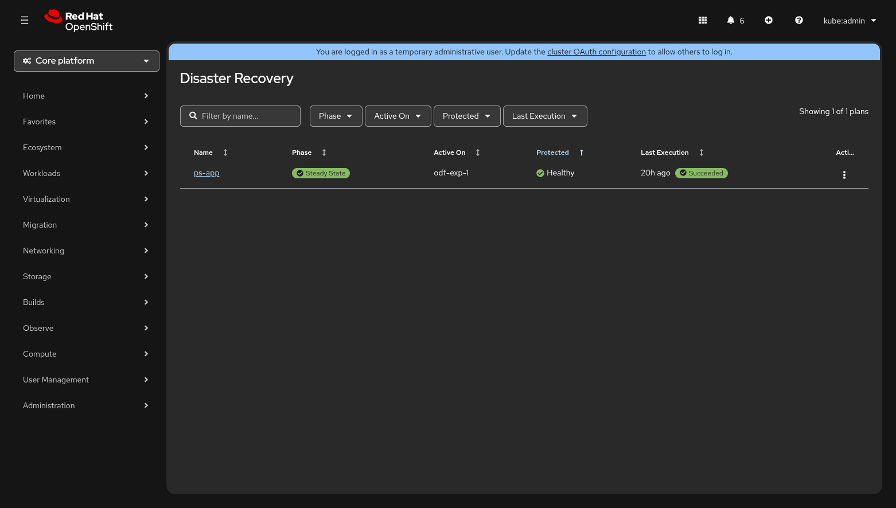

# Soteria

**Storage-agnostic disaster recovery orchestrator for OpenShift Virtualization.**

Soteria is an open-source, Kubernetes-native DR orchestrator that unifies failover, failback, and reprotect workflows across heterogeneous storage backends — ODF, Dell, Pure Storage, NetApp — through a single, consistent workflow engine. Platform engineers define DR plans using standard Kubernetes labels and CRDs; the orchestrator handles volume promotion, VM startup sequencing, wave-based throttling, and a full audit trail.



> **📖 Full documentation:** [soteria-project.github.io/soteria/docs](https://soteria-project.github.io/soteria/docs/)

## Quick Start

### Prerequisites

- Two OpenShift clusters (v4.16+ / Kubernetes v1.28+)
- [cert-manager](https://cert-manager.io/) installed on both clusters
- [scylla-operator](https://operator.docs.scylladb.com/) installed on both clusters
- Cross-cluster networking ([Submariner](https://submariner.io/) or [Cilium Cluster Mesh](https://docs.cilium.io/en/stable/network/clustermesh/))

### Install via Helm

```bash
helm repo add soteria https://soteria-project.github.io/soteria
helm repo update

# Seed site (first cluster)
helm install soteria soteria/soteria \
  --namespace soteria --create-namespace \
  --set site.name=east \
  --set site.role=seed \
  --set scylladb.localDC=east

# Joining site (second cluster)
helm install soteria soteria/soteria \
  --namespace soteria --create-namespace \
  --set site.name=west \
  --set site.role=joining \
  --set scylladb.localDC=west \
  --set scylladb.managed.externalSeeds[0]=soteria-scylladb-client.soteria.svc.clusterset.local
```

For the full installation walkthrough — including cert-manager CA bootstrap, networking setup, and all configuration options — see the [Helm Installation Guide](https://soteria-project.github.io/soteria/docs/installation/helm/).

## Contributing

We welcome contributions! The project uses Go 1.25, Ginkgo/Gomega for tests, and Podman (or Docker) for container builds.

```bash
git clone https://github.com/soteria-project/soteria.git
cd soteria
make test              # Unit tests
make integration       # Integration tests (ScyllaDB via testcontainers)
make helmchart-test    # Helm chart smoke test (Kind cluster)
make lint              # Lint with golangci-lint
```

For the full developer setup — including local Kind clusters, storage driver development, and debugging tips — see the [Developer Setup Guide](https://soteria-project.github.io/soteria/docs/contributing/dev-setup/).

## License

Apache License 2.0 — see [LICENSE](LICENSE) for details.
