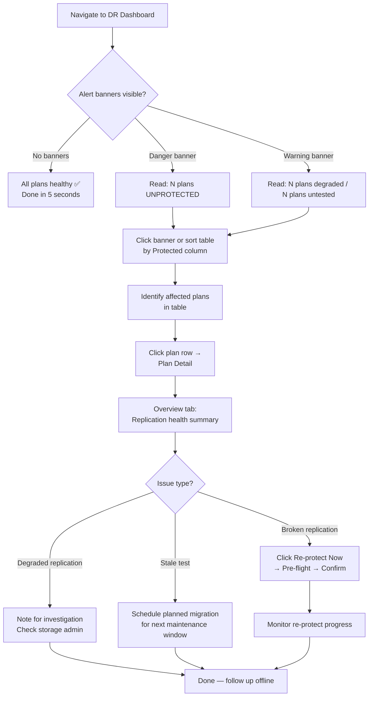
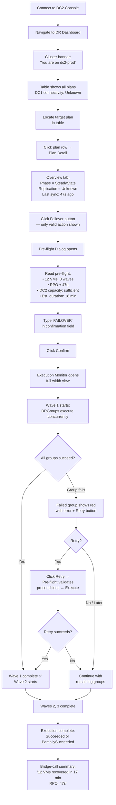
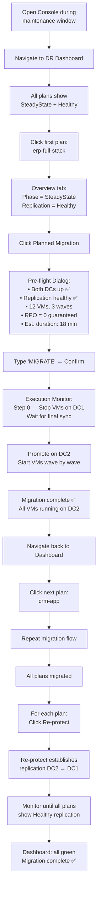
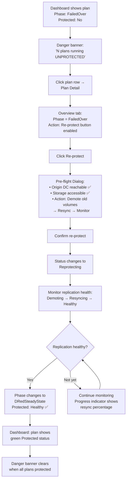

# UX Design Specification — Soteria

**Author:** Raffa
**Date:** 2026-04-05

---

## Executive Summary

### Project Vision

Soteria is the SRM of the Kubernetes era — an open-source, Kubernetes-native DR orchestrator for OpenShift Virtualization that provides storage-agnostic disaster recovery across heterogeneous storage backends through a single, consistent workflow engine. The core design philosophy is **careful planning, simple execution**: plans are designed deliberately with waves, throttling, and consistency groups; when the moment arrives, the operator presses one button and the orchestrator handles the rest.

The OCP Console plugin is the primary visual interface, serving as both a planning workbench and a disaster command center. It communicates exclusively through the Kubernetes API via an Aggregated API Server backed by ScyllaDB, meaning both datacenters see identical DR state — the same Console view regardless of which cluster you're connected to.

### Target Users

**Platform Engineers / Infrastructure Architects (Primary — Planning Mode)**
Represented by Maya in the user journeys. Senior engineers responsible for RTO/RPO commitments, compliance audits, and DR testing. They set up DR plans, monitor replication health, run DR tests, and produce audit evidence. They work methodically — reviewing wave composition, validating pre-flight checks, iterating on plan design. They need clarity, completeness, and confidence. Their success metric: "I can prove to auditors that our DR works."

**DR Operators (Primary — Disaster Mode)**
Represented by Carlos in the user journeys. Infrastructure operators on rotation who execute tested DR plans during incidents. They're paged at 3 AM when a datacenter goes dark. They need speed, simplicity, and zero ambiguity. They must orient themselves instantly (which cluster am I on? what's the status?), trigger the right action, and monitor progress on a bridge call. Their success metric: "Everything is up on the DR site and I can tell the bridge call exactly what happened."

**Storage Vendor Engineers (Secondary — Developer Mode)**
Represented by Priya in the user journeys. Go developers implementing StorageProvider drivers. Their UX is primarily CLI, code, and the no-op driver as reference. The `make dev-cluster` onboarding experience and conformance test suite are their "interface." Their success metric: "I can develop and validate a driver without real storage infrastructure."

### Key Design Challenges

1. **Dual-Mode Interface (Planning vs. Disaster):** The same Console views must serve two radically different emotional states — calm methodical planning and high-stress disaster response. Progressive disclosure and context-aware information density are essential to avoid compromising either mode.

2. **Safety-Critical Operation Design:** Failover is irreversible (fail-forward model, no rollback). The UX must prevent accidental execution through deliberate friction (confirmation keywords, pre-flight gates) while adding zero unnecessary friction during genuine emergencies.

3. **Cross-Cluster Orientation:** Both clusters display identical data from ScyllaDB, but the operator's context differs. The UX must instantly answer: "Where am I? What's active here? What actions are available?" Disorientation during a disaster is operationally dangerous.

4. **Real-Time Execution Visualization:** The live Gantt-style execution monitor must render waves, DRGroups, individual VMs, partial failures, and retry actions — all updating via Kubernetes watch events — while remaining visually clear enough to share on a management bridge call.

5. **Information Density vs. Clarity:** DR dashboards must surface plan status, per-volume-group replication health, RPO estimates, execution history, wave composition, and cross-cluster state without causing information overload in either planning or disaster contexts.

### Design Opportunities

1. **Trust Through Transparency:** Soteria's combination of pre-flight checks, live execution monitoring, and immutable audit trails creates a "trust pipeline" — operators can see their protection, test their plans, and prove they worked. Making this trust visible and tangible is the product's strongest UX differentiator.

2. **Context-Aware Intelligence:** The well-defined 4-state DR cycle enables remarkably smart UI behavior — only valid state transitions appear as enabled actions, pre-flight checks surface problems before execution, and alert banners provide proactive guidance. The product should feel like it understands DR better than the operator does.

3. **Progressive Confidence Journey:** The UX can guide operators from "I don't know if we're protected" to "I know this works because I've tested it and I have the audit trail to prove it" — building confidence incrementally through setup completion, successful test executions, and routine health confirmations.

## Core User Experience

### Defining Experience

Soteria's UX is built around a single underlying question: **"Am I protected?"** This question manifests through two fundamental interaction loops:

**The Daily Loop (Planning Mode):** Platform engineers open the DR Dashboard to verify protection status. In under 5 seconds, they know whether all plans are healthy, replication is active, and tests are current. This is the most frequent interaction and the foundation of trust.

**The Crisis Loop (Disaster Mode):** DR operators open the Console during an incident, select a plan, trigger failover, monitor execution, and report status. This is the most critical interaction, but its success depends entirely on the confidence built during daily planning interactions.

**The defining interaction is the dashboard health glance.** If the dashboard feels trustworthy — accurate, complete, and instantly readable — everything else follows. Trust in the dashboard gives operators the courage to press the failover button at 3 AM without hesitation. Conversely, if the dashboard ever shows "healthy" when replication is actually broken, the entire product's credibility collapses.

### Platform Strategy

| Dimension | Decision | Rationale |
|---|---|---|
| Platform | OCP Console plugin (web) | Zero context-switch for OpenShift administrators; inherits authentication and RBAC |
| UI Framework | PatternFly 6 | Red Hat Console consistency; upstream template pins PF 6; Console 4.22+ requires PF 6 |
| Plugin Architecture | Webpack module federation | Standard OCP dynamic plugin pattern |
| Input Mode | Desktop-first (keyboard/mouse) | DR operations performed from workstations and NOC stations, not mobile devices |
| Screen Optimization | Large screen, multi-monitor, screen-share | Operators use multi-monitor setups; execution views are shared on bridge calls during incidents |
| Mobile Support | None | DR operations require cluster connectivity and are not performed from mobile devices |
| Offline Support | None | All operations require live Kubernetes API access by definition |
| CLI Parity | Full | Every Console action has a kubectl equivalent; CRD-based API design provides this for free |
| Data Transport | Kubernetes API exclusively | Console reads/writes via `useK8sWatchResource()` hooks; no separate REST endpoints |

### Effortless Interactions

**Instant Status Assessment:** The DR Dashboard provides a single-glance answer to "Am I protected?" — plan status, replication health, and last test results visible without clicking into any detail view.

**Label-Driven Protection:** Adding a VM to DR protection requires two kubectl labels (plan selector + wave number). The orchestrator auto-discovers VMs and forms waves — no plan editing, no protection group management UI for initial setup.

**Context-Aware Actions:** Only valid state transitions appear as enabled actions. In SteadyState, the Failover button is available. In FailedOver, Reprotect appears. Invalid actions are never shown — the UI eliminates the "what should I do next?" question.

**Inline Error Resolution:** When a DRGroup fails during execution, the error appears inline in the execution monitor with a "Retry" action button. No log diving, no separate error view, no copying IDs between screens.

**Structured Audit Evidence:** DRExecution records are structured Kubernetes resources with per-wave, per-group, per-step status and timestamps. Compliance evidence is a `kubectl get drexecutions` query, not a collection of screenshots.

### Critical Success Moments

1. **"First Green Dashboard"** — The platform engineer finishes setting up their first DRPlan. The dashboard shows it as Protected with healthy replication. For the first time, they can answer "yes, we're protected" with evidence.

2. **"The Test That Worked"** — The first planned migration executes successfully during a maintenance window. All waves complete. All VMs come up on the DR site. The DRExecution record captures every step. The plan is proven, not hoped.

3. **"The 3 AM Button Press"** — A disaster strikes. The operator triggers failover. The pre-flight check shows exactly what will happen. The execution monitor fills in wave by wave. Minutes later, workloads are running on the DR site. The operator reports precise RPO and timeline to the bridge call.

4. **"The Audit Closer"** — Execution history is presented to compliance reviewers as structured evidence. The DR audit finding is closed with timestamped proof of successful failover and recovery.

### Experience Principles

1. **Glanceable Confidence:** DR status must be assessable in under 5 seconds. The dashboard is a confidence meter, not a data table. Green means protected. Yellow means degraded. Red means act now.

2. **Validated Courage:** Pre-flight checks transform fear into informed action. Before any failover, the operator sees exactly what will happen — VM count, estimated RPO, DR site capacity, estimated duration. Courage to act comes from knowing what to expect.

3. **Honest Reporting:** Partial success is a first-class outcome, not a hidden failure. When 11 of 12 VMs succeed and one fails, the UI says exactly that — with the failed VM identified, the error displayed, and a retry action available. The operator is never left guessing.

4. **Context-Aware Guidance:** The UI always knows what should happen next. State-dependent actions, proactive alert banners ("1 plan running UNPROTECTED"), and progressive disclosure ensure the operator sees the right information at the right time — never everything at once.

5. **Bridge-Call Ready:** Every execution view is designed to be shared — on a projector, via screen-share, or described verbally. Status is expressed in plain language and visual progress, not technical codes. "Wave 2 of 3 complete, 4 VMs remaining, estimated 6 minutes" — not "DRGroup-7 status: InProgress."

## Desired Emotional Response

### Primary Emotional Goals

**Confidence Through Evidence:** The overarching emotional goal is transforming ambient DR anxiety into quiet, evidence-based confidence. Users should feel "I know we're protected — and I can prove it." This confidence is not abstract — it's built incrementally through accurate dashboards, successful tests, and immutable audit trails.

**Controlled Calm Under Pressure:** During disaster scenarios, the product must be an emotional anchor. Pre-flight checks ground the operator with facts. The execution monitor provides a steady stream of progress. The result is controlled, focused action — not panic.

**Professional Pride:** After a successful failover or a closed audit finding, the operator should feel pride — "I handled it, and I have the evidence." Soteria should make the operator look competent and prepared, because they are.

### Emotional Journey Mapping

| Stage | Starting Emotion | Target Emotion | Design Mechanism |
|---|---|---|---|
| Discovery & Setup | Anxiety ("we're unprotected") | Clarity → Satisfaction | Guided plan creation, immediate status feedback, first green dashboard |
| Daily Monitoring | Background worry | Calm assurance | Boringly reliable dashboard, no false alarms, data freshness indicators |
| Test Execution | Nervous anticipation | Building confidence → Validation | Wave-by-wave visual progress, successful completion confirmation, exportable proof |
| Disaster Failover | Fear/adrenaline | Controlled calm → Focused action → Relief | Pre-flight facts ground the operator, live progress reduces uncertainty, completion brings relief |
| Post-Incident | Exhaustion | Pride → Evidence | Clean audit trail, structured execution report, shareable summary |
| Return Visit | Habitual check | Quiet confidence | Consistent green status, "still protected" at a glance |

### Micro-Emotions

**Trust over Skepticism:** Dashboard accuracy is the emotional bedrock. If the status shows "Healthy," it must be healthy. One false positive destroys trust permanently. Design mechanism: honest degraded/unknown states, data freshness timestamps, replication lag indicators.

**Confidence over Anxiety:** Pre-flight checks transform fear into informed readiness. Design mechanism: before any destructive action, show exactly what will happen — VM count, estimated RPO, estimated duration, DR site capacity, summary of operations.

**Control over Helplessness:** When failures occur, the operator must immediately know what failed, why, and what they can do. Design mechanism: inline error display with retry action, failed items identified by name (not ID), actionable guidance.

**Relief over Dread:** Watching execution progress is an anxiety-relief mechanism. Design mechanism: wave-by-wave visual progress, completed items turn green, estimated remaining time counts down.

### Design Implications

| Emotional Goal | UX Design Approach |
|---|---|
| Trust through accuracy | Never show "Healthy" as default — always derive from real replication status. Show "Unknown" honestly when data is stale. Include "last updated" timestamps on all health indicators. |
| Confidence through preparation | Pre-flight dialog is not a speed bump — it's a confidence builder. Show enough detail to inform, not enough to overwhelm. Include estimated RPO and duration prominently. |
| Control through actionability | Every error state has a next action. Failed DRGroups show "Retry" inline. Degraded replication shows "Re-protect Now." Unprotected VMs show "Add to Plan." |
| Relief through progress | Execution monitor uses visual progress (filled bars, green checkmarks) not just text status. Each completed wave is a visible relief milestone. |
| Calm through simplicity | During disaster mode, hide everything except the execution flow. No navigation distractions, no sidebar noise. The execution monitor is the entire world. |
| Pride through evidence | DRExecution records are designed to be shareable — structured, timestamped, human-readable. The operator can export proof of successful recovery. |

### Emotional Design Principles

1. **Honest by Default:** Never manufacture confidence. If replication is degraded, say so prominently. If a test hasn't been run in 30 days, flag it. False comfort is more dangerous than visible warnings. Users trust products that tell them uncomfortable truths.

2. **Anxiety is a Feature (When Appropriate):** Alert banners like "1 DR Plan running UNPROTECTED" should create productive anxiety — the kind that motivates action. The UX should distinguish between productive anxiety (something needs attention) and destructive anxiety (too much information, unclear severity).

3. **Progress is the Antidote to Fear:** During execution, visible progress — wave completing, VMs starting, time counting down — is the most powerful anxiety reducer. The execution monitor is not just informational; it's therapeutic.

4. **Simplicity Scales with Urgency:** The more critical the moment, the simpler the interface should become. Dashboard browsing can be information-rich. Failover execution should be focused and minimal. The UI adapts its density to match the user's stress level.

5. **Evidence Builds Identity:** Operators who can prove their DR works feel professionally confident. Every successful test, every clean audit trail, every green dashboard reinforces their identity as someone who has DR under control. Soteria should make operators feel prepared, not just protected.

## UX Pattern Analysis & Inspiration

### Inspiring Products Analysis

**VMware SRM — The Feature North Star**
The product Soteria is designed to replace. SRM established the mental model for VM disaster recovery: protection groups → recovery plans → test/failover execution → audit history. Its strengths are clear plan visualization, first-class test mode, and structured execution reports. Its weaknesses — manual protection group curation, non-Kubernetes UX, vendor lock-in — are exactly where Soteria differentiates. Key lesson: SRM proves that DR operators want a planning-first interface where testing is a primary action, not an afterthought.

**OpenShift Console — The Native Home**
Soteria lives inside the OCP Console and must feel indistinguishable from built-in functionality. The Console establishes strong patterns: list → detail → action navigation, colored status badges, kebab menus for context actions, event streams in detail views, and PatternFly component consistency. Any deviation from these patterns will feel foreign to users who spend hours daily in the Console.

**ArgoCD — Sync Status as UX Archetype**
ArgoCD's application health tiles are the closest existing pattern to Soteria's DR Dashboard. Each application card shows sync status, health, and timing in a compact, glanceable format. The resource tree visualization (expanding to see nested resources) maps to Soteria's plan → wave → DRGroup → VM hierarchy. ArgoCD proves that complex Kubernetes state can be presented as intuitive at-a-glance tiles.

**GitHub Actions — Pipeline Execution Visualization**
GitHub Actions' workflow visualization solves a problem nearly identical to Soteria's execution monitor: sequential stages (waves) containing concurrent jobs (DRGroups), with real-time progress, inline error display, and re-run capabilities for failed jobs. The visual language — stages as horizontal swim lanes, jobs as nodes within stages, green/red/yellow status indicators — is directly transferable.

**Grafana Alerting — Status Confidence**
Grafana's alert state panels demonstrate how to build trust in monitoring status: color-coded severity (firing/pending/normal), data freshness indicators ("last evaluation: 30s ago"), and silence/acknowledge patterns. The data freshness indicator is particularly important for Soteria — showing when replication health was last checked builds trust that "Healthy" means "actually healthy right now."

### Transferable UX Patterns

**Navigation & Information Architecture:**

| Pattern | Source | Soteria Application |
|---|---|---|
| List → Detail → Action | OCP Console | DRPlan list → Plan detail (waves, VMs, health) → Failover/Reprotect actions |
| Health tile grid | ArgoCD | DR Dashboard as a grid of plan health cards — status, replication, last test at a glance |
| Status badges (colored pills) | OCP Console | Plan phase (SteadyState=green, FailedOver=blue, Degraded=yellow) as inline badges |
| Kebab context menu | OCP Console | Per-plan actions (Failover, Reprotect, View History) in familiar kebab menu |

**Execution & Progress Visualization:**

| Pattern | Source | Soteria Application |
|---|---|---|
| Sequential stages + concurrent jobs | GitHub Actions | Waves as sequential stages, DRGroups as concurrent jobs within each wave |
| Inline re-run of failed jobs | GitHub Actions | Retry failed DRGroup inline without re-running the entire execution |
| Duration estimates from history | GitHub Actions | "Estimated duration: 18 min (based on last execution)" in pre-flight dialog |
| Live progress with expandable detail | GitHub Actions | Wave-level progress bars, expandable to per-VM step detail |

**Status & Health Monitoring:**

| Pattern | Source | Soteria Application |
|---|---|---|
| Data freshness indicator | Grafana | "Replication last checked: 30s ago" on health status indicators |
| Alert severity color coding | Grafana | Replication health: Healthy (green), Degraded (yellow), Error (red), Unknown (gray) |
| Resource tree drill-down | ArgoCD | Plan → Wave → DRGroup → VM hierarchical expansion |
| Event stream timeline | OCP Console | DRExecution events as chronological timeline in plan detail view |

**Safety & Confirmation:**

| Pattern | Source | Soteria Application |
|---|---|---|
| Pre-flight summary before destructive action | SRM | Full pre-flight dialog with VM count, RPO estimate, capacity, duration before failover |
| Confirmation keyword input | AWS (delete protection) | Type "FAILOVER" to confirm — prevents accidental execution |
| Test as primary action | SRM | DR test execution prominent in plan detail, not hidden in a submenu |

### Anti-Patterns to Avoid

1. **SRM's Manual Protection Groups:** SRM requires manually curating protection groups and assigning VMs. Soteria uses label-driven auto-formation — adding a VM is two labels, not a UI wizard. Never regress to manual group management.

2. **Dashboard-as-Data-Dump:** Many monitoring tools show every metric on a single page. Soteria's dashboard must answer "Am I protected?" in 5 seconds, not present a wall of metrics. Progressive disclosure — summary first, detail on demand.

3. **Silent Failures / Optimistic Status:** Products that default to "Healthy" when no data is available create false confidence. Soteria must show "Unknown" when status cannot be confirmed. Honest status is non-negotiable.

4. **Confirmation Fatigue:** Too many "Are you sure?" dialogs train users to click through without reading. Soteria uses one high-quality pre-flight dialog for destructive actions, not cascading confirmations.

5. **Log-Diving for Error Resolution:** Products that force users to read log files to understand failures fail the disaster-mode user. Every error must be surfaced inline with actionable next steps.

6. **Separate Admin Console:** DR tools that require a separate UI (different URL, different auth) create context-switch overhead. Soteria lives inside the OCP Console — zero context switch, inherited auth/RBAC.

### Design Inspiration Strategy

**Adopt Directly:**
- OCP Console list → detail → action navigation (mandatory for native feel)
- GitHub Actions sequential-stage + concurrent-job execution visualization
- Grafana data freshness indicators on all health status
- PatternFly 6 component library (required by NFR17)

**Adapt for Soteria:**
- ArgoCD health tiles → DR Plan health cards (adapted for DR-specific status: phase, replication health, last test, RPO)
- GitHub Actions re-run → DRGroup retry (adapted for DR safety: retry only when preconditions are met, with pre-flight validation)
- SRM execution reports → DRExecution audit trail (adapted for Kubernetes-native structured data, not proprietary reports)

**Avoid:**
- SRM's manual protection group model (replaced by label-driven auto-formation)
- Custom UI components where PatternFly equivalents exist (breaks Console consistency)
- Separate monitoring views for replication health (integrate into plan detail, not a separate page)
- Auto-dismiss notifications for critical status changes (replication degradation must persist until resolved)

## Design System Foundation

### Design System Choice

**PatternFly 6** — Red Hat's open-source design system, mandated by NFR17 for OCP Console plugin consistency and provided by the `openshift/console-plugin-template` starter. The upstream template pins PF 6.2.2+; Console 4.22+ drops PF 5 support entirely. The Console SDK README explicitly states "New dynamic plugins should use PF 6.x."

PatternFly is not a choice — it's a requirement. The value of documenting it lies in understanding what PatternFly provides natively versus what requires custom development, and ensuring all custom components align with PatternFly's design tokens for visual consistency.

> **Note (updated post-Epic 6 UAT):** This document was originally authored referencing PatternFly 5 token names. OCP 4.20 ships **PatternFly 6**, which uses the `--pf-t--global--*` token prefix (e.g. `--pf-t--global--icon--color--status--success--default`) instead of the `--pf-v5-global--*` prefix used throughout this spec. Token references below (e.g. `--pf-v5-global--success-color--100`) are **semantic placeholders** — implementations must map to the corresponding PF6 design token equivalents. PF6 component APIs are largely compatible; CSS class selectors use `pf-v6-c-*` prefix (not `pf-v5-c-*`). Additionally, OCP 4.20's Console runtime provides **React Router v5** (not v7) — all routing uses `react-router-dom` imports (`Link`, `useHistory`, `useParams`, `useLocation`), not the `react-router` unified import from v7.

### Rationale for Selection

| Factor | Assessment |
|---|---|
| Platform mandate | NFR17 requires PatternFly components and Red Hat Console UI guidelines |
| User familiarity | Target users (OpenShift platform engineers) work in PatternFly-based UI daily |
| Component coverage | ~80% of Soteria's UI needs are met by standard PatternFly components |
| Accessibility | WCAG 2.1 AA compliance built into all PatternFly components |
| Consistency | Plugin feels native to OCP Console — zero learning curve for navigation and interaction patterns |
| Maintenance | PatternFly updates are tracked by the Console team; staying aligned reduces maintenance burden |
| Forward compatibility | Console 4.22+ supports PF 6 only — PF 5 plugins will break on upgrade |

### Implementation Approach

**Standard PatternFly Components (Direct Use):**

| UI Element | PatternFly Component | Usage |
|---|---|---|
| DR Dashboard plan list | DataList or Table | Primary plan listing with status columns |
| Plan/execution status | Label (colored variants) | Inline status badges: SteadyState (green), FailedOver (blue), Degraded (yellow), Failed (red) |
| Plan detail page | Page > PageSection + Tabs | Tabbed layout: Overview, Waves, History, Configuration |
| Failover/Reprotect actions | Dropdown / KebabToggle | Context actions per plan, state-dependent enablement |
| Pre-flight confirmation | Modal (lg) | Full pre-flight dialog with summary, RPO, capacity, confirmation input |
| Alert banners | Alert (inline, danger variant) | "1 DR Plan running UNPROTECTED" persistent banner on dashboard |
| Wave-level progress | ProgressStepper | Sequential wave progress with per-wave status indicators |
| Empty states | EmptyState | "No DR Plans configured" with guided setup action |
| Plan metadata | DescriptionList | Plan configuration details: selector, wave label, throttling |
| Event timeline | Timeline (Chronology variant) | DRExecution events in plan history tab |
| Notification toasts | AlertGroup (toast) | Execution completion notifications, replication status changes |

**Custom Components (PatternFly Token-Aligned):**

| Component | Purpose | Design Constraints |
|---|---|---|
| ExecutionGanttChart | Live execution visualization — waves as rows, DRGroups as blocks, real-time progress, inline error/retry | Uses PatternFly color tokens (--pf-v5-global--success-color, danger, warning), spacing scale, and typography. No external charting library — purpose-built for bridge-call readability. |
| DRLifecycleDiagram | Plan Detail Overview: visual state machine showing 4-phase DR cycle (SteadyState → FailedOver → DRedSteadyState → FailedBack) with highlighted current phase, transition buttons, and in-progress indicators | Uses PatternFly color tokens for phase nodes (accent for current, faded for others). Transition arrow with Button component for the active transition; dashed border on destination node during transient phases. Danger variant exclusively for Failover button. |
| ReplicationHealthIndicator | Compact compound status showing health state + RPO lag + data freshness in one element | Composite of PatternFly Label + Timestamp + Tooltip. Consistent color semantics: Healthy=green, Degraded=yellow, Error=red, Unknown=gray. |
| WaveCompositionTree | Hierarchical visualization of plan structure — waves → DRGroups → VMs with inline status decorators | Built on PatternFly TreeView with custom node renderers for VM status, consistency level, and storage backend indicators. |

### Customization Strategy

**Design Token Usage:**
All custom components use PatternFly's CSS custom properties exclusively — no hardcoded colors, spacing, or typography values. This ensures visual consistency and automatic alignment with future PatternFly theme updates.

**Key Token Categories:**
- Colors: `--pf-v5-global--success-color--100` (healthy), `--pf-v5-global--danger-color--100` (failed/error), `--pf-v5-global--warning-color--100` (degraded), `--pf-v5-global--disabled-color--100` (unknown)
- Spacing: `--pf-v5-global--spacer--sm/md/lg` for all margins and padding
- Typography: `--pf-v5-global--FontSize--sm/md/lg` for all text sizing
- Borders: `--pf-v5-global--BorderWidth--sm` and `--pf-v5-global--BorderColor--100`

**Console SDK Integration:**
All data fetching uses Console SDK hooks (`useK8sWatchResource`, `useK8sModel`) rather than direct API calls. This ensures proper caching, RBAC enforcement, and real-time watch subscription management.

**Dark Mode Consideration:**
PatternFly's token system handles light/dark mode automatically for standard components. Custom components must use only token-based colors to inherit dark mode support without additional CSS.

## Defining Experience

### The Core Interaction

**"Labels become protection. Protection becomes proof."**

Soteria's defining experience is the seamless progression from Kubernetes labels to verified, auditable DR protection. An administrator adds two labels to a VM (`app.kubernetes.io/part-of: erp-system` and `soteria.io/wave: "1"`). The DR Dashboard immediately shows the VM as part of a protected plan with healthy replication. The administrator triggers a planned migration test. The DRExecution audit trail proves the plan works. When a real disaster strikes, the operator presses one button and watches the tested plan execute exactly as expected.

The product's magic lies in gap elimination — closing the distance between "I configured some labels" and "I can prove my DR works to auditors." Every competing approach requires manual runbooks, vendor-specific consoles, or untested scripts to bridge this gap. Soteria bridges it automatically through label-driven auto-formation, visual execution monitoring, and structured audit records.

### User Mental Model

**The SRM Mental Model (What Users Bring):**

Platform engineers migrating from VMware carry an established mental model:

| SRM Concept | User's Mental Model | Soteria Equivalent |
|---|---|---|
| Protection Group | "A group of related VMs I protect together" | DRPlan with label selector (auto-formed, not manually curated) |
| Recovery Plan | "The ordered sequence for recovering an application" | Waves within a DRPlan (auto-formed from wave labels) |
| Test Recovery | "Prove the plan works without production impact" | Planned migration during maintenance window (v1); Test mode with volume clones (post-v1) |
| Failover | "Execute the plan for real" | DRExecution in disaster or planned_migration mode |
| Reprotect | "Re-establish replication after failover" | Re-protect workflow (DemoteVolume → ResyncVolume → monitor) |
| History Report | "Proof that DR was tested and worked" | DRExecution records with per-wave, per-group, per-step status |

**The Kubernetes Twist:**
Users bring the SRM mental model, but Soteria applies Kubernetes-native primitives. Labels replace manual protection group curation. CRDs replace proprietary configuration databases. The Console replaces a separate SRM UI. RBAC replaces SRM's custom permissions. This mapping must feel natural — the mental model transfers, but the mechanics are better.

**Key Mental Model Expectations:**
- Users think in **applications** (ERP, CRM), not individual VMs — label selectors match this thinking
- Users expect **ordered recovery** (DB → app → web) — wave labels express this directly
- Users understand **partial failure** is real — fail-forward with PartiallySucceeded matches their expectations
- Users value **tested plans** over untested automation — the planned migration test flow is the trust builder

### Success Criteria

| Criterion | Measure | Design Implication |
|---|---|---|
| **5-second status check** | Dashboard answers "Am I protected?" in one glance without scrolling or clicking | Dashboard health tiles with aggregate status, not detailed metrics |
| **Two-label protection** | Adding a VM to DR takes two kubectl commands, no Console interaction required | Auto-discovery from labels — Console reflects reality, doesn't define it |
| **Pre-flight confidence** | Operator reads pre-flight dialog and feels informed enough to proceed | Show VM count, RPO estimate, RTO estimate, capacity — enough to decide, not enough to overwhelm |
| **Wave-by-wave relief** | Each completed wave in the execution monitor visibly reduces anxiety | Progressive green fill, completed wave count, estimated time remaining |
| **Exportable proof** | Compliance evidence requires no manual assembly — structured DRExecution records suffice | Kubernetes-native resources queryable via kubectl; Console can render execution history as a report |
| **Retry without re-run** | Failed DRGroup can be retried without re-executing the entire plan | Inline retry button on failed DRGroups in execution monitor; pre-flight validates retry preconditions |

### Novel UX Patterns

**Established Patterns (Adopt):**

| Pattern | Origin | Why It Works for Soteria |
|---|---|---|
| Plan → Test → Execute → Audit | VMware SRM | Matches the trusted DR operational workflow that users already understand |
| List → Detail → Action | OCP Console | Native navigation pattern that feels like built-in Console functionality |
| Pipeline stage visualization | GitHub Actions | Sequential waves with concurrent operations — the visual metaphor is intuitive |
| Health status dashboard | Grafana | At-a-glance monitoring with color-coded severity is a proven operational pattern |

**Novel Patterns (Innovate):**

| Pattern | What's New | User Education Strategy |
|---|---|---|
| **Label-driven auto-formation** | VMs self-organize into plans and waves via Kubernetes labels — no manual group management | Dashboard shows the result of auto-formation; wave composition view lets users verify the mapping matches their mental model |
| **Context-aware state actions** | Only valid DR state transitions appear as UI actions — the UI eliminates invalid choices entirely | No education needed — users see only what they can do; tooltip on disabled states explains why |
| **Inline execution retry** | Failed DRGroups show retry action inline in the execution monitor with pre-flight validation | Familiar from GitHub Actions "re-run failed jobs"; tooltip explains retry preconditions |
| **Cross-cluster identity** | Same view on both clusters' Consoles, with cluster-aware context ("You are on DC2; ERP is active on DC1") | Persistent cluster identity banner orients the user; "Switch perspective" is never needed because the data is shared |

### Experience Mechanics

**Planning Mode — "Configure and Verify":**

| Step | User Action | System Response | Feedback |
|---|---|---|---|
| 1. Label | `kubectl label vm erp-db-1 app.kubernetes.io/part-of=erp-system soteria.io/wave="1"` | DRPlan controller discovers VM via label selector | Dashboard updates: plan VM count increments, wave composition updates |
| 2. Review | Open plan detail → Waves tab | System shows auto-formed wave composition: Wave 1 (3 DB VMs), Wave 2 (5 app VMs), Wave 3 (4 web VMs) | Wave tree visualization with per-VM replication health indicators |
| 3. Validate | Click "Pre-flight Check" | System evaluates: all VMs reachable, replication healthy, DR site has capacity | Pre-flight summary: green checkmarks for each validation, any warnings highlighted |
| 4. Test | Click "Planned Migration" → Pre-flight dialog → Type "MIGRATE" | Orchestrator executes: stop VMs → final sync → promote → start VMs wave by wave | Live execution monitor: Gantt chart fills in wave by wave, completion time displayed |
| 5. Verify | Review DRExecution in History tab | Structured execution record with per-wave, per-group status and timing | Timeline view showing each step's duration, result, and any warnings |
| 6. Prove | `kubectl get drexecutions -l plan=erp-full-stack` | Kubernetes-native structured data | JSON/YAML output suitable for compliance evidence |

**Disaster Mode — "Confirm and Execute":**

| Step | User Action | System Response | Feedback |
|---|---|---|---|
| 1. Orient | Open Console on DC2 → Navigate to DR Dashboard | Dashboard shows all plans; DC1 plans show replication status "Unknown" (DC1 unreachable) | Cluster identity banner: "You are on dc2-prod"; plan status honestly shows "Unknown" for DC1 connectivity |
| 2. Select | Click on `erp-full-stack` plan | Plan detail shows: SteadyState phase, last replication sync 47s ago, Failover button enabled | Context-aware action: only Failover is available (valid state transition from SteadyState) |
| 3. Confirm | Click "Failover" → Pre-flight dialog appears | Pre-flight: 12 VMs, 3 waves, RPO ~47s, DR site capacity sufficient, estimated duration 18 min | Clear summary with RPO prominently displayed; confirmation input field: "Type FAILOVER to confirm" |
| 4. Execute | Type "FAILOVER" → Click Confirm | Orchestrator creates DRExecution, begins wave-by-wave execution with force:true | Live Gantt chart: Wave 1 starts, DRGroups process concurrently, progress bars fill |
| 5. Handle | (If DRGroup fails) Click "Retry" on failed group | System validates retry preconditions, re-attempts failed DRGroup | Failed group highlighted red with error message; retry button appears; successful retry turns green |
| 6. Report | Read execution summary | DRExecution shows: PartiallySucceeded or Succeeded, per-wave timing, total RPO, total duration | Bridge-call-ready summary: "12 VMs recovered in 17 minutes, RPO 47 seconds, 1 group required retry" |

## Visual Design Foundation

### Color System

**Base System:** PatternFly 6 semantic color tokens (inherited from OCP Console). No custom color palette — all colors reference PatternFly CSS custom properties to ensure Console consistency and automatic light/dark mode support.

**DR-Specific Semantic Color Mapping:**

| DR State | Semantic Meaning | PatternFly Token | Visual Treatment |
|---|---|---|---|
| SteadyState | Protected, healthy, nominal | `--pf-v5-global--success-color--100` (green) | Solid Label badge |
| DRedSteadyState | Protected after failover, healthy on DR site | `--pf-v5-global--success-color--100` (green) | Solid Label badge (same as SteadyState — healthy is healthy) |
| FailedOver | Running on DR site, reprotect needed | `--pf-v5-global--info-color--100` (blue) | Solid Label badge |
| FailingOver / Reprotecting / FailingBack | Active operation in progress | `--pf-v5-global--info-color--100` (blue) | Outlined Label badge + spinner icon |
| Replication Healthy | Volumes replicating normally | `--pf-v5-global--success-color--100` (green) | Small status dot or icon |
| Replication Degraded | Replication behind or intermittent | `--pf-v5-global--warning-color--100` (yellow) | Small status dot + warning icon |
| Replication Error | Replication broken | `--pf-v5-global--danger-color--100` (red) | Small status dot + error icon |
| Replication Unknown | Cannot determine status (site unreachable) | `--pf-v5-global--disabled-color--100` (gray) | Small status dot + question mark icon |
| Execution Succeeded | All DRGroups completed successfully | `--pf-v5-global--success-color--100` (green) | Checkmark icon in execution history |
| Execution PartiallySucceeded | Some DRGroups failed | `--pf-v5-global--warning-color--100` (yellow) | Warning icon in execution history |
| Execution Failed | Execution could not proceed | `--pf-v5-global--danger-color--100` (red) | Error icon in execution history |

**Alert Banner Color Semantics:**

| Alert Type | Scenario | PatternFly Variant |
|---|---|---|
| Danger (persistent) | "1 DR Plan running UNPROTECTED" — broken replication requiring re-protect | `Alert` variant="danger", not dismissible |
| Warning (persistent) | "Replication degraded for 2 volume groups" — degraded but not broken | `Alert` variant="warning", not dismissible |
| Info (dismissible) | "Failover completed successfully" — informational notification | `Alert` variant="info" or `AlertGroup` toast |
| Custom (persistent) | "Last DR test: 45 days ago" — stale test warning | `Alert` variant="warning" with custom messaging |

**Execution Monitor Color Language:**

| Element | State | Color | Purpose |
|---|---|---|---|
| Wave bar | Pending | Gray (`--pf-v5-global--disabled-color--200`) | Not yet started |
| Wave bar | In Progress | Blue animated (`--pf-v5-global--info-color--100`) | Currently executing |
| Wave bar | Completed | Green (`--pf-v5-global--success-color--100`) | Successfully finished — relief milestone |
| Wave bar | Partially Failed | Yellow (`--pf-v5-global--warning-color--100`) | Some groups failed within wave |
| DRGroup block | Failed | Red (`--pf-v5-global--danger-color--100`) | Failed — shows retry action |
| DRGroup block | Retrying | Blue pulsing (`--pf-v5-global--info-color--100`) | Retry in progress |
| Time indicator | Elapsed | Default text color | Running clock |
| Time indicator | Estimated remaining | Muted text (`--pf-v5-global--Color--200`) | Countdown based on history |

### Typography System

**Base System:** PatternFly 6 typography (inherited). Red Hat Display for headings, Red Hat Text for body content. All sizing via PatternFly type scale tokens.

**DR-Specific Typography Decisions:**

| Context | Size | Weight | Rationale |
|---|---|---|---|
| Dashboard plan name | `--pf-v5-global--FontSize--lg` | Semi-bold | Scannable — identify plans quickly |
| Dashboard status text | `--pf-v5-global--FontSize--sm` | Normal | Secondary to plan name; status badge carries the color semantics |
| Pre-flight RPO display | `--pf-v5-global--FontSize--2xl` | Bold | RPO is the single most important number before failover — must be impossible to miss |
| Pre-flight VM count | `--pf-v5-global--FontSize--xl` | Semi-bold | Second most important pre-flight fact |
| Execution monitor wave label | `--pf-v5-global--FontSize--md` | Semi-bold | Readable at screen-share resolution |
| Execution monitor time | `--pf-v5-global--FontSize--lg` | Monospace variant | Elapsed and remaining time must be stable-width (no layout shift as digits change) |
| Confirmation keyword input | `--pf-v5-global--FontSize--lg` | Monospace | "FAILOVER" must be typed deliberately and visually distinct |
| Bridge-call summary | `--pf-v5-global--FontSize--xl` | Normal | Designed to be read aloud: "12 VMs recovered, RPO 47 seconds" |

**Screen-Share Readability Rule:** All text in the execution monitor must be legible at 720p screen-share resolution. Minimum effective size: `--pf-v5-global--FontSize--md` (14px). Critical numbers (RPO, time, VM count) use `--pf-v5-global--FontSize--lg` or larger.

### Spacing & Layout Foundation

**Base System:** PatternFly 6 spacing scale (8px base unit). All spacing via PatternFly spacer tokens.

**Layout Density by Context:**

| View | Density | Spacing Approach | Rationale |
|---|---|---|---|
| DR Dashboard | Medium | `--pf-v5-global--spacer--lg` between plan cards | Glanceable — plans should be visually distinct but all visible without scrolling (< 20 plans) |
| Plan Detail - Overview | Medium | Standard PatternFly page section spacing | Consistent with other OCP Console detail pages |
| Plan Detail - Waves | High (collapsed) → Medium (expanded) | TreeView with compact default, expanded on click | Wave composition can be complex; start collapsed, expand on demand |
| Execution Monitor | Low density, high emphasis | `--pf-v5-global--spacer--xl` between waves; large progress elements | During execution, this IS the interface — spacious layout reduces stress, large elements are screen-share readable |
| Pre-flight Dialog | Medium in large modal | `--pf-v5-global--spacer--lg` between sections; RPO/RTO given extra vertical space | Must be scannable but not overwhelming; critical numbers need visual breathing room |
| Execution History | High density table | Standard PatternFly Table compact variant | Historical data — users scan many records efficiently |

**Grid and Layout Strategy:**

- **Full-width plugin area:** Soteria uses the full Console content area (no sidebar within the plugin)
- **Dashboard:** Responsive grid — 1 column on narrow, 2-3 columns on wide for plan cards (if card-based) or full-width table (if table-based)
- **Plan Detail:** Single column with horizontal tabs (Overview, Waves, History, Configuration)
- **Execution Monitor:** Full-width, no tabs — the monitor is the entire view during execution
- **Pre-flight Dialog:** PatternFly Modal (large variant, ~800px), centered

### Accessibility Considerations

**Inherited from PatternFly 6:**
- WCAG 2.1 AA contrast ratios on all standard components
- Keyboard navigation support on all interactive elements
- Screen reader compatibility via ARIA attributes
- Focus management for modals and dialogs

**DR-Specific Accessibility Requirements:**

| Requirement | Implementation | Rationale |
|---|---|---|
| Color-independent status communication | Status always communicated via icon + text label in addition to color | Color-blind operators must distinguish Healthy/Degraded/Error without relying on green/yellow/red |
| High-contrast execution monitor | Execution monitor states use both color and pattern/icon differentiation | Bridge calls may use low-quality projectors with poor color reproduction |
| Keyboard-accessible failover | Entire failover flow (select plan → pre-flight → type confirmation → confirm) operable via keyboard | Operators may work from terminal-focused environments or via SSH with limited mouse access |
| Screen reader execution updates | ARIA live regions for execution status changes | Accessible monitoring of in-progress executions |
| Confirmation input accessibility | Confirmation keyword field has clear label, error state, and screen reader announcement | The "Type FAILOVER" interaction must be unambiguous for all users |

## Design Direction Decision

### Design Directions Explored

Three design directions were evaluated, each representing a different philosophy for how operators interact with DR state within the OCP Console:

**Direction A — "Operations Table" (Console-Native Purity):**
Standard PatternFly Table for the dashboard (sortable columns: plan name, phase, replication health, last test). Plan detail page with wave composition and VM membership. Execution monitor for live progress. Maximum alignment with existing OCP Console patterns.

**Direction B — "Confidence Dashboard" (Card-Based with Alert-Driven Navigation):**
Health summary cards in a responsive grid, with persistent alert banners. Split-view plan detail. Custom horizontal Gantt chart for execution monitoring.

**Direction C — "Hybrid Command Center" (Table + Contextual Panels):**
Table-based dashboard with drawer panel for quick context. Vertical pipeline view for execution monitoring.

### Chosen Direction

**Direction A ("Operations Table") as the primary approach, with alert banners and Gantt execution monitor from B.**

The card-based dashboard (Direction B) was rejected because **the system must support up to 500 DRPlans**. Cards require pagination or infinite scroll at that scale, which destroys the ability to scan status efficiently. A table with sorting, filtering, and column-based status indicators handles hundreds of rows natively — this is exactly what PatternFly Table is designed for and what OCP Console users expect for large resource lists.

| View | Chosen Approach | Source Direction |
|---|---|---|
| DR Dashboard | PatternFly Table with sortable/filterable columns + persistent alert banners above | A + B (alert banners) |
| Plan Detail | Full detail page with tabs (Overview, Waves, History, Configuration) — navigated to from table row click | A |
| Plan Detail Overview | DR lifecycle state machine diagram showing 4-phase cycle with context-aware transition buttons and in-progress indicators | Novel (inspired by SRM lifecycle) |
| Wave Visualization | TreeView within Plan Detail Waves tab — expandable wave → DRGroup → VM hierarchy with inline status | A |
| Pre-flight Dialog | Large modal with structured summary sections — triggered from state machine transition buttons | A |
| Execution Monitor | Custom horizontal Gantt chart — full-width, bridge-call optimized | B |
| Execution History | PatternFly Table (compact variant) within Plan Detail History tab | A |

### Dashboard Table Design

**Columns:**

| Column | Content | Sortable | Filterable | Purpose |
|---|---|---|---|---|
| Name | Plan name (link to detail view) | Yes | Text search | Primary identifier |
| Phase | Status badge (SteadyState, FailedOver, etc.) | Yes | Dropdown filter | Current DR state |
| Active On | Cluster name where VMs are currently running | Yes | Dropdown filter | Cross-cluster orientation — replaces dedicated DC1/DC2 columns |
| Protected | ReplicationHealthIndicator compact: icon + health label + "RPO Ns" in one line | Yes | Dropdown filter | The critical "Am I protected?" column — RPO is embedded here, not a separate column |
| Last Execution | Date + result badge (Succeeded/PartiallySucceeded/Failed) | Yes | Dropdown filter | Recency of validated DR |
| Actions | Kebab menu (Failover, Reprotect, View History) — state-dependent | — | — | Context actions |

**Removed columns (design simplification, 2026-04-25):** DC1 status, DC2 status, VMs count, and RPO were removed to reduce visual noise at 500-plan scale. "Active On" already provides cross-cluster orientation. RPO is embedded in the Protected column's compact indicator. VM count is available in the Plan Detail view.

**Table Features:**
- Default sort: Protected column (Error first, then Degraded, then Unknown, then Healthy) — problems surface to the top
- Toolbar: filter chips for Phase, Active On, Protected status, Last Execution
- Bulk selection for multi-plan operations (future)
- Compact variant for high-density scanning
- Row click navigates to Plan Detail page

**Alert Banners (Above Table):**
Persistent alerts surface the most urgent issues without requiring the operator to sort or filter:
- Danger: "N DR Plans running UNPROTECTED — replication broken" with direct action
- Warning: "N plans with degraded replication"
- Warning: "N plans not tested in 30+ days"

### Plan Detail View

Navigated to from dashboard table row click. Full-page detail view with horizontal tabs:

**Overview Tab — DR Lifecycle State Machine:**

The Overview tab is redesigned as a visual state machine showing the 4-phase DR lifecycle cycle. This mirrors the architecture diagram operators already know and eliminates the "what can I do next?" question entirely.

Layout:
- **Plan header:** Name, VM count, wave count, active cluster
- **Transition progress banner:** Appears during transient phases (FailingOver, Reprotecting, FailingBack, Restoring) showing wave progress, elapsed time, and estimated remaining time. Links to execution detail. When visible, all action buttons are disabled.
- **State machine diagram:** The 4 rest phases (SteadyState, FailedOver, DRedSteadyState, FailedBack) arranged as a cycle with transition arrows between them
  - **Current phase:** Highlighted with accent-filled border. Only one phase highlighted at a time.
  - **Other phases:** Faded to ~35% opacity — visible for orientation but clearly not the current state
  - **Transition arrows:** Each arrow shows the action name (Failover, Reprotect, Failback, Restore). Only the outgoing arrow from the current rest phase shows an enabled action button. All other arrows show the action name as faded text.
  - **In-progress transitions:** During transient states, the outgoing arrow shows "In progress..." with a blue indicator instead of a button. The destination phase node shows a dashed accent border (visual "arriving here"). No action buttons appear anywhere.
  - **Action button click:** Opens the pre-flight confirmation modal (Epic 7). Confirmation keyword and pre-flight summary are handled entirely within the modal — not shown inline on the diagram.
  - **Failover button style:** Danger variant (red) reserved exclusively for Failover. All other transitions use secondary (neutral) variant.
- Each phase node shows: phase label, description, VM location (DC1/DC2), datacenter roles (Active/Passive), and replication direction

**Waves Tab:**
- TreeView showing the auto-formed wave composition:
  - Wave 1 (3 VMs) — expandable
    - DRGroup chunk visualization (based on maxConcurrentFailovers)
    - Per-VM: name, namespace, storage backend, replication health, consistency level
  - Wave 2 (5 VMs) — expandable
  - Wave 3 (4 VMs) — expandable
- Visual indicators for namespace-level consistency groups
- Unprotected VMs warning if any matched VMs have broken replication

**History Tab:**
- PatternFly Table (compact) listing all DRExecution records for this plan
- Columns: Date, Mode (Planned/Disaster), Result, Duration, RPO, Triggered By
- Row click navigates to execution detail view

**Configuration Tab:**
- Plan metadata (DescriptionList): name, label selector, wave label, maxConcurrentFailovers, creation date
- ReplicationHealthIndicator (expanded variant): per-volume-group health, RPO, freshness, data freshness timestamps
- YAML view of the DRPlan CRD spec (read-only, kubectl-equivalent)
- Labels and annotations

### Design Rationale

1. **Table scales to 500 plans:** PatternFly Table handles hundreds of rows with sorting, filtering, pagination, and column-based scanning. Cards cannot achieve this without pagination that breaks the status-scanning workflow.

2. **Console-native navigation:** Table row → Detail page is the standard OCP Console pattern (Pods, Nodes, PVCs all work this way). Zero learning curve for the primary navigation flow.

3. **Default sort surfaces problems:** Sorting by protection status (Error first) means the operator's eye immediately goes to plans that need attention — no manual filtering required for the daily health check.

4. **Alert banners for the 5-second glance:** While the table serves data scanning for 500 plans, the alert banners above the table serve the "5-second confidence check" — if no banners appear, everything is healthy. Banners are the glanceable layer; the table is the detailed layer.

5. **Plan Detail is the wave/VM home:** Wave composition and VM membership live in the Plan Detail page, not on the dashboard. This is the right information architecture for 500 plans — dashboard answers "which plans need attention?" and Plan Detail answers "what's in this plan and what can I do?"

6. **Gantt chart for execution (from Direction B):** The horizontal Gantt chart remains the best execution visualization regardless of dashboard layout. During active execution, the operator is focused on one plan — the dashboard layout is irrelevant.

7. **State machine Overview replaces metadata grid:** The Overview tab shows the 4-phase DR lifecycle as a visual cycle diagram instead of a static metadata list with detached action buttons. This mirrors the architecture diagram operators already know, and the transition buttons embedded in the arrows eliminate the "what can I do next?" question. During transitions, a progress banner replaces the button — the operator sees exactly what's happening without navigating away.

8. **Configuration tab absorbs plan details:** Plan metadata (label selector, wave label, throttling) and replication health details moved from Overview to Configuration tab. This keeps Overview focused on lifecycle state and actions — the two things operators care about most.

### Implementation Approach

**Phase 1 (v1 MVP):**
- DR Dashboard table (PatternFly Table with toolbar, sorting, filtering — 6 columns: Name, Phase, Active On, Protected, Last Execution, Actions)
- Alert banner component above table (PatternFly Alert, persistent)
- Plan Detail page with tabs (Overview, Waves, History, Configuration)
- DR Lifecycle state machine diagram in Overview tab (DRLifecycleDiagram custom component)
- Transition in-progress banner with wave progress in Overview tab
- Wave composition TreeView in Waves tab
- Pre-flight confirmation modal (PatternFly Modal, large) — triggered from state machine transition buttons
- Execution monitor — PatternFly ProgressStepper for wave-level progress with expandable per-wave detail (simplified Gantt)
- Execution history table in History tab

**Phase 1b (v1 polish):**
- Full horizontal Gantt chart execution monitor (custom component)
- ReplicationHealthIndicator composite component (compact for dashboard, expanded for Configuration tab)

**Phase 2 (post-v1):**
- Plan creation wizard (PatternFly Wizard)
- Replication health monitoring detail views with RPO time-series
- Unprotected VM detection view
- Dashboard bulk operations

## User Journey Flows

### Journey 1: Daily Health Check (Maya — Planning Mode)

**Goal:** Verify all DR plans are healthy in under 30 seconds. This is the most frequent Console interaction.

**Entry Point:** Maya navigates to Disaster Recovery in the Console's left navigation.



**Key Design Decisions:**
- **No banners = healthy:** The absence of alert banners IS the positive signal. No action needed.
- **Default sort by protection status:** Even without reading banners, scrolling the table shows problems at the top.
- **One click to action:** From dashboard to re-protect action is: banner click → plan detail → re-protect button (3 clicks).

---

### Journey 2: Disaster Failover (Carlos — Disaster Mode, 3 AM)

**Goal:** Execute a tested DR plan under pressure with full confidence and honest reporting.

**Entry Point:** Carlos connects to DC2's Console after receiving a page that DC1 is unreachable.



**Key Design Decisions:**
- **Cluster identity banner:** Carlos must instantly know "I'm on DC2" — disorientation during a disaster is dangerous.
- **Unknown status is honest:** DC1 is unreachable, so replication shows "Unknown" — not "Error" (we don't know if replication broke or if we just can't check).
- **Pre-flight as confidence builder:** RPO, VM count, capacity, duration — enough to act with confidence.
- **FAILOVER keyword:** Deliberate friction that prevents accidental execution while being fast for intentional action.
- **Inline retry:** Failed DRGroup shows retry action immediately — no navigation away from the execution monitor.
- **Bridge-call summary:** Final status is designed to be read aloud on a call.

---

### Journey 3: Planned Migration (Maya — Maintenance Window)

**Goal:** Gracefully migrate all workloads from DC1 to DC2 during a scheduled maintenance window with zero data loss.

**Entry Point:** Maya opens Console during the maintenance window. Both DCs are up.



**Key Design Decisions:**
- **RPO = 0 guaranteed:** Planned migration shows this prominently — both DCs are up, final sync ensures zero data loss.
- **MIGRATE keyword** (not "FAILOVER"): Different confirmation keyword for planned migration — reinforces the intent distinction.
- **Sequential plan execution:** Maya migrates one plan at a time, monitoring each before starting the next. Dashboard return between plans lets her track overall progress.
- **Re-protect as follow-up:** After all plans are migrated, Maya re-protects each to establish reverse replication. Dashboard eventually returns to all-green.

---

### Journey 4: Re-protect After Failover (Maya/Carlos — Recovery)

**Goal:** Re-establish replication after a failover so the system is protected again.

**Entry Point:** After a failover, the dashboard shows plans in FailedOver phase with no active replication.



**Key Design Decisions:**
- **Danger banner drives action:** The persistent "UNPROTECTED" banner creates productive anxiety that motivates re-protect.
- **Re-protect is a storage-only operation:** No waves, no VM orchestration — just volume demotion, resync, and health monitoring.
- **Progress indicator during resync:** Replication resync can take time (depends on data divergence). A progress indicator (resync percentage or estimated time) manages expectations.
- **Banner clears automatically:** When all plans return to healthy replication, the danger banner disappears — the visual "all clear" signal.

---

### Journey Patterns

**Common Navigation Pattern:**
Dashboard Table → Row Click → Plan Detail (Tabs) → Action Button → Pre-flight Modal → Confirm → Monitor

This 6-step pattern applies to all destructive operations (failover, planned migration, re-protect) with only the pre-flight content and confirmation keyword varying.

**Common Feedback Pattern:**
Action triggered → Status badge updates → Live progress → Completion summary → Dashboard reflects new state

Every operation follows this feedback loop. The operator never has to refresh or navigate away to see results.

**Common Error Pattern:**
Error occurs → Inline error display (red highlight + message) → Actionable next step (Retry / Investigate / Contact Admin) → Resolution → Status updates automatically

Errors are never silent, never require log diving, and always suggest a next action.

### Flow Optimization Principles

1. **Minimum clicks to critical action:** Failover from dashboard is 4 clicks: row click → Failover → type keyword → Confirm. This cannot be reduced without sacrificing safety.

2. **No dead ends:** Every view has a clear next action or navigation back to the dashboard. The operator is never stranded on a page wondering "now what?"

3. **Progressive information:** Dashboard (aggregate) → Plan Detail (plan-level) → Execution Monitor (step-level) → DRExecution record (audit-level). Each level adds detail without repeating the previous level.

4. **Context preservation:** When returning to the dashboard from plan detail, table scroll position and filters are preserved. The operator doesn't lose their place.

5. **Keyboard shortcuts (future):** For disaster-mode efficiency — `F` for failover from plan detail, `R` for re-protect, `Esc` to close modals.

## Component Strategy

### Design System Components (PatternFly 6 — Direct Use)

| Component | PatternFly Element | Usage in Soteria | Journey Reference |
|---|---|---|---|
| DRPlan Table | Table (composable, compact) | Dashboard: sortable, filterable plan list at 500-plan scale | All journeys |
| Table Toolbar | Toolbar + ToolbarFilter | Dashboard: filter chips for Phase, Active On, Protected status | Journey 1 |
| Status Badge | Label (colored, with icon) | Inline status for phase, execution result, replication health | All journeys |
| Alert Banner | Alert (inline, not dismissible) | Dashboard: "N plans UNPROTECTED" danger/warning banners | Journeys 1, 4 |
| Plan Detail Layout | Page + PageSection + Tabs | Plan detail page with Overview, Waves, History, Configuration tabs | All journeys |
| Plan Metadata | DescriptionList | Configuration tab: name, selector, throttle, creation date | Journeys 2, 3 |
| Action Buttons | Button (primary/secondary) + Dropdown | Context-aware: Failover, Reprotect, Planned Migration — state-dependent visibility | Journeys 2, 3, 4 |
| Pre-flight Modal | Modal (variant="large") | Pre-flight confirmation dialog with structured summary | Journeys 2, 3, 4 |
| Confirmation Input | TextInput + FormGroup | "Type FAILOVER to confirm" with validation feedback | Journeys 2, 3 |
| Wave Progress | ProgressStepper | Wave-level sequential progress during execution (Phase 1 simplified monitor) | Journeys 2, 3 |
| Execution History | Table (compact) | History tab: DRExecution records with columns for date, mode, result, duration | Journeys 1, 2 |
| Empty State | EmptyState | "No DR Plans configured" with setup guidance | First-time experience |
| Toast Notifications | AlertGroup (toast) | "Failover completed", "Re-protect finished" notifications | All journeys |
| YAML Viewer | CodeBlock | Configuration tab: read-only DRPlan CRD spec | Planning mode |
| Breadcrumb | Breadcrumb | Navigation: DR Dashboard > Plan Name > Execution | All journeys |

### Custom Components

#### 1. ExecutionGanttChart

**Purpose:** Real-time visualization of a DRExecution in progress — showing wave-level sequential progress and DRGroup-level concurrent execution with inline error handling and retry actions. The primary interface during active failover and planned migration. Designed to be bridge-call readable.

**Anatomy:**
```
┌─────────────────────────────────────────────────────────────┐
│ Execution: erp-full-stack — Disaster Failover               │
│ Started: 03:14:22 AM  │  Elapsed: 4m 12s  │  Est. remaining: ~14m │
├─────────────────────────────────────────────────────────────┤
│ Wave 1 (Databases — 3 VMs)           [████████████████] ✅  │
│   ├─ DRGroup-1 (erp-db-1, erp-db-2)     Completed  1m 32s │
│   └─ DRGroup-2 (erp-db-3)               Completed  1m 18s │
│                                                              │
│ Wave 2 (App Servers — 5 VMs)         [████████░░░░░░░░] 🔄  │
│   ├─ DRGroup-3 (erp-app-1..3)           In Progress  0m 45s│
│   ├─ DRGroup-4 (erp-app-4, erp-app-5)   Pending           │
│                                                              │
│ Wave 3 (Web Frontends — 4 VMs)       [░░░░░░░░░░░░░░░░] ⏳  │
│   ├─ DRGroup-5 (erp-web-1..3)           Pending           │
│   └─ DRGroup-6 (erp-web-4)              Pending           │
├─────────────────────────────────────────────────────────────┤
│ Summary: 3/12 VMs recovered │ Wave 1/3 complete             │
└─────────────────────────────────────────────────────────────┘
```

**States:**

| Element | State | Visual | Interaction |
|---|---|---|---|
| Wave | Pending | Gray bar, dimmed text | Expandable to see DRGroups |
| Wave | In Progress | Blue animated bar, bold text | Auto-expanded, live updates |
| Wave | Completed | Green filled bar, checkmark | Collapsible |
| Wave | Partially Failed | Yellow bar, warning icon | Auto-expanded, shows failed groups |
| DRGroup | Pending | Gray text | None |
| DRGroup | In Progress | Blue text, spinner | Expandable to per-VM steps |
| DRGroup | Completed | Green text, checkmark, duration | Expandable |
| DRGroup | Failed | Red text, error icon, error message | **Retry button** (primary action) |
| DRGroup | Retrying | Blue pulsing, spinner | Live progress |
| Header | Running | Elapsed time counting, est. remaining | None |
| Header | Complete | Total duration, final result badge | None |

**Data Source:** `useK8sWatchResource` on DRExecution resource — status updates stream via Kubernetes watch events.

**Accessibility:** ARIA live region for status changes ("Wave 1 completed. Wave 2 starting."). Keyboard navigation between waves and DRGroups. Retry button focusable via Tab.

**Screen-Share Optimization:** Minimum font size `--pf-v5-global--FontSize--md`. High contrast between states. No hover-only information — all critical data visible by default.

---

#### 2. DRLifecycleDiagram

**Purpose:** Visual state machine showing the 4-phase DR lifecycle as a cycle in the Plan Detail Overview tab. Answers "where am I in the DR lifecycle?" and "what can I do next?" at a glance. Replaces the previous metadata grid + action buttons layout.

**Anatomy:**
```
┌──────────────────┐              ┌──────────────────┐
│  ★ Steady State  │── Failover →│    Failed Over    │
│  VM on DC1       │              │    VM on DC2      │
│  DC1: Active     │              │    DC2: Active    │
│  Repl: DC1→DC2   │              │    No replication │
└──────────────────┘              └──────────────────┘
        ↑                                  ↓
     Restore                          Reprotect
        ↑                                  ↓
┌──────────────────┐              ┌──────────────────┐
│   Failed Back    │← Failback ──│ DR-ed Steady State│
│   VM on DC1      │              │    VM on DC2      │
│   DC1: Active    │              │    DC2: Active    │
│   No replication │              │    Repl: DC2→DC1  │
└──────────────────┘              └──────────────────┘

★ = current phase (accent-filled)
All other nodes faded to ~35% opacity
Only the outgoing transition from ★ shows an enabled action button
```

**States:**

| Element | State | Visual | Interaction |
|---|---|---|---|
| Phase node | Current (rest) | Accent-filled border and background | Shows datacenter details |
| Phase node | Not current | Faded to 35% opacity | Visible for orientation |
| Phase node | Transition destination | Dashed accent border | Visual "arriving here" |
| Transition arrow | Available | Action button (Button component) | Opens pre-flight modal on click |
| Transition arrow | In progress | "In progress..." blue pill + indicator | No interaction — progress banner shown above |
| Transition arrow | Idle | Faded action name text | No interaction |
| Progress banner | Active transition | Blue callout with wave progress, elapsed/remaining time | Link to execution detail |

**Transition-Phase Mapping:**

| Rest Phase | Outgoing Action | Transient Phase | Target Rest Phase | Button Style |
|---|---|---|---|---|
| SteadyState | Failover | FailingOver | FailedOver | Danger (red) |
| FailedOver | Reprotect | Reprotecting | DRedSteadyState | Secondary |
| DRedSteadyState | Failback | FailingBack | FailedBack | Secondary |
| FailedBack | Restore | Restoring | SteadyState | Secondary |

**Data Source:** DRPlan `.status.phase` and `.status.activeExecution` fields watched via Console SDK. Phase determines which node is highlighted; activeExecution non-empty triggers the transition in-progress state.

**Accessibility:** Each phase node readable as: "Steady State, current phase, VM on DC1, replication DC1 to DC2." Action button accessible via Tab. During transitions, ARIA live region announces: "Failover in progress, wave 2 of 3."

---

#### 3. ReplicationHealthIndicator

**Purpose:** Compact compound status element showing replication health + RPO lag + data freshness in a single inline element. Used in dashboard table cells and plan detail Configuration tab.

**Anatomy:**
```
Dashboard cell:         ✅ Healthy · RPO 12s · checked 30s ago
Configuration tab:      ✅ Healthy
                        RPO: 12 seconds (last sync 30s ago)
                        Volume Groups: 4/4 healthy
```

**Variants:**

| Variant | Usage | Content |
|---|---|---|
| Compact (table cell) | Dashboard Protected column | Icon + label + RPO + freshness in one line |
| Expanded (Configuration tab) | Plan detail Configuration tab | Full breakdown with per-volume-group health |

**States:**

| State | Icon | Color | RPO Display | Freshness |
|---|---|---|---|---|
| Healthy | Checkmark | Green | "RPO Ns" | "checked Ns ago" |
| Degraded | Warning triangle | Yellow | "RPO Ns" (elevated) | "checked Ns ago" |
| Error | Error circle | Red | "RPO unknown" | "last check Ns ago" or "check failed" |
| Unknown | Question mark | Gray | "—" | "unable to check" |

**Data Source:** DRPlan `.status.replicationHealth` and `.status.lastReplicationCheck` fields.

**Accessibility:** Full status readable as single string: "Replication healthy, RPO 12 seconds, last checked 30 seconds ago."

---

#### 4. WaveCompositionTree

**Purpose:** Hierarchical visualization of a DRPlan's auto-formed wave structure showing waves → DRGroups → VMs with inline status decorators. Used in Plan Detail Waves tab.

**Anatomy:**
```
▼ Wave 1 — Databases (3 VMs)                    All Healthy ✅
  ├─ DRGroup chunk 1 (maxConcurrent: 4)
  │  ├─ erp-db-1    odf-storage    VM-level     ✅ Healthy  RPO 8s
  │  ├─ erp-db-2    odf-storage    VM-level     ✅ Healthy  RPO 8s
  │  └─ erp-db-3    dell-storage   VM-level     ⚠️ Degraded RPO 45s
  │
▼ Wave 2 — App Servers (5 VMs)                  1 Degraded ⚠️
  ├─ DRGroup chunk 1 (maxConcurrent: 4)
  │  ├─ erp-app-1   odf-storage    Namespace: erp-apps ✅ RPO 8s
  │  ├─ erp-app-2   odf-storage    Namespace: erp-apps ✅ RPO 8s
  │  ├─ erp-app-3   odf-storage    Namespace: erp-apps ✅ RPO 8s
  │  └─ erp-app-4   dell-storage   VM-level     ✅ Healthy  RPO 12s
  ├─ DRGroup chunk 2
  │  └─ erp-app-5   dell-storage   VM-level     ✅ Healthy  RPO 12s
  │
▶ Wave 3 — Web Frontends (4 VMs)                All Healthy ✅
```

**Per-VM Columns:** VM name, storage backend, consistency level (VM-level or namespace name), replication health, RPO.

**States:**
- Wave collapsed (▶): shows wave label, VM count, aggregate health
- Wave expanded (▼): shows DRGroup chunks and per-VM detail
- VM healthy: green icon
- VM degraded: yellow icon with RPO highlighted
- VM error: red icon with error tooltip

**Data Source:** DRPlan `.status.waves[]` with per-VM replication info from `GetReplicationInfo`.

**Accessibility:** TreeView with ARIA tree role. Arrow keys for expand/collapse. Each VM row readable as: "erp-db-1, ODF storage, VM-level consistency, replication healthy, RPO 8 seconds."

### Component Implementation Strategy

**Build Approach:**
- All custom components are React functional components with TypeScript
- Styling via PatternFly CSS custom properties only — no hardcoded values
- Data fetching via Console SDK hooks (`useK8sWatchResource`)
- Testing via Jest + React Testing Library (Console plugin template default)

**Component Composition:**
- Custom components compose PatternFly primitives wherever possible (Labels, Icons, ProgressBars)
- Only render logic and layout are custom — no custom form controls, buttons, or modals

### Implementation Roadmap

**Phase 1 (v1 MVP) — Core Components:**

| Priority | Component | Rationale |
|---|---|---|
| P0 | Dashboard Table (PatternFly standard) | Entry point for all journeys — must ship first |
| P0 | Alert Banner integration | "5-second glance" depends on alert banners above table |
| P0 | Plan Detail page with tabs | Required for all action flows |
| P0 | DRLifecycleDiagram | Overview tab — state machine with transition actions; gateway to all DR operations |
| P0 | Pre-flight Modal | Required for all destructive actions — triggered from lifecycle diagram buttons |
| P0 | ProgressStepper execution monitor | Simplified execution visualization (defer Gantt to 1b) |
| P1 | ReplicationHealthIndicator (compact) | Dashboard Protected column content |
| P1 | WaveCompositionTree | Waves tab in plan detail |

**Phase 1b (v1 polish) — Enhanced Components:**

| Priority | Component | Rationale |
|---|---|---|
| P2 | ExecutionGanttChart | Full bridge-call-ready execution visualization replacing ProgressStepper |
| P2 | ReplicationHealthIndicator (expanded) | Configuration tab with per-volume-group breakdown |

**Phase 2 (post-v1) — Extension Components:**

| Priority | Component | Rationale |
|---|---|---|
| P3 | Plan Creation Wizard | PatternFly Wizard for guided plan creation via Console |
| P3 | RPO Time-Series Chart | Replication health monitoring with historical RPO graph |
| P3 | Unprotected VM List | Dedicated view for VMs not covered by any DRPlan |

## UX Consistency Patterns

### Action Hierarchy

**Primary Actions (Destructive — require pre-flight + confirmation):**

| Action | Available When | Confirmation Keyword | Button Style |
|---|---|---|---|
| Failover (Disaster) | Phase = SteadyState | "FAILOVER" | PatternFly Button variant="danger" |
| Planned Migration | Phase = SteadyState, both DCs up | "MIGRATE" | PatternFly Button variant="primary" |
| Re-protect | Phase = FailedOver | "REPROTECT" | PatternFly Button variant="primary" |
| Failback | Phase = DRedSteadyState | "FAILBACK" | PatternFly Button variant="primary" |

**Secondary Actions (Safe — no confirmation needed):**

| Action | Context | Button Style |
|---|---|---|
| Pre-flight Check | Plan detail, any state | PatternFly Button variant="secondary" |
| View History | Plan detail, any state | Tab navigation (no button) |
| Retry DRGroup | Failed DRGroup in execution monitor | PatternFly Button variant="primary" (inline) |
| Expand/Collapse wave | Wave composition tree | TreeView toggle (no button) |

**Pattern Rules:**
- Destructive actions always open a pre-flight modal before execution
- Only valid state transitions appear as action buttons — invalid actions are hidden entirely, not disabled
- Danger variant (red) is reserved exclusively for disaster failover — the most consequential action
- The confirmation keyword matches the action name — "FAILOVER" for failover, "MIGRATE" for migration

### Feedback Patterns

**Status Change Notifications:**

| Event | Feedback Type | Persistence | Content |
|---|---|---|---|
| Execution started | Toast notification (info) | Auto-dismiss 8s | "Failover started for erp-full-stack" |
| Execution completed (success) | Toast notification (success) | Auto-dismiss 15s | "Failover completed: 12 VMs recovered in 17 min" |
| Execution completed (partial) | Toast notification (warning) | Persistent until dismissed | "Failover partially succeeded: 1 DRGroup failed — [View Details]" |
| Replication degraded | Alert banner (warning) | Persistent until resolved | "N plans with degraded replication" |
| Replication broken | Alert banner (danger) | Persistent until resolved | "N plans running UNPROTECTED" |
| Re-protect complete | Toast notification (success) | Auto-dismiss 8s | "Re-protect complete: replication healthy" |

**Pattern Rules:**
- Persistent alerts for conditions requiring action (broken/degraded replication)
- Auto-dismiss toasts for informational events (execution started)
- Longer display for important results (execution completed: 15s)
- Persistent + not dismissible for critical conditions until the condition is resolved
- All toasts include a link to the relevant plan detail

### Loading & Empty State Patterns

| Scenario | Pattern | Content |
|---|---|---|
| Dashboard loading | PatternFly Skeleton rows in table | Skeleton rows matching table column layout |
| Plan detail loading | PatternFly Skeleton in page sections | Skeleton blocks for metadata and wave tree |
| No DR Plans configured | PatternFly EmptyState | Icon + "No DR Plans configured" + "Create your first DR plan by labeling VMs with..." + link to documentation |
| No execution history | PatternFly EmptyState (compact) | "No executions yet" + "Trigger a planned migration to validate your DR plan" |
| Replication status unavailable | Gray "Unknown" indicator | "Unable to determine replication status — check storage connectivity" |
| Execution monitor — waiting | ProgressStepper with all steps pending | "Waiting for execution to start..." |

**Pattern Rules:**
- Skeleton loading matches the actual content layout to prevent layout shift
- Empty states always include guidance for what to do next — never a blank page
- Error states always include an actionable suggestion

### Navigation Patterns

**Information Architecture:**

```
Console Left Nav
└─ Disaster Recovery (plugin nav item)
   ├─ DR Dashboard (default landing — plan table + alert banners)
   │  └─ [Click row] → Plan Detail
   │     ├─ Overview Tab (metadata, health, actions)
   │     ├─ Waves Tab (wave composition tree)
   │     ├─ History Tab (execution history table)
   │     │  └─ [Click row] → Execution Detail
   │     │     └─ Execution Monitor (Gantt/ProgressStepper)
   │     └─ Configuration Tab (YAML view)
   └─ Breadcrumb: DR Dashboard > Plan Name > [Tab/Execution]
```

**Pattern Rules:**
- Breadcrumb navigation on all pages below the dashboard level
- Browser back button works correctly at every level (URL-based routing)
- Table scroll position and filters are preserved when returning from plan detail
- Execution monitor is a full-page view (not a tab) — accessed from executing a plan or from History tab

### Search & Filtering Patterns

**Dashboard Table Toolbar:**

| Filter | Type | Options |
|---|---|---|
| Plan name | Text search (debounced) | Free text |
| Phase | Dropdown multi-select | SteadyState, FailedOver, FailingOver, Reprotecting, DRedSteadyState, FailingBack |
| Active On | Dropdown multi-select | [Cluster names discovered from data] |
| Protected | Dropdown multi-select | Healthy, Degraded, Error, Unknown |
| Last Execution | Dropdown | Succeeded, PartiallySucceeded, Failed, Never |

**Pattern Rules:**
- Filters are additive (AND logic) — selecting Phase=FailedOver AND Protected=Error shows only failed-over plans with broken replication
- Active filter chips displayed below toolbar with individual clear buttons
- "Clear all filters" action when any filters are active
- Table row count updates to show filtered results: "Showing 12 of 500 plans"
- URL reflects active filters (shareable filtered views via URL)

## Responsive Design & Accessibility

### Responsive Strategy

**Desktop-Only Product:** Soteria is an OCP Console plugin exclusively used on desktop workstations and NOC station monitors. No mobile or tablet optimization is required. The Console itself does not support mobile form factors for operational tasks.

**Screen Size Considerations:**

| Screen Size | Strategy | Notes |
|---|---|---|
| 1920px+ (Full HD / multi-monitor) | Optimal layout — full table width, generous spacing | Primary target: NOC stations and developer workstations |
| 1440px (Laptop) | Standard layout — table columns may need horizontal scroll for all columns visible | Common for on-call operators using laptops |
| 1024px (Minimum) | Minimum supported — some table columns may be hidden by default (lower-priority columns like RPO) | Edge case: small laptop or split-screen |
| < 1024px | Not supported | OCP Console operational tasks are not performed on small screens |

**Screen-Share Optimization (Critical):**
The execution monitor must be readable at screen-share and projector quality:
- Minimum font size: 14px for all text, 18px+ for critical numbers
- High contrast between status colors — no subtle color variations
- No hover-only information — all data visible by default
- Animation kept subtle — no distracting motion during bridge calls

### Accessibility Strategy

**Compliance Level:** WCAG 2.1 AA — inherited from PatternFly 5 for standard components, maintained for custom components.

**Custom Component Accessibility Checklist:**

| Component | Keyboard | Screen Reader | Color Independence | Focus Management |
|---|---|---|---|---|
| ExecutionGanttChart | Arrow keys navigate waves/groups; Tab to retry button | ARIA live region for status changes; tree structure for hierarchy | Icons + text labels alongside colors | Focus moves to retry button on failure |
| CrossClusterStatusColumns | Standard table cell navigation | Cell content reads as full status sentence | Filled/open circle + text label | Standard table focus |
| ReplicationHealthIndicator | Standard focus | Full status as single readable string | Icon + text + color | Standard focus |
| WaveCompositionTree | Arrow keys expand/collapse; Enter to select | ARIA tree role; each node reads full VM status | Icons + text labels | Focus follows expansion |
| Pre-flight Modal | Tab through all fields; Esc to close | Modal announced; confirmation field labeled | N/A (no color-dependent elements) | Focus trapped in modal; auto-focus on first element |

### Testing Strategy

| Test Type | Tool | Frequency | Scope |
|---|---|---|---|
| Automated a11y audit | axe-core (integrated in Jest tests) | Every PR | All components |
| Keyboard navigation | Manual test checklist | Every new component, every journey | Complete journey flows |
| Screen reader | NVDA (Windows), VoiceOver (Mac) | Per-release | Critical journeys: failover, health check |
| Color contrast | axe-core automatic + manual spot-check | Every PR | All text, all status indicators |
| Color blindness | Chrome DevTools simulation | Per-release | Dashboard, execution monitor |
