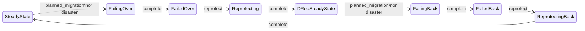

# DR Lifecycle & State Machine

Soteria manages the full disaster recovery lifecycle through an **8-phase
symmetric state machine** — four rest states where the system is idle, and four
transition states where an operation is in progress. This page documents every
state, every transition, the difference between planned migration and disaster
failover, and how partial failures are handled.

## State Machine Overview



The state machine is **symmetric**: failover and failback use the same
`FailoverHandler`, reprotect and restore use the same `ReprotectHandler`.
Direction is encoded in the phase names, not in handler logic.

## The Four Rest States

Rest states represent stable system positions where no DR operation is running.
Only rest states are persisted in `DRPlan.Status.Phase`.

| Rest State | Workloads Run On | Replication Direction | Description |
|---|---|---|---|
| **SteadyState** | Primary site | Primary → Secondary | Normal operations. VMs run on the primary site with replication protecting data to the secondary. |
| **FailedOver** | Secondary site | None (unprotected) | After failover completes. VMs are running on the secondary site but replication has not been re-established. |
| **DRedSteadyState** | Secondary site | Secondary → Primary | After re-protect completes. VMs run on the secondary site with reverse replication protecting data back to the primary. |
| **FailedBack** | Primary site | None (unprotected) | After failback completes. VMs are running on the primary site again but replication has not been re-established. |

!!! warning "Unprotected States"
    **FailedOver** and **FailedBack** are unprotected — no replication is active.
    Always run re-protect (or restore) promptly after failover (or failback) to
    re-establish replication.

## The Four Transitions

Transition states are **never persisted** in `DRPlan.Status.Phase`. They are
derived at runtime by `EffectivePhase(restPhase, activeExecMode)` from the
combination of the current rest phase and the active `DRExecution`'s mode.

| Transition | From → To | Execution Mode | Handler |
|---|---|---|---|
| **FailingOver** | SteadyState → FailedOver | `planned_migration` or `disaster` | `FailoverHandler` |
| **Reprotecting** | FailedOver → DRedSteadyState | `reprotect` | `ReprotectHandler` |
| **FailingBack** | DRedSteadyState → FailedBack | `planned_migration` or `disaster` | `FailoverHandler` |
| **ReprotectingBack** | FailedBack → SteadyState | `reprotect` | `ReprotectHandler` |

### The Full Cycle

A complete DR round-trip traverses all eight phases:

```
SteadyState → FailingOver → FailedOver → Reprotecting
→ DRedSteadyState → FailingBack → FailedBack → ReprotectingBack
→ SteadyState
```

After completing the full cycle, the system returns to its original state with
workloads on the primary site and replication flowing primary → secondary.

## Execution Modes

Soteria supports three execution modes, specified at runtime on the
`DRExecution` resource (not on the `DRPlan`):

| Mode | When to Use | Step 0 | Per-Group Path | RPO |
|---|---|---|---|---|
| `planned_migration` | Both sites available, zero data loss required | Stop VMs + demote source | SetSource → StartVM | Zero (graceful) |
| `disaster` | Primary site unavailable | No-op (site unreachable) | SetSource → StartVM | Last sync point |
| `reprotect` | After failover/failback, re-establish replication | N/A | State verification → health monitoring | N/A |

## Planned Migration vs. Disaster Failover

Both planned migration and disaster failover use the **same `FailoverHandler`**,
parameterized by `FailoverConfig{GracefulShutdown}`. The controller maps the
execution mode to the config:

- `planned_migration` → `FailoverConfig{GracefulShutdown: true}`
- `disaster` → `FailoverConfig{GracefulShutdown: false}`

### Planned Migration (GracefulShutdown=true)

Planned migration ensures **zero data loss** by gracefully shutting down
workloads on the source site before promoting volumes on the target.

#### Step 0 — Global Pre-Execution

Step 0 runs once, before any wave begins. It affects all VMs in the plan:

1. **Stop all origin VMs in reverse wave order.** Dependants stop before
   dependencies (e.g., webservers stop first, database stops last). This
   ensures higher-tier services can drain before losing the backing data
   store.

2. **Call `StopReplication` on each source volume group** to demote the
   primary to secondary (read-only). The storage backend's replication daemon
   (e.g., rbd-mirror) automatically syncs the demotion snapshot to the
   target site.

3. **Wait for VR/VGR confirmation.** The reconciler waits for
   `VolumeReplication` resources to confirm `role=Target` (state=Secondary)
   on the target site before signalling `DemotionComplete` and allowing
   promotion. This wait is event-driven (via VR watch), not polling, with a
   configurable timeout (`DRPlanSpec.ResyncTimeout`, default 10 minutes).

#### Per-Group Execution

After Step 0 completes globally, the target site processes each wave
sequentially:

1. **`SetSource`** — Promote the target volume group to primary (writable).
2. **`StartVM`** — Start the VM on the target site.

Wave N+1 begins only after all VMs in wave N reach the Running state
(configurable timeout via `DRPlanSpec.VMReadyTimeout`, default 5 minutes).

### Disaster Failover (GracefulShutdown=false)

Disaster failover assumes the **primary site is unreachable**. There is no
Step 0 — the origin VMs cannot be stopped and source volumes cannot be
gracefully demoted.

#### Step 0 — No-Op

`PreExecute` returns immediately. No VM stops, no `StopReplication` calls.

#### Per-Group Execution

The target site runs the same per-group path as planned migration:

1. **`SetSource`** — Force-promote the target volume group to primary. The
   storage driver handles the unreachable peer internally (e.g., force
   promotion in rbd-mirror).
2. **`StartVM`** — Start the VM on the target site.

!!! info "RPO Impact"
    Disaster failover recovers to the **last successful replication sync
    point**. Any writes on the primary site after the last sync are lost.
    The orchestrator does not track or enforce RPO targets — RPO is
    determined by the storage replication configuration.

### Side-by-Side Comparison

| Aspect | Planned Migration | Disaster Failover |
|---|---|---|
| Step 0 | Stop VMs (reverse wave order) + `StopReplication` | No-op |
| Data loss | Zero (graceful demotion + sync) | Up to last sync point |
| Source site | Must be available | Assumed unreachable |
| Per-group path | `SetSource` → `StartVM` | `SetSource` → `StartVM` |
| Handler | `FailoverHandler{GracefulShutdown: true}` | `FailoverHandler{GracefulShutdown: false}` |

## Re-Protect and Restore

Re-protect and restore are **storage-only** operations — they change volume
replication roles without moving workloads. No VM stop or start occurs.

| Operation | Transition | Purpose |
|---|---|---|
| **Re-protect** | FailedOver → Reprotecting → DRedSteadyState | Establish reverse replication (secondary → primary) |
| **Restore** | FailedBack → ReprotectingBack → SteadyState | Restore original replication (primary → secondary) |

Both use the same `ReprotectHandler` with a **two-sided design**:

### Active Site (Owner)

The site where workloads are currently running executes the `ReprotectHandler`:

1. **Phase 1 — State Verification:** For each volume group, read the current
   replication role via `GetReplicationStatus`. Both `RoleSource` (primary,
   legitimate on the active site) and `RoleTarget` (secondary) pass
   verification. The Owner site does **not** demote or resync its own volumes.

2. **Phase 2 — Health Monitoring:** Poll `GetReplicationStatus` at
   configurable intervals until all volume groups report `HealthHealthy` or
   the timeout expires (default 24 hours). Timeout results in
   `PartiallySucceeded` — replication is active but not yet fully synced.

### Passive Site

The site where workloads are **not** running handles cleanup via
`reconcileReprotectPassive` in the DRExecution reconciler:

- **Demotes stale primaries** by calling `StopReplication` (transitions volume
  from primary to secondary).
- **Verifies** volumes reach secondary state with healthy replication.

This two-sided design is necessary because after a disaster failover, the
surviving site's volumes may still believe they are primary. The passive site
corrects this.

## Fail-Forward Error Model

Soteria uses a **fail-forward** strategy — rollback is impossible when the
active datacenter may be down. When a DRGroup fails during execution, the
engine does **not** halt. Instead:

1. The failed group is marked `Failed` in the DRExecution status with
   structured error details (`GroupError` — step name + affected resource).
2. Execution continues with remaining groups in the current wave and
   subsequent waves.
3. The overall execution result is computed from individual group outcomes:

| Outcome | Condition |
|---|---|
| **Succeeded** | All DRGroups completed successfully |
| **PartiallySucceeded** | Some groups completed, some failed |
| **Failed** | No groups completed successfully |

### Phase Advancement on Failure

- **Succeeded** or **PartiallySucceeded**: `CompleteTransition` advances the
  DRPlan to the next rest state. Even partial success advances the lifecycle
  because some workloads are now running on the target site.
- **Failed**: The DRPlan stays in its transition phase (e.g., `FailingOver`).
  Manual intervention is required.

### Retrying Failed Groups

After a `PartiallySucceeded` execution, operators can retry failed DRGroups by
annotating the DRExecution:

```yaml
metadata:
  annotations:
    soteria.io/retry-groups: "group-name-1,group-name-2"
    # or: soteria.io/retry-groups: "all-failed"
```

Retry preconditions:

- Execution result must be `PartiallySucceeded`
- No retry already in progress (no `InProgress` groups)
- All VMs in retry groups must pass health validation (VM exists, not
  migrating, not paused)

Retry uses the same handler and driver as the original execution.
`CompleteTransition` is **not** called during retry — the plan phase was
already advanced during the initial execution.

## Checkpointing and Resume

### Per-DRGroup Checkpointing

After each DRGroup completes (success or failure), the executor writes the
group status and checkpoint as a single atomic status update. This ensures:

- **At most one in-flight DRGroup can be lost on crash.** The last group whose
  merged status+checkpoint write completed is the recovery point.
- **Sequential chunk execution** guarantees only one chunk writes to the
  DRExecution at any time.

### Execution Resume on Restart

When the controller restarts, it detects in-progress executions and uses
`ResumeAnalyzer` to determine the resume point:

1. Walk `Status.Waves[]` to find the first wave with non-terminal groups.
2. Groups with `Result == InProgress` (crashed mid-execution) are reset to
   `Pending` and retried — all driver operations are idempotent.
3. Completed and Failed groups are skipped.
4. Execution continues from the resume wave.

### Leader Election

Leader election gates only the workflow engine reconciliation. All replicas
continue serving API requests. On leader failure, the standby acquires the
lease and picks up in-progress executions via checkpoint resume.

## Site-Aware Reconciliation

In a multi-site deployment, each Soteria instance is configured with
`--site-name`. The reconcile role is determined by
`ReconcileRole(phase, mode, localSite, primary, secondary)`:

| Role | Responsibilities |
|---|---|
| **Owner** | Runs the full execution workflow (Step 0 and/or per-group waves) |
| **Step0Only** | Runs only Step 0 (source site in planned migration) |
| **None** | Skips reconciliation (not this site's responsibility) |

In planned migration, the source site runs Step 0 (stop VMs, demote
volumes), and the target site runs the per-group waves (promote, start VMs).
In disaster mode, the source site exits immediately (it may be unreachable);
the target site runs everything.

## Code References

The state machine and execution engine are implemented in the following
packages:

| File | Purpose |
|---|---|
| `pkg/engine/statemachine.go` | `Transition()`, `CompleteTransition()`, `EffectivePhase()` — pure state machine functions |
| `pkg/engine/failover.go` | `FailoverHandler` — unified handler for failover and failback |
| `pkg/engine/reprotect.go` | `ReprotectHandler` — storage-only re-protect and restore |
| `pkg/engine/executor.go` | Wave executor, fail-forward logic, checkpointing |
| `pkg/engine/resume.go` | Execution state reconstruction on restart |
| `pkg/apis/soteria.io/v1alpha1/types.go` | Phase constants, `ExecutionMode`, `ExecutionResult` |
