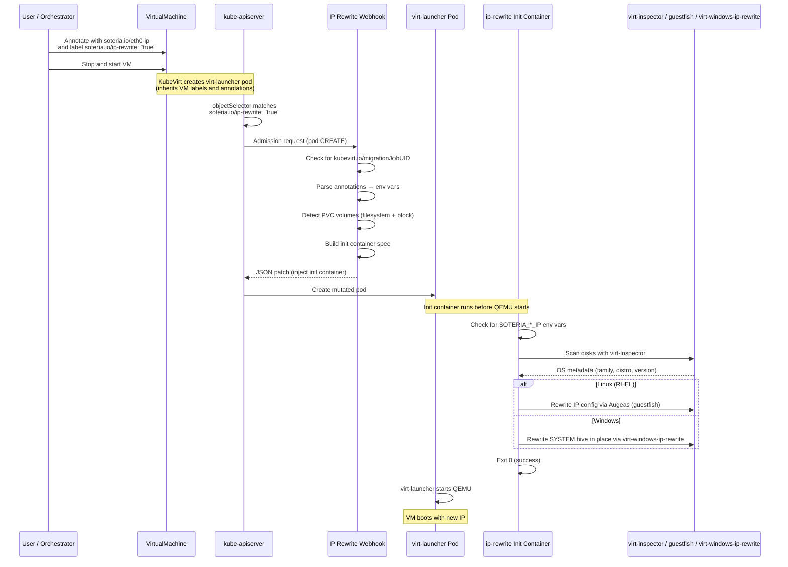

# IP Rewrite Architecture

The IP rewrite feature is a **standalone add-on** that reconfigures guest
network settings on VM disks before the VM boots. It works by intercepting
virt-launcher pod creation with a mutating admission webhook and injecting an
init container that edits the guest filesystem offline using
[libguestfs](https://libguestfs.org/) tools.

This feature has **no dependency on Soteria CRDs** (DRPlan, DRExecution). It
operates entirely through Kubernetes labels and annotations on VM resources,
making it usable with any orchestration tool — `kubectl`, ArgoCD, Ansible, or
Soteria's own DRExecution workflow.

**Use cases:**

- Disaster recovery IP reconfiguration after failover to a different subnet
- Planned migration to a new network segment
- Lab or staging environment cloning with different IPs

## Annotation and Label Contract

The IP rewrite feature is activated by a **label** and configured through
**annotations** on VirtualMachine resources. KubeVirt propagates VM metadata
labels and annotations down to the virt-launcher pod, where the webhook
intercepts them.

### Label (Opt-In and Webhook Filter)

The opt-in label must be placed on the VM's **pod template** so that KubeVirt
stamps it onto the virt-launcher pod:

```yaml
spec:
  template:
    metadata:
      labels:
        soteria.io/ip-rewrite: "true"
```

This label serves two purposes:

1. **Webhook filtering** — The `MutatingWebhookConfiguration` uses an
   `objectSelector` with this label. The Kubernetes API server only sends
   admission requests for pods that carry this label, so the webhook is never
   invoked for unlabeled pods.
2. **Opt-in signal** — Setting this label explicitly opts the VM into IP
   rewriting.

### Annotations (IP Configuration)

IP annotations go on the VM's **pod template** at
`spec.template.metadata.annotations`. KubeVirt copies
`spec.template.metadata` onto the VMI → virt-launcher pod; the webhook reads
these annotations from `pod.Annotations`.

Each annotation configures a single network interface:

```yaml
spec:
  template:
    metadata:
      annotations:
        soteria.io/<interface>-ip: "<address>/<prefix>;<gateway>"
```

- `<interface>` — the guest network interface name (e.g., `eth0`, `eth1`).
  On Windows this is a label only; adapters are matched by existing static
  IP or subnet, not by this name.
- `<address>/<prefix>` — the desired static IP and CIDR prefix length
- `<gateway>` — the default gateway for that interface

### DNS Annotation (Optional)

```yaml
spec:
  template:
    metadata:
      annotations:
        soteria.io/dns: "<server1>,<server2>"
```

When present, DNS servers are applied to all interfaces. When absent, DNS
configuration is left untouched on the guest.

### Examples

=== "Single-NIC"

    ```yaml
    apiVersion: kubevirt.io/v1
    kind: VirtualMachine
    metadata:
      name: my-vm
    spec:
      template:
        metadata:
          labels:
            soteria.io/ip-rewrite: "true"
          annotations:
            soteria.io/eth0-ip: "10.0.2.100/24;10.0.2.1"
    ```

=== "Multi-NIC"

    ```yaml
    apiVersion: kubevirt.io/v1
    kind: VirtualMachine
    metadata:
      name: my-vm
    spec:
      template:
        metadata:
          labels:
            soteria.io/ip-rewrite: "true"
          annotations:
            soteria.io/eth0-ip: "10.0.2.100/24;10.0.2.1"
            soteria.io/eth1-ip: "192.168.1.50/16;192.168.1.1"
    ```

=== "With DNS"

    ```yaml
    apiVersion: kubevirt.io/v1
    kind: VirtualMachine
    metadata:
      name: my-vm
    spec:
      template:
        metadata:
          labels:
            soteria.io/ip-rewrite: "true"
          annotations:
            soteria.io/eth0-ip: "10.0.2.100/24;10.0.2.1"
            soteria.io/eth1-ip: "192.168.1.50/16;192.168.1.1"
            soteria.io/dns: "10.0.2.10,10.0.2.11"
    ```

## How It Works

### Sequence Diagram

The following diagram shows the full flow from VM annotation to VM boot with
the new IP address:



### Webhook Interception

The IP rewrite webhook is a standalone Go binary (`cmd/ip-rewrite-webhook`)
that runs as a Deployment in the cluster, separate from the main Soteria
controller-manager.

**Admission flow:**

1. The `MutatingWebhookConfiguration` registers for `pods` `CREATE`
   operations with an `objectSelector` matching
   `soteria.io/ip-rewrite: "true"`.
2. The Kubernetes API server evaluates the label selector *before* sending
   the admission request — pods without the label never reach the webhook.
3. The webhook handler at `/mutate-v1-pod` (port 9443) processes the request.
4. The handler transforms annotations into environment variables for the init
   container: `soteria.io/eth0-ip` becomes `SOTERIA_ETH0_IP`,
   `soteria.io/dns` becomes `SOTERIA_DNS`.
5. The handler identifies all PVC-backed volumes in the pod spec and creates
   corresponding volume mounts at `/disks/<volumeName>` for filesystem-mode
   PVCs, and volume devices at `/disks/<volumeName>` for block-mode PVCs.
6. The init container is prepended before all existing init containers so it
   runs first, before QEMU starts.
7. The handler returns a JSON patch that adds the init container to the pod
   spec.

**Init container spec highlights:**

- **Image:** Helm `initContainer.image.repository` + `initContainer.image.tag`
  (default: `quay.io/raffaelespazzoli/soteria-ip-rewrite:<appVersion>`). The
  chart passes `--init-container-image` and `--init-container-pull-policy`
  to the webhook, which injects that image into virt-launcher pods with
  `imagePullPolicy` from `initContainer.image.pullPolicy` (default
  `IfNotPresent`).
- **KVM:** When `initContainer.requestKVMDevice` is `true` (default), the
  webhook requests `devices.kubevirt.io/kvm: 1` so libguestfs can use
  hardware virtualization. Set it to `false` on nodes without `/dev/kvm`
  (nested virt unavailable); libguestfs then uses TCG software emulation.
- **Security context:** Runs as the `qemu` user (`runAsUser: 107`,
  `runAsNonRoot: true`) with `allowPrivilegeEscalation: false` and all
  capabilities dropped — the libguestfs appliance runs inside a user-mode
  QEMU VM, so no elevated container capabilities are needed
- **Volume mounts:** Filesystem-mode PVC volumes are mounted under `/disks/`;
  block-mode PVC volumes are exposed as device nodes under `/disks/`

### Fail-Open Policy

The webhook is configured with `failurePolicy: Ignore`. If the webhook server
is unavailable (scaled to zero, crashed, network partition), the Kubernetes
API server admits the pod **unmodified** — the VM starts without IP
rewriting.

!!! warning "Fail-open means no IP rewrite on webhook failure"
    When the webhook is down, VMs start with their existing IP
    configuration. This is a deliberate design choice: VM availability is
    prioritized over IP correctness. Monitor webhook health to detect
    this condition.

### OS Detection

After the init container starts, the entrypoint performs OS detection:

1. **Environment variable check** — If no `SOTERIA_*_IP` variables are set,
   the script exits immediately with code 0 (no-op). The virt-launcher
   proceeds normally.

2. **Disk scanning** — The entrypoint iterates over disk images and block
   devices under `/disks/`, running
   `virt-inspector --xml --no-applications --no-icon -a <disk>` on each
   candidate. `virt-inspector` uses the libguestfs appliance to analyze the
   disk and returns XML metadata about the operating system.

3. **Boot disk identification** — A disk with an `<operatingsystem>` element
   in the virt-inspector output is a boot disk candidate. Data disks (no OS)
   are logged and skipped. When multiple disks contain an OS, the volume
   named `rootdisk` is preferred; otherwise the first candidate
   alphabetically is selected.

4. **OS family and version extraction** — The entrypoint extracts the OS
   family (`linux` or `windows`), distribution (`rhel`, `windows`), and
   major/minor version from the XML output using `xmllint --xpath`.

5. **Dispatch** — Based on the detected OS:
    - **RHEL** — version-gated to major versions 7–10; other RHEL versions
      are rejected
    - **Windows** — dispatched by OS family (`windows`) with no version
      gate. Server 2016–2025 and Windows 11 are the tested
      and supported matrix
    - **Unsupported OS** → exits with a non-zero code listing supported
      operating systems

!!! note "LIBGUESTFS_BACKEND=direct"
    The image bakes in `LIBGUESTFS_BACKEND=direct` and
    `LIBGUESTFS_PATH=/guestfs-appliance`. The webhook injects the same
    variables on the init container. Direct backend means user-mode QEMU
    without libvirtd; the pre-built appliance avoids running supermin at
    pod start.

### Linux IP Rewrite (Augeas)

For RHEL guests, the handler uses [Augeas](https://augeas.net/) via
`guestfish` to edit network configuration files on the guest filesystem. The
specific file format depends on the RHEL version:

| RHEL Version | Config Format | Config Path | Augeas Lens |
|---|---|---|---|
| RHEL 7 | `ifcfg-*` | `/etc/sysconfig/network-scripts/ifcfg-<iface>` | `Shellvars.lns` |
| RHEL 8 | `ifcfg-*` or NM keyfile | Auto-detected: NM keyfile preferred, `ifcfg` fallback | `Shellvars.lns` or `NetworkManager.lns` |
| RHEL 9 | NM keyfile | `/etc/NetworkManager/system-connections/<conn>.nmconnection` | `NetworkManager.lns` |
| RHEL 10 | NM keyfile | `/etc/NetworkManager/system-connections/<conn>.nmconnection` | `NetworkManager.lns` |

**How it works:**

1. The handler mounts the guest filesystem read-only to detect which network
   configuration format is in use (NM keyfile, then `ifcfg` by `DEVICE`,
   then `ifcfg-<iface>` filename).
2. Existing `ifcfg` interfaces with `BOOTPROTO=dhcp` (or `bootp`) are
   refused — DHCP-to-static conversion is not supported on RHEL.
3. It remounts read-write and uses `guestfish aug-set` commands (via the
   appropriate Augeas lens) to update IP address, prefix length, gateway, and
   optionally DNS servers.
4. If RHEL 8+ has **no** on-disk network config for the interface (typical
   of cloud-init guests that only generate connections under `/run`), the
   handler writes a new NetworkManager keyfile.
5. The handler supports multiple interfaces — each `SOTERIA_*_IP` variable
   maps to a guest interface configuration file.

### Windows IP Rewrite (hivex)

For Windows guests, the handler uses
[hivex](https://libguestfs.org/hivex.3.html) to edit the Windows registry
hive offline. Network configuration in Windows is stored in the SYSTEM
registry hive.

**Registry path:**

```
HKLM\SYSTEM\<ControlSet>\Services\Tcpip\Parameters\Interfaces\<AdapterGUID>
```

**How it works:**

Windows NTFS is often dirty after a crash or force-stop, and RHEL libguestfs
refuses to mount NTFS unless the program name starts with `virt-`
(RHBZ#1240276). The handler therefore runs as `virt-windows-ip-rewrite` and
edits the hive **in the appliance** — the SYSTEM hive is never downloaded
or uploaded:

1. `ntfsfix` the Windows root device, then mount it read-write
   (`remove_hiberfile`).
2. Resolve the SYSTEM hive path with `case_sensitive_path` (virt-inspector
   often leaves `windows_system_hive` empty).
3. Open the hive writable (`hivex_open(..., write=True)`), determine the
   active `ControlSet` from inspector metadata or `Select\Current`, and
   enumerate adapter GUIDs under
   `ControlSet<N>\Services\Tcpip\Parameters\Interfaces\`.
4. Match the target adapter: a single-NIC guest prefers the existing static
   adapter, or converts the first DHCP adapter to static if none is static;
   multi-NIC guests match by subnet, then the first unused GUID.
5. Write `EnableDHCP`, `IPAddress`, `SubnetMask`, `DefaultGateway`, and
   optional `NameServer` with `hivex_node_set_value` (Python guestfs, so
   REG_DWORD / UTF-16LE REG_MULTI_SZ payloads can contain NUL bytes that
   guestfish cannot pass on its command line).
6. Commit to a sibling file, replace the hive, and truncate `SYSTEM.LOG*`.

**Registry value types used:**

| Value | Type | Description |
|---|---|---|
| `IPAddress` | `REG_MULTI_SZ` | Static IP address(es) |
| `SubnetMask` | `REG_MULTI_SZ` | Subnet mask(s) corresponding to IP addresses |
| `DefaultGateway` | `REG_MULTI_SZ` | Default gateway address(es) |
| `NameServer` | `REG_SZ` | Comma-separated DNS server addresses |
| `EnableDHCP` | `REG_DWORD` | Set to `0` to disable DHCP (static config) |

### Migration Detection

The webhook checks for the `kubevirt.io/migrationJobUID` label on incoming
pods. This label is set by KubeVirt on pods created during live migration.

When this label is detected, the webhook returns an `Allowed` response
immediately — no init container is injected. This is critical because:

- Migration pods run a *target* virt-launcher that takes over the running VM
  from the source virt-launcher
- Modifying the disk during migration would corrupt the running VM's
  filesystem
- The IP is already correct on the running VM — only the initial boot needs
  rewriting

## Components

| Component | Location | Description |
|---|---|---|
| **Webhook Server** | `cmd/ip-rewrite-webhook` | Standalone Go binary serving the mutating admission webhook on port 9443. Configured via flags (`--init-container-image`, `--init-container-pull-policy`, `--request-kvm-device`, `--cert-dir`). |
| **Webhook Handler** | `internal/webhook/iprewrite` | Core admission logic: annotation parsing, migration detection, init container construction, JSON patch generation. |
| **Init Container Image** | `build/ip-rewrite/Containerfile` | CentOS Stream 9-based image containing `guestfs-tools`, `augeas`, `hivex`, `python3-libguestfs`, `perl-hivex`, and `libguestfs-winsupport`. |
| **MWC Manifest** | `config/ip-rewrite-webhook` | Reference `MutatingWebhookConfiguration` with `objectSelector`, `failurePolicy: Ignore`, and cert-manager CA injection annotation. |

## Supported Guest Operating Systems

| OS | Versions | Architecture | Config Method | Config Path |
|---|---|---|---|---|
| RHEL 7 | 7.x | x86_64 | `ifcfg-*` via Augeas | `/etc/sysconfig/network-scripts/ifcfg-<iface>` |
| RHEL 8 | 8.x | x86_64 | `ifcfg-*` or NM keyfile via Augeas | Auto-detected: NM keyfile preferred, `ifcfg` fallback |
| RHEL 9 | 9.x | x86_64 | NM keyfile via Augeas | `/etc/NetworkManager/system-connections/<conn>.nmconnection` |
| RHEL 10 | 10.x | x86_64 | NM keyfile via Augeas | `/etc/NetworkManager/system-connections/<conn>.nmconnection` |
| Windows Server 2016 | — | x86_64 | Registry hive via hivex | `<systemroot>\system32\config\system` |
| Windows Server 2019 | — | x86_64 | Registry hive via hivex | `<systemroot>\system32\config\system` |
| Windows Server 2022 | — | x86_64 | Registry hive via hivex | `<systemroot>\system32\config\system` |
| Windows Server 2025 | — | x86_64 | Registry hive via hivex | `<systemroot>\system32\config\system` |
| Windows 11 | — | x86_64 | Registry hive via hivex | `<systemroot>\system32\config\system` |

## Known Limitations

- **IPv6** — Not supported. Only IPv4 addresses are handled.
- **DHCP-to-static (RHEL)** — Not supported when an `ifcfg` interface is
  already DHCP. RHEL 8+ guests with no on-disk network config get a new
  NetworkManager keyfile instead.
- **DHCP-to-static (Windows)** — A single-NIC guest with only a DHCP adapter
  is converted to static. Multi-NIC matching prefers an existing static
  adapter or a subnet match.
- **Hostname rewrite** — Not supported. Only IP, gateway, and DNS are
  modified.
- **BitLocker / encrypted disks** — Encrypted Windows volumes cannot be
  inspected or rewritten. Decrypt the OS disk in the guest before failover.
- **Guest architecture** — The supported guest OS matrix is x86_64. The
  init-container and webhook images are multi-architecture (`linux/amd64`,
  `linux/arm64`, `linux/ppc64le`) so they can run on those node
  architectures. ARM Windows guests are not certified by OpenShift
  Virtualization and are untested.
- **Non-RHEL Linux** — Distributions such as Ubuntu, Fedora, or SUSE are not
  supported. Only RHEL 7–10 is handled on the Linux side.
