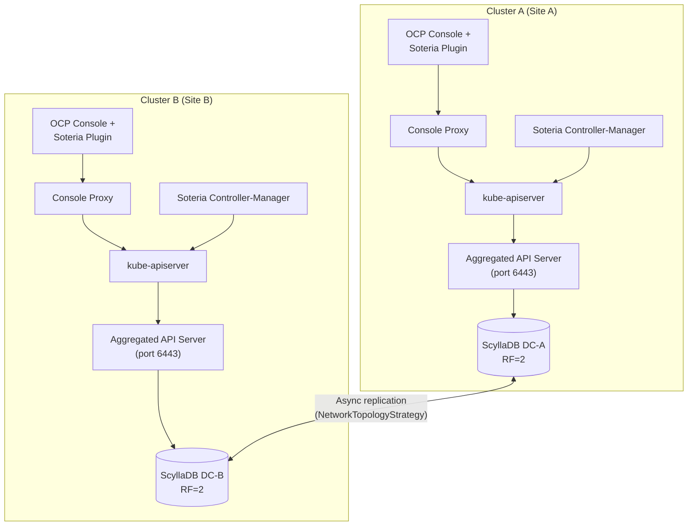
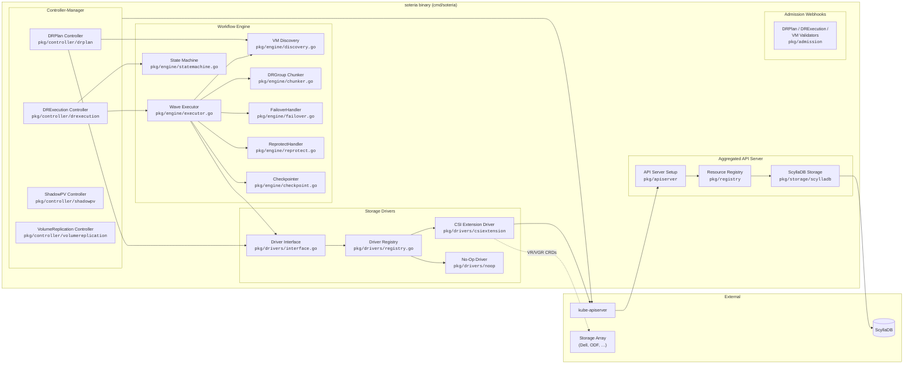
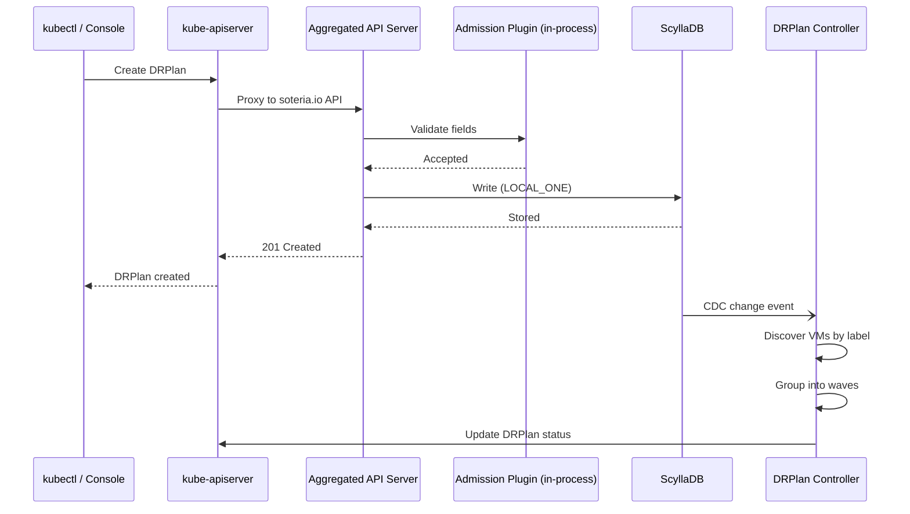
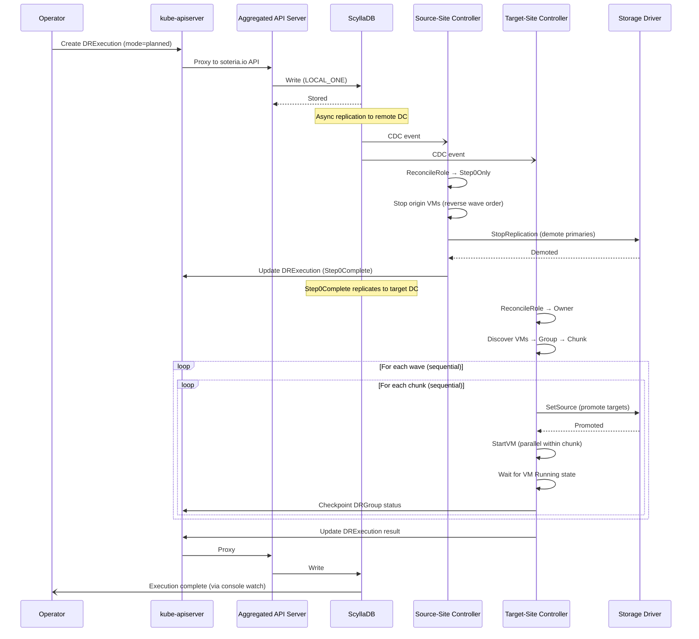
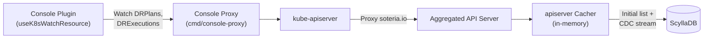

# Architecture Overview

Soteria is a Kubernetes-native disaster recovery (DR) orchestrator for
OpenShift Virtualization. It coordinates volume replication and VM lifecycle
across two OpenShift clusters, giving platform engineers a single control
plane for planned migrations and disaster failovers.

This page describes the two-cluster topology, the components that make up
Soteria, how they connect, and the data flow during DR operations.

## Two-Cluster Topology

Soteria follows a **symmetric two-cluster** design. Each cluster runs an
identical Soteria deployment: a controller-manager, an aggregated API server,
and a ScyllaDB datacenter. There is no "primary controller" or "secondary
controller" — site roles are determined per-operation by the DRPlan's
`primarySite` / `secondarySite` fields and the current lifecycle phase.



**Key properties of this topology:**

- **No direct controller-to-controller communication.** Cross-cluster
  coordination happens exclusively through ScyllaDB async replication.
  Each controller reads and writes locally (LOCAL_ONE consistency) with no
  cross-datacenter latency on the critical path.
- **Symmetric deployment.** Both clusters run the same binary
  (`cmd/soteria/main.go`) with a `--site-name` flag that identifies the
  local site. The controller computes its reconcile role (Owner, Step0Only,
  or None) dynamically for each operation based on the plan's sites and the
  current DR phase.
- **Survives single-DC failure.** When one datacenter goes down, the
  surviving cluster continues to read existing plans and write new execution
  records. When the failed datacenter recovers, ScyllaDB automatically
  reconciles state.
- **Console shows identical data on both sites.** Because both clusters read
  from the same ScyllaDB state, the console plugin displays the same plan
  status and execution history regardless of which cluster it runs on.

## Component Diagram

The diagram below shows the major components within a single Soteria
deployment and how they interact.



## Component Responsibilities

Each component has a well-defined role within the architecture:

### Binaries

| Component | Package | Description |
|---|---|---|
| **Soteria** | `cmd/soteria` | Single binary that runs the controller-manager and aggregated API server in one process. Leader election gates workflow execution; all replicas serve API requests. |
| **Console Proxy** | `cmd/console-proxy` | Lightweight reverse proxy that serves the console plugin SPA and forwards `/api/k8s/` requests to the in-cluster kube-apiserver with injected service-account tokens. |

### Controllers

| Controller | Package | Description |
|---|---|---|
| **DRPlan** | `pkg/controller/drplan` | Reconciles DRPlan resources. Discovers VMs via `soteria.io/drplan` labels, groups them into waves, monitors replication health by polling `GetReplicationStatus`, and manages disk-level metadata enrichment. |
| **DRExecution** | `pkg/controller/drexecution` | Reconciles DRExecution resources. Computes the local site's reconcile role, delegates to the workflow engine's wave executor for failover/failback, and calls the reprotect handler for re-protection workflows. |
| **ShadowPV** | `pkg/controller/shadowpv` | Two sub-controllers (Publisher and Consumer) that mirror PersistentVolume metadata across clusters via ScyllaDB. The publisher writes local PV data; the consumer creates matching PVs on the remote site. |
| **VolumeReplication** | `pkg/controller/volumereplication` | Manages VolumeReplication (VR) and VolumeGroupReplication (VGR) custom resources that represent the CSI-level replication lifecycle. |

### Workflow Engine

| Component | Package | Description |
|---|---|---|
| **State Machine** | `pkg/engine/statemachine.go` | Defines the 8-phase DR lifecycle with 4 rest states and 4 transition states. Pure functions map `(currentPhase, executionMode)` to target phases. |
| **VM Discovery** | `pkg/engine/discovery.go` | Discovers VMs by label selector and partitions them into ordered waves based on the plan's `waveLabel`. |
| **DRGroup Chunker** | `pkg/engine/chunker.go` | Splits VolumeGroups within each wave into chunks respecting `maxConcurrentFailovers`. |
| **Wave Executor** | `pkg/engine/executor.go` | Orchestrates the full discover → group → chunk → execute pipeline. Runs waves sequentially; chunks within a wave also run sequentially; VMs within a chunk run in parallel. Uses fail-forward semantics. |
| **FailoverHandler** | `pkg/engine/failover.go` | Unified handler for both failover and failback. Parameterized by `GracefulShutdown`: planned migration stops VMs and demotes replication first (Step 0); disaster skips directly to `SetSource → StartVM`. |
| **ReprotectHandler** | `pkg/engine/reprotect.go` | Handles reprotect and restore workflows. Verifies VR roles, monitors replication health, and coordinates with the passive site's demotion of stale primaries. |
| **Checkpointer** | `pkg/engine/checkpoint.go` | Writes per-DRGroup checkpoints to the DRExecution status after each group completes. Enables crash-recovery resume from the last successful checkpoint. |
| **Resume Analyzer** | `pkg/engine/resume.go` | On startup, detects in-progress executions and determines the resume point by walking `Status.Waves[]` to find the first wave with non-terminal groups. |

### Aggregated API Server

| Component | Package | Description |
|---|---|---|
| **API Server** | `pkg/apiserver` | Registers the `soteria.io` API group with the kube-apiserver aggregation layer. Serves DRPlan, DRExecution, and ShadowPV resources backed by ScyllaDB instead of etcd. |
| **Resource Registry** | `pkg/registry` | Wires API resources to their storage backends and REST strategies (create/update/delete validation, defaulting, field selectors). |
| **ScyllaDB Storage** | `pkg/storage/scylladb` | Implements the Kubernetes `storage.Interface` using a generic key-value schema in ScyllaDB. Provides CDC-based Watch with an initial SELECT snapshot, and maps CDC Timeuuid timestamps to Kubernetes `resourceVersion` values. |

### Storage Drivers

| Component | Package | Description |
|---|---|---|
| **Driver Interface** | `pkg/drivers/interface.go` | Defines the 7-method `StorageProvider` contract: `CreateVolumeGroup`, `DeleteVolumeGroup`, `GetVolumeGroup`, `SetSource`, `StopReplication`, `ResyncVolume`, `GetReplicationStatus`. |
| **Driver Registry** | `pkg/drivers/registry.go` | Registers and looks up drivers at startup. The DRPlan declares which driver to use; the executor resolves it from the registry. |
| **CSI Extension** | `pkg/drivers/csiextension` | Production driver that manages VolumeReplication and VolumeGroupReplication CRDs. Works with any CSI driver that supports the replication sidecar (Dell PowerFlex, ODF, etc.). |
| **No-Op Driver** | `pkg/drivers/noop` | Stub driver for development, testing, and CI. Accepts all operations as successful without touching storage. |

### Other Components

| Component | Package | Description |
|---|---|---|
| **Admission Webhooks** | `pkg/admission` | Validates DRPlan fields (wave labels, concurrency settings), DRExecution state transitions, and VM-to-plan assignment consistency. DRPlan/DRExecution validation runs in-process via the aggregated API server admission plugin; VM validation uses the controller-runtime webhook server. |
| **Metrics** | `pkg/metrics` | Exposes Prometheus metrics with the `soteria_` prefix: plan VM counts, failover durations, checkpoint write stats, and replication health gauges. |
| **API Types** | `pkg/apis/soteria.io/v1alpha1` | CRD type definitions for DRPlan, DRExecution, and ShadowPV. Includes deepcopy generation, defaulting, and validation. |
| **IP Rewrite Webhook** | `cmd/ip-rewrite-webhook` | Standalone mutating webhook that injects an init container into virt-launcher pods for offline guest filesystem IP reconfiguration. Independent of Soteria CRDs. See [IP Rewrite Architecture](ip-rewrite.md). |

## Data Flow

### Creating a DRPlan

When an administrator creates a DRPlan (via `kubectl` or the console):



The aggregated API server's in-process admission plugin validates field
constraints (wave label, concurrency limits) before persisting the resource
to ScyllaDB. The DRPlan controller then discovers VMs matching
`soteria.io/drplan=<planName>` and populates status with wave membership and
replication health.

### Executing a Failover

When an operator triggers a failover:



**Key points about failover data flow:**

- **Step 0 (planned migration only):** The source site stops VMs and demotes
  volume replication. In disaster mode, Step 0 is skipped because the source
  site may be unreachable.
- **Site-aware execution:** Each controller computes its role from
  `ReconcileRole(phase, mode, localSite, primary, secondary)`. Only the
  target site runs per-group wave execution. This eliminates cross-site
  write contention on the DRExecution status.
- **Sequential waves, sequential chunks, parallel VMs:** Waves enforce
  application dependency ordering. Chunks enforce concurrency limits. VMs
  within a chunk run `SetSource` and `StartVM` in parallel.
- **Fail-forward:** A failed DRGroup is recorded but does not block
  subsequent chunks or waves. The execution result reflects partial success.
- **Checkpoint resume:** After each DRGroup completes, its status is written
  to the DRExecution. On crash recovery, the resume analyzer finds the last
  checkpoint and continues from there.

### Console Plugin Data Path

The console plugin reads DR state through the standard Kubernetes watch API:



The apiserver's built-in cacher maintains an in-memory copy of resources,
consuming a single CDC stream from ScyllaDB and fanning out watch events to
all connected clients. This delivers sub-second update latency to the console
without additional polling.

## Project Structure Mapping

The diagram components map to the repository layout as follows:

```
cmd/
├── soteria/main.go            # Single binary entry point
└── console-proxy/main.go      # Console proxy entry point

pkg/
├── apis/soteria.io/           # CRD type definitions (v1alpha1)
├── apiserver/                 # Aggregated API server setup
├── registry/                  # API resource → storage wiring
│   ├── drplan/                #   DRPlan REST strategy
│   ├── drexecution/           #   DRExecution REST strategy
│   └── shadowpv/              #   ShadowPV REST strategy
├── storage/scylladb/          # ScyllaDB storage.Interface (14 files)
├── controller/
│   ├── drplan/                # DRPlan reconciler
│   ├── drexecution/           # DRExecution reconciler
│   ├── shadowpv/              # ShadowPV publisher + consumer
│   └── volumereplication/     # VR/VGR lifecycle controller
├── engine/                    # Workflow engine (16+ files)
├── drivers/
│   ├── interface.go           # StorageProvider contract
│   ├── registry.go            # Driver registry
│   ├── csiextension/          # CSI replication driver
│   ├── noop/                  # No-op driver (dev/CI)
│   ├── fake/                  # Mock driver (unit tests)
│   └── conformance/           # Driver conformance suite
├── admission/                 # Admission webhooks
└── metrics/                   # Prometheus metrics

internal/
└── preflight/                 # Pre-flight safety checks

console-plugin/                  # OCP Console plugin (TypeScript, separate image)
```

## Cross-Cluster State Coordination

Soteria avoids direct controller-to-controller communication. Instead, it
relies on ScyllaDB's built-in async replication to propagate state:

- **ScyllaDB topology:** `NetworkTopologyStrategy` with RF=2 per datacenter
  (4 nodes total across 2 DCs).
- **Consistency:** `LOCAL_ONE` for reads and writes. Each site operates
  against its local ScyllaDB datacenter with no cross-DC latency.
- **Conflict resolution:** Last-write-wins for most fields; lightweight
  transactions (LWT) for critical state transitions like DR phase changes.
- **Change propagation:** The aggregated API server uses ScyllaDB CDC
  (Change Data Capture) streams for the Kubernetes Watch API. CDC Timeuuid
  timestamps are mapped to Kubernetes `resourceVersion` values, providing
  monotonic ordering within each datacenter.
- **Schema:** A generic key-value table `(api_group, resource_type,
  namespace, name) → blob` mirrors the etcd storage model. No CQL schema
  migrations are needed when API fields change.

This design means that during a datacenter failure, the surviving cluster
continues operating normally. When the failed datacenter recovers, ScyllaDB
automatically reconciles the diverged state.
