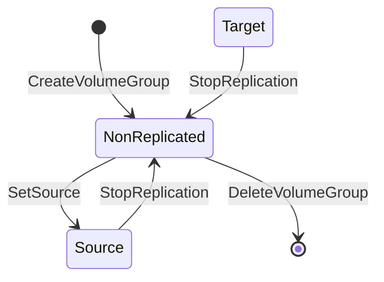

# Storage Drivers

Soteria abstracts storage-level replication behind the **StorageProvider** interface — a 7-method contract that every storage driver must implement. The orchestrator treats storage as a pluggable backend: the workflow engine calls interface methods without knowing whether the underlying storage is Dell PowerStore, Red Hat ODF, or a no-op stub for CI pipelines.

This page covers the interface contract, the replication model, driver lifecycle, the two built-in implementations, and the conformance test suite that all drivers must pass.

!!! info "Implementation Guide"
    This page is the **architecture overview**. For a step-by-step guide to writing a new driver, see [Writing Storage Drivers](../contributing/storage-drivers.md).

---

## StorageProvider Interface

The `StorageProvider` interface is defined in [`pkg/drivers/interface.go`](https://github.com/soteria-project/soteria/blob/main/pkg/drivers/interface.go). It consists of exactly **7 methods** that map to the volume group lifecycle and replication role transitions.

```go
type StorageProvider interface {
    CreateVolumeGroup(ctx context.Context, spec VolumeGroupSpec) (VolumeGroupInfo, error)
    DeleteVolumeGroup(ctx context.Context, id VolumeGroupID) error
    GetVolumeGroup(ctx context.Context, id VolumeGroupID) (VolumeGroupInfo, error)
    SetSource(ctx context.Context, id VolumeGroupID) error
    StopReplication(ctx context.Context, id VolumeGroupID) error
    ResyncVolume(ctx context.Context, id VolumeGroupID) error
    GetReplicationStatus(ctx context.Context, id VolumeGroupID) (ReplicationStatus, error)
}
```

### Method Reference

| Method | Parameters | Returns | Description |
|--------|-----------|---------|-------------|
| `CreateVolumeGroup` | `ctx context.Context`, `spec VolumeGroupSpec` | `VolumeGroupInfo, error` | Creates a volume group containing the specified PVCs. Idempotent: returns existing group info if a group with the same name and namespace already exists. |
| `DeleteVolumeGroup` | `ctx context.Context`, `id VolumeGroupID` | `error` | Removes a volume group and releases its resources. The underlying PVCs are not deleted — only the grouping is removed. Idempotent: returns `nil` if the group does not exist. |
| `GetVolumeGroup` | `ctx context.Context`, `id VolumeGroupID` | `VolumeGroupInfo, error` | Retrieves metadata for an existing volume group. Returns `ErrVolumeGroupNotFound` if not found. |
| `SetSource` | `ctx context.Context`, `id VolumeGroupID` | `error` | Transitions a volume group to the **Source** role (replication origin, read-write). Valid from `NonReplicated`; returns `ErrInvalidTransition` from `Target`. Idempotent: returns `nil` if already `Source`. |
| `StopReplication` | `ctx context.Context`, `id VolumeGroupID` | `error` | Transitions a volume group from `Source` or `Target` back to `NonReplicated`. Idempotent: returns `nil` if already `NonReplicated`. |
| `ResyncVolume` | `ctx context.Context`, `id VolumeGroupID` | `error` | Requests storage-layer data synchronization on the secondary site before a planned failover promotion. Does not change the engine's role model. Idempotent: returns `nil` if already in resync state. |
| `GetReplicationStatus` | `ctx context.Context`, `id VolumeGroupID` | `ReplicationStatus, error` | Returns the current replication role and health for a volume group. The engine polls this method to assess readiness before failover. |

### Error Contracts

Drivers must return typed sentinel errors defined in [`pkg/drivers/errors.go`](https://github.com/soteria-project/soteria/blob/main/pkg/drivers/errors.go) so the workflow engine can branch on error type via `errors.Is` without coupling to driver internals:

| Error | When Returned |
|-------|--------------|
| `ErrVolumeNotFound` | Operation on a volume that does not exist |
| `ErrVolumeGroupNotFound` | Any operation on a volume group ID that does not exist |
| `ErrReplicationNotReady` | Replication link not established or not healthy |
| `ErrInvalidTransition` | `SetSource` called when current role is `Target` |
| `ErrDriverNotFound` | Registry cannot find a driver for a provisioner name |

Drivers must never return raw error strings — always wrap with `fmt.Errorf("...: %w", sentinelErr)` or return the sentinel directly.

### Supporting Types

The interface uses several supporting types, all defined in [`pkg/drivers/types.go`](https://github.com/soteria-project/soteria/blob/main/pkg/drivers/types.go):

```go
// Opaque identifier assigned by the driver (e.g., CSI volume group handle)
type VolumeGroupID string

// Describes the desired volume group to create
type VolumeGroupSpec struct {
    Name      string
    Namespace string
    PVCNames  []string
    Labels    map[string]string
}

// Describes an existing volume group as returned by the driver
type VolumeGroupInfo struct {
    ID       VolumeGroupID
    Name     string
    PVCNames []string
}

// Reports current replication role and health
type ReplicationStatus struct {
    Role         VolumeRole
    Health       ReplicationHealth
    LastSyncTime *time.Time
}
```

### Idempotency Contract

All 7 methods must be **idempotent** — safe to retry after a crash or restart without side effects. Drivers act as reconcilers: they check the actual storage state before applying changes and return success if the desired state is already achieved.

| Method | Idempotency Behavior |
|--------|---------------------|
| `CreateVolumeGroup` | Returns existing group info if name+namespace match |
| `DeleteVolumeGroup` | Returns `nil` if group does not exist |
| `GetVolumeGroup` | Pure read — inherently idempotent |
| `SetSource` | Returns `nil` if already `Source` |
| `StopReplication` | Returns `nil` if already `NonReplicated` |
| `ResyncVolume` | Returns `nil` if already in resync state |
| `GetReplicationStatus` | Pure read — inherently idempotent |

All methods accept `context.Context` for cancellation and timeout propagation from the workflow engine. Drivers must respect context cancellation and return immediately when the context is done.

---

## Replication Model

The StorageProvider interface uses a **role-based replication model** with three volume roles and two engine-driven transitions.

### Volume Roles

| Role | Constant | Description |
|------|----------|-------------|
| **NonReplicated** | `RoleNonReplicated` | No active replication. Initial state after creation and intermediate state during role changes. |
| **Source** | `RoleSource` | Replication origin (primary). Volumes are read-write and data is replicated to the paired target. |
| **Target** | `RoleTarget` | Replication destination (secondary). Volumes are read-only and receive replicated data from the paired source. |

### Transition Rules

All role transitions pass through `NonReplicated` — there is no direct Source-to-Target or Target-to-Source path:



The engine drives exactly **two transitions**:

1. **NonReplicated → Source** via `SetSource` — promotes a volume group to replication origin
2. **Source → NonReplicated** (or **Target → NonReplicated**) via `StopReplication` — stops active replication

!!! warning "Target Role Is Never Set by the Engine"
    The `Target` role exists in `ReplicationStatus` — the paired site's driver may report its volumes as `Target` via `GetReplicationStatus`. However, the engine **never explicitly sets** a volume group to `Target`. When one site calls `SetSource`, the paired site implicitly becomes the target as an **admin precondition** — the driver assumes paired volumes are correctly configured on both storage instances before any replication method is called.

### ResyncVolume

`ResyncVolume` requests storage-layer data synchronization on the secondary site before a planned failover promotion. This is a **CSI-level concept** that does not change the engine's role model:

- The secondary's VR/VGR CRs transition through `Secondary → Resync → Secondary(Completed)` at the storage layer
- The engine waits for resync completion before proceeding with the promotion step (StopReplication → SetSource)
- This ensures zero data loss during planned migrations

### Replication Health

The `ReplicationHealth` type qualifies the health of an active replication link. Health is orthogonal to `VolumeRole`:

| Health | Constant | Description |
|--------|----------|-------------|
| **Healthy** | `HealthHealthy` | Replication is running and in sync |
| **Degraded** | `HealthDegraded` | Replication is running but falling behind |
| **Syncing** | `HealthSyncing` | Sync operation in progress (initial sync or catch-up) |
| **NotReplicating** | `HealthNotReplicating` | No active replication link (when role is `NonReplicated`) |
| **Unknown** | `HealthUnknown` | Driver cannot determine health (e.g., storage backend unreachable) |

---

## Driver Lifecycle

### Registration

Drivers register with the central registry using the `init()` + `RegisterDriver` pattern, following the same convention as `http.DefaultServeMux` and `prometheus.DefaultRegisterer`.

The registration flow:

1. Each driver package defines an `init()` function that calls `drivers.RegisterDriver(provisionerName, factory)`
2. The `pkg/drivers/all/` package provides a blank import aggregator that triggers all built-in driver registrations
3. The main binary imports `_ "github.com/soteria-project/soteria/pkg/drivers/all"` to activate all drivers at startup

```go
// pkg/drivers/noop/driver.go
func init() {
    shared := New()
    drivers.RegisterDriver(ProvisionerName, func() drivers.StorageProvider {
        return shared
    })
    drivers.SetFallbackDriver(func() drivers.StorageProvider {
        return shared
    })
}
```

The registry uses a **factory pattern** — `DriverFactory func() StorageProvider` — to defer resource allocation until a driver is actually needed. Registration panics on duplicate provisioner names (fail-fast at startup).

### Driver Selection

The workflow engine resolves the `StorageProvider` at execution time using the **plan-level declared driver name**, not runtime PVC inspection:

```go
driver, err := registry.GetDriver(plan.Spec.VolumeReplicationDriver.Type)
```

This design eliminates the `StorageClassLister` dependency and all runtime Kubernetes API calls for driver resolution during execution. The registry also supports PVC-based resolution via `GetDriverForPVC` for use cases that need to resolve PVC → StorageClass → provisioner → driver.

### Fallback Driver

The registry supports a **fallback driver** via `SetFallbackDriver`. When `GetDriver` cannot find an explicitly registered driver for a provisioner name, it returns the fallback instead of `ErrDriverNotFound`. The no-op driver registers itself as the fallback, enabling full dev/CI workflows without storage infrastructure.

### Registry API

The `Registry` type in [`pkg/drivers/registry.go`](https://github.com/soteria-project/soteria/blob/main/pkg/drivers/registry.go) is safe for concurrent use via `sync.RWMutex`:

| Method | Description |
|--------|-------------|
| `RegisterDriver(provisionerName, factory)` | Associate a provisioner name with a driver factory |
| `SetFallbackDriver(factory)` | Set the fallback factory for unregistered provisioners |
| `GetDriver(provisionerName)` | Return a `StorageProvider` for the given provisioner |
| `GetDriverForPVC(ctx, storageClassName, scLister)` | Resolve PVC → StorageClass → provisioner → driver |
| `ListRegistered()` | Return sorted list of registered provisioner names |

A process-wide `DefaultRegistry` instance provides package-level convenience functions (`drivers.RegisterDriver`, `drivers.GetDriver`, etc.).

---

## Reference Implementations

### No-Op Driver

The **no-op driver** ([`pkg/drivers/noop/`](https://github.com/soteria-project/soteria/tree/main/pkg/drivers/noop)) is the reference implementation that fulfils the full 7-method interface without performing actual storage operations. It tracks volume groups and replication roles **in memory** using a `sync.RWMutex`-protected map.

**Package structure:**

| File | Purpose |
|------|---------|
| `driver.go` | `StorageProvider` implementation + `init()` registration |
| `driver_test.go` | Unit tests for all 7 methods |
| `registration_test.go` | Verifies init() registration in `DefaultRegistry` |
| `doc.go` | Package documentation |

**Key characteristics:**

- **Provisioner name:** `noop.soteria.io` (also registered as `noop` for plan-level use)
- **Fallback driver:** Registered via `SetFallbackDriver` — any unrecognized provisioner falls through to noop
- **Shared instance:** The registry reuses a single in-memory driver instance so volume groups created on one lookup are visible to later read-only lookups in the same process
- **State is ephemeral:** All state is lost on process restart (by design — no persistent backend)
- **Thread-safe:** All methods use `sync.RWMutex` for concurrent access

**Primary uses:**

- Local development without storage infrastructure (`make dev-cluster`)
- CI pipeline testing of workflow engine logic in isolation
- Reference implementation for external driver authors

### CSI Extension Driver

The **CSI extension driver** ([`pkg/drivers/csiextension/`](https://github.com/soteria-project/soteria/tree/main/pkg/drivers/csiextension)) is the production implementation that manages volume replication through **CSI Addons** VolumeReplication (VR) and VolumeGroupReplication (VGR) Kubernetes CRDs. A csi-addons sidecar container reconciles these CRDs into actual storage-level replication operations.

**Package structure:**

| File | Purpose |
|------|---------|
| `driver.go` | `StorageProvider` implementation (CreateVolumeGroup, DeleteVolumeGroup, GetVolumeGroup, SetSource, StopReplication, ResyncVolume, GetReplicationStatus) |
| `status.go` | VR/VGR status → `ReplicationStatus` mapping (role, health, sync time) |
| `helpers.go` | CR lookup, replication state updates with retry-on-conflict |
| `volumehandle.go` | Volume handle parsing utilities |
| `constants.go` | Label keys, finalizer names, replication state constants |
| `doc.go` | Package documentation |
| `driver_test.go` | Unit tests for driver methods |
| `conformance_test.go` | Conformance suite runner |
| `integration_test.go` | Integration tests with envtest |
| `registration_test.go` | Registration verification |
| `volumehandle_test.go` | Volume handle parsing tests |

**Key characteristics:**

- **Driver name:** `csi-extension` (plan-level)
- **Requires Kubernetes client:** Unlike the noop driver, the CSI extension driver requires a `client.Client` at construction time and cannot use `init()` for self-registration
- **Registration in main.go:** Registered after the controller-runtime manager is created:

    ```go
    drivers.RegisterDriver(csiextension.DriverName, func() drivers.StorageProvider {
        return csiextension.New(mgr.GetClient())
    })
    ```

- **Rendering rule:** Volume groups are rendered as either individual VR CRs (single-VM, `vm-*` prefix) or a single VGR CR (multi-VM, `ns-*` prefix)
- **Dual-site finalizers:** Each site adds its own finalizer (`soteria.io/site-primary` or `soteria.io/site-secondary`) to VR/VGR CRs so deletion requires both sites to clean up independently
- **Status aggregation:** For multi-VR volume groups, health uses worst-wins, role comes from the first CR, and `LastSyncTime` is the oldest across all PVCs

---

## Conformance Suite

The **conformance test suite** ([`pkg/drivers/conformance/suite.go`](https://github.com/soteria-project/soteria/blob/main/pkg/drivers/conformance/suite.go)) validates that any `StorageProvider` implementation correctly implements the full DR lifecycle contract. All driver implementations — both built-in and external — must pass this suite.

### Test Groups

The suite runs four test groups:

| Group | What It Validates |
|-------|------------------|
| **Lifecycle** | Complete DR lifecycle sequence: `CreateVolumeGroup` → `SetSource` → `ResyncVolume` → `GetReplicationStatus(Source)` → `StopReplication` → `GetReplicationStatus(NonReplicated)` → `DeleteVolumeGroup` → `GetVolumeGroup(deleted)` |
| **Idempotency** | Every method called twice in succession with identical arguments — the second call must succeed without error |
| **ContextCancellation** | Every method called with a pre-cancelled `context.Context` — must return an error immediately, never block or succeed |
| **ErrorConditions** | Operations on a nonexistent `VolumeGroupID` — must return `ErrVolumeGroupNotFound` (verified via `errors.Is`) |

### Running the Suite

Wire the conformance suite in a `_test.go` file:

```go
package mydriver_test

import (
    "testing"

    "github.com/soteria-project/soteria/pkg/drivers/conformance"
    "example.com/mydriver"
)

func TestConformance(t *testing.T) {
    conformance.RunConformance(t, mydriver.New())
}
```

Run it with:

```bash
go test ./pkg/drivers/conformance/...
```

The suite uses only the standard `testing` package — no Ginkgo, Gomega, or other test framework dependencies. It works with any Go test runner, CI system, or IDE.

---

## Package Layout

```
pkg/drivers/
├── interface.go          # StorageProvider interface (7 methods)
├── types.go              # VolumeGroupID, VolumeGroupSpec, VolumeGroupInfo,
│                         # VolumeRole, ReplicationStatus, ReplicationHealth
├── errors.go             # Typed sentinel errors
├── registry.go           # Driver registry (provisioner → factory mapping)
├── id.go                 # Deterministic VolumeGroupID computation
├── credentials.go        # CredentialSource, CredentialResolver interface
├── credentials_secret.go # Kubernetes Secret credential resolver
├── doc.go                # Package documentation
├── all/
│   └── all.go            # Blank import aggregator for built-in drivers
├── noop/
│   ├── driver.go         # No-op reference implementation
│   ├── doc.go            # Package documentation
│   └── *_test.go         # Tests
├── csiextension/
│   ├── driver.go         # CSI extension production implementation
│   ├── status.go         # VR/VGR status mapping
│   ├── helpers.go        # CR lookup and state updates
│   ├── volumehandle.go   # Volume handle parsing
│   ├── constants.go      # Labels, finalizers, replication states
│   ├── doc.go            # Package documentation
│   └── *_test.go         # Tests (unit, conformance, integration)
├── conformance/
│   ├── suite.go          # Conformance test suite (RunConformance)
│   ├── doc.go            # Package documentation
│   └── noop_test.go      # Conformance run against noop driver
└── fake/
    ├── driver.go         # Configurable fake for test injection
    ├── doc.go            # Package documentation
    └── driver_test.go    # Fake driver tests
```

---

## Architectural Boundaries

The driver interface defines a clear boundary in the system:

- **Above the interface** (engine, controllers): driver-agnostic workflow logic that calls `StorageProvider` methods
- **Below the interface** (driver packages): vendor-specific storage operations
- **External drivers** import `pkg/drivers/` (the public API) — never `internal/`

The engine resolves drivers via the plan-level `VolumeReplicationDriver.Type` field, keeping driver selection declarative and deterministic. Volume pairing, StorageClass configuration, and VolumeReplicationClass setup are **admin preconditions** — the orchestrator assumes they are correctly configured before any replication method is called.
