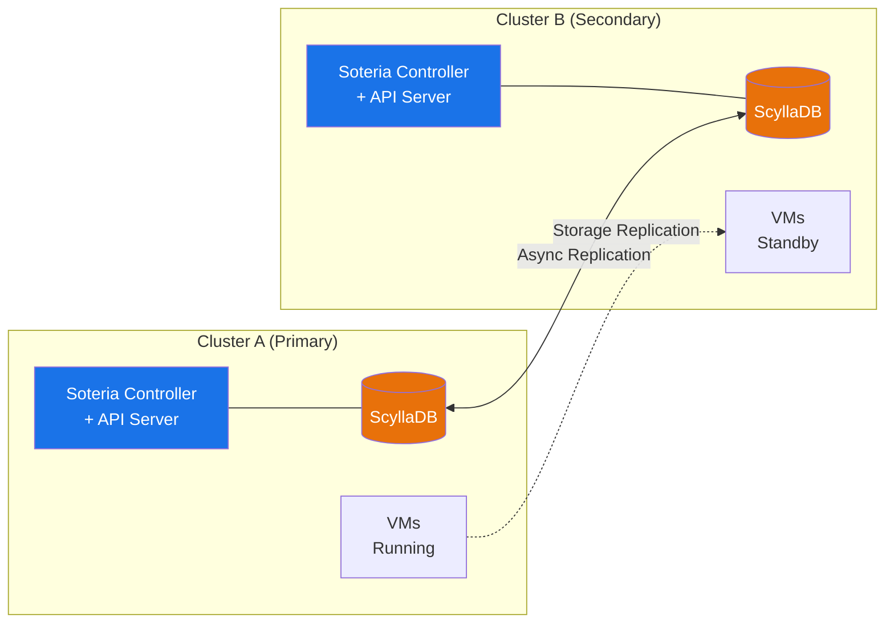

---
hide:
  - toc
---

# Soteria

**Storage-agnostic disaster recovery orchestrator for OpenShift Virtualization.**

Soteria is an open-source, Kubernetes-native disaster recovery (DR) orchestrator that unifies failover, failback, and reprotect workflows across heterogeneous storage backends — ODF, Dell, Pure Storage, NetApp — through a single, consistent workflow engine. Platform engineers define DR plans using standard Kubernetes labels and CRDs; the orchestrator handles volume promotion, VM startup sequencing, wave-based throttling, and a full audit trail.

!!! tip "Why Soteria?"
    Thousands of organizations migrating from VMware vSphere to OpenShift Virtualization are discovering there is no equivalent to VMware Site Recovery Manager. Each storage vendor offers its own replication tooling, but no unified orchestration layer exists. Soteria fills that gap — starting lean with a pluggable driver framework, growing toward SRM-class maturity, and doing it in the open under Apache 2.0.

---

## Key Capabilities

-   :material-swap-horizontal-bold:{ .lg .middle } **Full DR Lifecycle**

    ---

    Complete 4-state, 8-phase lifecycle: **failover → reprotect → failback → restore**. Planned migrations include graceful shutdown and data resync; disaster mode skips directly to promotion.

-   :material-waves:{ .lg .middle } **Wave-Based Execution**

    ---

    VMs are grouped into ordered waves via Kubernetes labels. Each wave executes sequentially with configurable concurrency throttling (`maxConcurrentFailovers`) to control blast radius.

-   :material-harddisk:{ .lg .middle } **Storage-Agnostic Drivers**

    ---

    A 7-method `StorageProvider` interface abstracts vendor-specific replication. Ship with **noop** (development) and **csi-extension** (production via CSI-Addons VolumeReplication CRs). Add new backends without changing the orchestrator.

-   :material-kubernetes:{ .lg .middle } **Kubernetes-Native CRDs**

    ---

    Declare DR plans as `DRPlan` resources with label selectors. Trigger executions by creating `DRExecution` resources. Standard RBAC, admission webhooks, and `kubectl` workflows — no proprietary CLI.

-   :material-database-sync:{ .lg .middle } **Cross-Cluster Shared State**

    ---

    A Kubernetes Aggregated API Server backed by **ScyllaDB** ensures both datacenters see identical DR state. CDC-based watches provide real-time updates; state survives single-DC failure.

-   :material-monitor-dashboard:{ .lg .middle } **OpenShift Console Plugin**

    ---

    A PatternFly 6 console plugin provides a DR dashboard, plan detail views, and a live execution monitor — all integrated into the OpenShift web console.

---

## How It Works

Soteria separates **careful planning** from **simple execution**. DRPlans are designed deliberately — waves, throttling, consistency levels — and validated through pre-flight reports. When the moment arrives, the operator triggers a single action and the orchestrator executes the plan exactly as designed.

Each cluster runs the same single binary: a **controller-manager** (DRPlan reconciler, DRExecution reconciler, ShadowPV controllers, VolumeReplication watcher) plus a Kubernetes **Aggregated API Server** backed by ScyllaDB. Cross-site state is shared through ScyllaDB's async replication — both clusters serve identical DRPlan and DRExecution resources through the standard Kubernetes API.

### Execution Flow

1. **Label VMs** — Apply `soteria.io/drplan` and `soteria.io/wave` labels to VirtualMachine resources.
2. **Create a DRPlan** — The controller discovers VMs, forms volume groups, and produces a pre-flight report showing exactly how the plan would execute.
3. **Trigger execution** — Create a `DRExecution` with the desired mode (`planned_migration`, `disaster`, or `reprotect`).
4. **Wave-by-wave processing** — The engine promotes volumes, starts VMs, and waits for readiness — wave by wave, group by group, with per-DRGroup checkpointing for crash resilience.
5. **Monitor and audit** — Track progress through Kubernetes conditions, events, and the Console plugin. Every execution is an immutable audit record.

---

## Architecture at a Glance

| Component | Role |
|---|---|
| **DRPlan Controller** | Discovers VMs via label selectors, forms volume groups, runs pre-flight validation, polls replication health |
| **DRExecution Controller** | Orchestrates the wave executor and failover/reprotect handlers through the state machine |
| **ShadowPV Controllers** | Publish and consume PersistentVolume metadata across sites for cross-cluster volume awareness |
| **VolumeReplication Watcher** | Monitors VolumeReplication and VolumeGroupReplication CR status for resync completion signals |
| **Aggregated API Server** | Serves DRPlan and DRExecution resources from ScyllaDB via a generic KV store (`storage.Interface`) |
| **Workflow Engine** | State machine, wave executor, DRGroup chunker, failover/reprotect handlers, resume analyzer, checkpointer |
| **Storage Drivers** | `noop` (dev/CI), `csi-extension` (production CSI-Addons), `fake` (testing), conformance test suite |
| **Admission Webhooks** | VM webhook (plan existence, wave consistency), DRPlan/DRExecution validation (immutability, concurrency gate) |
| **Console Plugin** | PatternFly 6 OpenShift Console integration — dashboard, plan detail, execution monitor |
| **Metrics** | Prometheus `soteria_*` metrics for plan counts, VM totals, failover durations |

---

## Design Principles

- **Human-triggered only** — All failover requires explicit human initiation. No auto-failover, no failure detection — this eliminates split-brain by design.
- **Fail-forward** — Rollback is impossible when the active DC is down. Failed DRGroups are marked `Failed`, the engine continues, and the execution reports `PartiallySucceeded`.
- **Idempotent reconciliation** — Every controller and every driver method is safe to retry after a crash or restart.
- **Storage is the truth** — The orchestrator does not track or enforce RPO targets. RPO is determined by the storage replication layer.
- **Label-driven composition** — Adding a VM to DR protection is two labels (`soteria.io/drplan`, `soteria.io/wave`), not a plan rewrite.

---

## Documentation Guide

| Section | What You'll Find |
|---|---|
| [**Installation**](installation/prerequisites.md) | Prerequisites, ScyllaDB network setup (Submariner / Cilium), Helm chart deployment |
| [**Architecture**](architecture/overview.md) | Component deep-dives, DR lifecycle state machine, storage driver framework |
| [**Usage**](usage/drplan.md) | DRPlan authoring, waves & throttling, volume grouping, executing failover, Console UI guides |
| [**Reference**](reference/api/drplan.md) | CRD API reference for DRPlan and DRExecution, Helm values reference |
| [**Contributing**](contributing/dev-setup.md) | Developer setup, writing storage drivers |

---

## Quick Links

- [:fontawesome-brands-github: GitHub Repository](https://github.com/soteria-project/soteria)
- [:material-license: Apache 2.0 License](https://github.com/soteria-project/soteria/blob/main/LICENSE)
