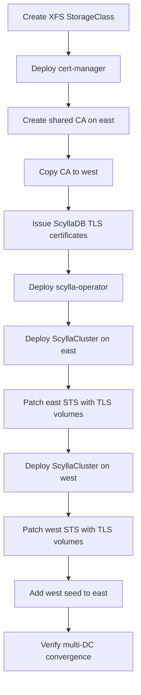

# ScyllaDB with Cilium Cluster Mesh

This guide walks through deploying ScyllaDB as a cross-datacenter cluster
using **Cilium Cluster Mesh** for inter-cluster networking. By the end you
will have a two-DC ScyllaDB cluster with mTLS, cross-DC seed discovery, and
verified multi-DC convergence.

!!! info "Reference implementation"
    Every command in this guide mirrors
    [`hack/multisite/setup-scylladb.sh`](https://github.com/soteria-project/soteria/blob/main/hack/multisite/setup-scylladb.sh).
    The Kustomize overlays live under
    [`hack/multisite/overlays/`](https://github.com/soteria-project/soteria/tree/main/hack/multisite/overlays).

---

## Prerequisites

| Requirement | Details |
|-------------|---------|
| **Two Kubernetes clusters** | Referred to as *east* (seed DC) and *west* (joining DC) throughout this guide. |
| **Cilium CNI installed** | Cilium must be the CNI on both clusters. |
| **Cilium Cluster Mesh connected** | Cluster Mesh must be enabled and connected between east and west before deploying ScyllaDB. |
| **Block storage** | A `rook-ceph-block` StorageClass (or equivalent) must exist on both clusters. |
| **CLI tools** | `helm`, `kubectl`, `jq` |

Verify Cluster Mesh connectivity before proceeding:

```bash
cilium clustermesh status --context east
cilium clustermesh status --context west
```

Both clusters should report `connected`.

---

## Deployment overview

The deployment follows this sequence:



---

## Step 1 — Create an XFS StorageClass

ScyllaDB requires XFS-formatted volumes. Create a StorageClass that provisions
XFS volumes from your existing block storage:

```yaml title="storage-class-xfs.yaml"
apiVersion: storage.k8s.io/v1
kind: StorageClass
metadata:
  name: rook-ceph-block-xfs
provisioner: rook-ceph.rbd.csi.ceph.com
parameters:
  clusterID: rook-ceph
  pool: mirrored-pool
  imageFormat: "2"
  imageFeatures: layering,exclusive-lock
  csi.storage.k8s.io/provisioner-secret-name: rook-csi-rbd-provisioner
  csi.storage.k8s.io/provisioner-secret-namespace: rook-ceph
  csi.storage.k8s.io/controller-expand-secret-name: rook-csi-rbd-provisioner
  csi.storage.k8s.io/controller-expand-secret-namespace: rook-ceph
  csi.storage.k8s.io/node-stage-secret-name: rook-csi-rbd-node
  csi.storage.k8s.io/node-stage-secret-namespace: rook-ceph
  csi.storage.k8s.io/fstype: xfs
reclaimPolicy: Delete
allowVolumeExpansion: true
```

Apply on both clusters:

```bash
kubectl --context east apply -f storage-class-xfs.yaml
kubectl --context west apply -f storage-class-xfs.yaml
```

!!! warning "xfsprogs required"
    The nodes must have `xfsprogs` installed. On Fedora-based nodes:

    ```bash
    minikube ssh -p east -- "sudo dnf install -y xfsprogs"
    minikube ssh -p west -- "sudo dnf install -y xfsprogs"
    ```

---

## Step 2 — Deploy cert-manager

Install cert-manager on both clusters using Helm OCI:

```bash
for ctx in east west; do
  helm upgrade --install cert-manager \
    oci://quay.io/jetstack/charts/cert-manager \
    --version v1.20.3 \
    --namespace cert-manager \
    --create-namespace \
    --set crds.enabled=true \
    --kube-context "${ctx}" \
    --wait --timeout 5m
done
```

Wait for all cert-manager components to be ready:

```bash
for ctx in east west; do
  for deploy in cert-manager cert-manager-cainjector cert-manager-webhook; do
    kubectl --context "${ctx}" -n cert-manager \
      rollout status deployment/"${deploy}" --timeout=3m
  done
  echo "${ctx}: cert-manager ready"
done
```

---

## Step 3 — Create a shared CA

Cross-DC mTLS requires both clusters to trust each other's certificates.
Soteria uses a **shared CA** pattern: the east cluster generates a self-signed
CA key-pair, which is then copied to west. Both clusters issue certificates
from the same root, eliminating the need for cross-CA trust bundles.

### 3a — Generate the CA on east

Create the namespace, a self-signed `ClusterIssuer`, a CA `Certificate`, and
a namespace-scoped `Issuer` that signs with the CA:

```bash
# Create the soteria namespace
kubectl --context east create namespace soteria --dry-run=client -o yaml \
  | kubectl --context east apply -f -
```

```yaml title="Apply on east"
# Self-signed ClusterIssuer (bootstrap)
apiVersion: cert-manager.io/v1
kind: ClusterIssuer
metadata:
  name: soteria-selfsigned
spec:
  selfSigned: {}
---
# CA Certificate
apiVersion: cert-manager.io/v1
kind: Certificate
metadata:
  name: soteria-ca
  namespace: soteria
spec:
  isCA: true
  commonName: soteria-ca
  secretName: soteria-ca-key-pair
  issuerRef:
    name: soteria-selfsigned
    kind: ClusterIssuer
---
# Namespace Issuer backed by the CA
apiVersion: cert-manager.io/v1
kind: Issuer
metadata:
  name: soteria-internal
  namespace: soteria
spec:
  ca:
    secretName: soteria-ca-key-pair
```

Verify the CA certificate reaches `Ready`:

```bash
kubectl --context east -n soteria get certificate soteria-ca
# NAME         READY   SECRET                AGE
# soteria-ca   True    soteria-ca-key-pair   30s
```

### 3b — Copy the CA to west

Export the CA key-pair Secret from east, strip cluster-specific metadata, and
apply it on west:

```bash
# Create namespace on west
kubectl --context west create namespace soteria --dry-run=client -o yaml \
  | kubectl --context west apply -f -

# Copy the CA secret
kubectl --context east -n soteria get secret soteria-ca-key-pair -o json \
  | jq 'del(.metadata.resourceVersion, .metadata.uid,
            .metadata.creationTimestamp, .metadata.managedFields,
            .metadata.annotations["cert-manager.io/certificate-name"])' \
  | kubectl --context west -n soteria apply --server-side --force-conflicts -f -
```

Create the same namespace Issuer on west:

```yaml title="Apply on west"
apiVersion: cert-manager.io/v1
kind: Issuer
metadata:
  name: soteria-internal
  namespace: soteria
spec:
  ca:
    secretName: soteria-ca-key-pair
```

Verify the Issuer reaches `Ready`:

```bash
kubectl --context west -n soteria get issuer soteria-internal
# NAME               READY   AGE
# soteria-internal   True    15s
```

---

## Step 4 — Issue ScyllaDB TLS certificates

Create a serving certificate on each cluster. The certificate covers the
ScyllaDB headless service DNS names and is issued by the shared
`soteria-internal` Issuer:

Apply the following certificate on **both** clusters:

```bash
for ctx in east west; do
  kubectl --context "${ctx}" -n soteria apply -f - <<'EOF'
apiVersion: cert-manager.io/v1
kind: Certificate
metadata:
  name: soteria-scylladb-serving
  namespace: soteria
spec:
  secretName: scylladb-serving-tls
  issuerRef:
    name: soteria-internal
    kind: Issuer
  dnsNames:
    - soteria-scylladb-client.soteria.svc.cluster.local
    - soteria-scylladb-client.soteria.svc
    - "*.soteria-scylladb-client.soteria.svc.cluster.local"
    - "*.soteria.svc.cluster.local"
  usages:
    - server auth
    - client auth
EOF
done
```

---

## Step 5 — Deploy scylla-operator

Install the ScyllaDB operator via Helm on both clusters:

```bash
helm repo add scylla \
  https://scylla-operator-charts.storage.googleapis.com/stable
helm repo update scylla

for ctx in east west; do
  helm upgrade --install scylla-operator scylla/scylla-operator \
    --create-namespace \
    --namespace scylla-operator \
    --version v1.21.0 \
    --kube-context "${ctx}" \
    --wait --timeout 5m
done
```

Verify both the operator and webhook server are running:

```bash
for ctx in east west; do
  kubectl --context "${ctx}" -n scylla-operator \
    rollout status deployment/scylla-operator --timeout=5m
  kubectl --context "${ctx}" -n scylla-operator \
    rollout status deployment/webhook-server --timeout=5m
  echo "${ctx}: scylla-operator ready"
done
```

---

## Step 6 — Networking: Cilium Cluster Mesh and global services

### How cross-cluster networking works

Cilium Cluster Mesh provides **pod-to-pod routing** between clusters. ScyllaDB
uses `broadcastOptions.nodes.type: PodIP` so that each ScyllaDB node advertises
its Pod IP as the internode address. Because Cilium routes Pod IPs across
clusters, these addresses are directly reachable from the remote DC.

### Cross-cluster service export

To enable cross-cluster DNS discovery, ScyllaDB's per-node headless services
are exported using the **Multi-Cluster Services (MCS) API**. Each DC has a
`ServiceExport` resource that registers the per-node headless service for
Cilium Cluster Mesh endpoint synchronization:

```yaml title="hack/multisite/overlays/east/serviceexport.yaml"
apiVersion: multicluster.x-k8s.io/v1alpha1
kind: ServiceExport
metadata:
  name: soteria-scylladb-east-rack1-0
  namespace: soteria
```

```yaml title="hack/multisite/overlays/west/serviceexport.yaml"
apiVersion: multicluster.x-k8s.io/v1alpha1
kind: ServiceExport
metadata:
  name: soteria-scylladb-west-rack1-0
  namespace: soteria
```

With `nodeService.type: Headless`, scylla-operator creates a headless service
per node. Exporting it via `ServiceExport` makes that pod addressable from the
remote cluster at:

```
<pod>.<dc>.<svc>.<ns>.svc.clusterset.local
```

### Cross-DC seed discovery

ScyllaDB uses **seeds** for gossip protocol bootstrapping. In a two-DC setup:

- **East** is the seed DC — it bootstraps first with no external seeds.
- **West** discovers east via `externalSeeds` pointing to east's per-node DNS
  resolved through Cilium Cluster Mesh:

```yaml
externalSeeds:
  - soteria-scylladb-east-rack1-0.soteria.svc.clusterset.local
```

After west joins the cluster, east is patched to add the west seed for
**symmetric reconnection** — ensuring east can rediscover west after network
partitions:

```bash
kubectl --context east -n soteria \
  patch scyllaclusters.scylla.scylladb.com soteria-scylladb \
  --type=merge \
  -p '{"spec":{"externalSeeds":["soteria-scylladb-west-rack1-0.soteria.svc.clusterset.local"]}}'
```

---

## Step 7 — Deploy ScyllaDB

### Base ScyllaCluster configuration

The base `ScyllaCluster` CR defines the shared configuration. Key fields for
Cilium networking:

```yaml title="hack/multisite/overlays/base/scyllacluster.yaml"
apiVersion: scylla.scylladb.com/v1
kind: ScyllaCluster
metadata:
  name: soteria-scylladb
  namespace: soteria
spec:
  version: "2026.1.3"
  developerMode: true
  exposeOptions:
    broadcastOptions:
      nodes:
        type: PodIP       # (1)!
      clients:
        type: PodIP
    nodeService:
      type: Headless      # (2)!
  datacenter:
    name: REPLACED_BY_OVERLAY
    racks:
      - name: rack1
        members: 1        # (3)!
        storage:
          capacity: 5Gi
          storageClassName: rook-ceph-block-xfs
        resources:
          requests:
            cpu: 100m
            memory: 512Mi
          limits:
            cpu: "1"
            memory: 1Gi
```

1.  **PodIP broadcast** makes internode addresses routable cross-cluster via
    Cilium pod-to-pod routing. Do not change this to `ServiceClusterIP` — per-pod
    ClusterIPs are cluster-local and will not work cross-DC.
2.  **Headless node service** creates a headless Service per node, which is
    then exported via `ServiceExport` for Cilium Cluster Mesh discovery.
3.  Set `members` to `1` for development. Production deployments should use 3+.

### mTLS configuration

ScyllaDB is configured for mutual TLS on both internode and client connections.
The TLS ConfigMap specifies certificate paths:

```yaml title="hack/multisite/overlays/base/scylladb-tls-config.yaml"
apiVersion: v1
kind: ConfigMap
metadata:
  name: scylla-config
  namespace: soteria
data:
  scylla.yaml: |
    server_encryption_options:
      internode_encryption: all
      certificate: /etc/scylla/certmanager-tls/tls.crt
      keyfile: /etc/scylla/certmanager-tls/tls.key
      truststore: /etc/scylla/certmanager-ca/ca-bundle.crt
      require_client_auth: true
    client_encryption_options:
      enabled: true
      certificate: /etc/scylla/certmanager-tls/tls.crt
      keyfile: /etc/scylla/certmanager-tls/tls.key
      truststore: /etc/scylla/combined-ca/ca-bundle.crt
      require_client_auth: true
```

The ScyllaCluster is patched to reference this ConfigMap and mount the TLS
volumes at the rack level:

| Volume | Source Secret | Mount Path | Purpose |
|--------|-------------|------------|---------|
| `certmanager-serving` | `scylladb-serving-tls` | `/etc/scylla/certmanager-tls` | Server cert + key |
| `certmanager-ca` | `scylladb-serving-tls` (ca.crt only) | `/etc/scylla/certmanager-ca` | Internode CA trust |
| `combined-ca` | `scylladb-serving-tls` (ca.crt only) | `/etc/scylla/combined-ca` | Client CA trust |

### Deploy east (seed DC)

Apply the east overlay, which sets `datacenter.name: east` and removes
`externalSeeds` (east bootstraps standalone):

```bash
kubectl --context east apply --server-side --force-conflicts \
  -k hack/multisite/overlays/east
```

Wait for ScyllaDB to be ready:

```bash
kubectl --context east -n soteria get scyllaclusters soteria-scylladb -w
# Wait until readyMembers matches your members count
```

### Patch the StatefulSet with TLS volumes

!!! warning "scylla-operator v1.21 limitation"
    The scylla-operator (v1.21) does not propagate rack-level `volumes` and
    `volumeMounts` to the StatefulSet. As a workaround, the StatefulSet must be
    patched directly. The operator may revert this patch during reconciliation;
    re-apply if needed.

Identify the StatefulSet and the scylla container index:

```bash
# Get the STS name
STS=$(kubectl --context east -n soteria \
  get sts -l scylla/cluster=soteria-scylladb -o name | head -1)

# Find the scylla container index
SCYLLA_IDX=$(kubectl --context east -n soteria \
  get "${STS}" -o json \
  | jq -r '.spec.template.spec.containers
    | to_entries[] | select(.value.name=="scylla") | .key')
```

Apply the TLS volume patch:

```bash
# Add volumes
kubectl --context east -n soteria patch "${STS}" --type=json -p "[
  {\"op\":\"add\",\"path\":\"/spec/template/spec/volumes/-\",
   \"value\":{\"name\":\"certmanager-serving\",
     \"secret\":{\"secretName\":\"scylladb-serving-tls\"}}},
  {\"op\":\"add\",\"path\":\"/spec/template/spec/volumes/-\",
   \"value\":{\"name\":\"certmanager-ca\",
     \"secret\":{\"secretName\":\"scylladb-serving-tls\",
       \"items\":[{\"key\":\"ca.crt\",\"path\":\"ca-bundle.crt\"}]}}},
  {\"op\":\"add\",\"path\":\"/spec/template/spec/volumes/-\",
   \"value\":{\"name\":\"combined-ca\",
     \"secret\":{\"secretName\":\"scylladb-serving-tls\",
       \"items\":[{\"key\":\"ca.crt\",\"path\":\"ca-bundle.crt\"}]}}}
]"

# Add volume mounts to the scylla container
kubectl --context east -n soteria patch "${STS}" --type=json -p "[
  {\"op\":\"add\",
   \"path\":\"/spec/template/spec/containers/${SCYLLA_IDX}/volumeMounts/-\",
   \"value\":{\"name\":\"certmanager-serving\",
     \"mountPath\":\"/etc/scylla/certmanager-tls\",\"readOnly\":true}},
  {\"op\":\"add\",
   \"path\":\"/spec/template/spec/containers/${SCYLLA_IDX}/volumeMounts/-\",
   \"value\":{\"name\":\"certmanager-ca\",
     \"mountPath\":\"/etc/scylla/certmanager-ca\",\"readOnly\":true}},
  {\"op\":\"add\",
   \"path\":\"/spec/template/spec/containers/${SCYLLA_IDX}/volumeMounts/-\",
   \"value\":{\"name\":\"combined-ca\",
     \"mountPath\":\"/etc/scylla/combined-ca\",\"readOnly\":true}}
]"

# Restart pods to pick up TLS volumes
kubectl --context east -n soteria delete pods \
  -l scylla/cluster=soteria-scylladb --wait=false
```

Wait for ScyllaDB to recover after the restart.

### Deploy west (joining DC)

Apply the west overlay, which sets `datacenter.name: west` and configures
`externalSeeds` pointing to east via Cilium Cluster Mesh DNS:

```bash
kubectl --context west apply --server-side --force-conflicts \
  -k hack/multisite/overlays/west
```

Wait for west ScyllaDB to become ready, then repeat the TLS StatefulSet patch
for the west cluster (same commands as above, replacing `east` with `west`).

### Add west seed to east for symmetric reconnection

After west joins the cluster, patch east to add the west seed. This ensures
east can rediscover west after network partitions:

```bash
kubectl --context east -n soteria \
  patch scyllaclusters.scylla.scylladb.com soteria-scylladb \
  --type=merge \
  -p '{"spec":{"externalSeeds":["soteria-scylladb-west-rack1-0.soteria.svc.clusterset.local"]}}'
```

---

## Step 8 — Verify multi-DC convergence

### nodetool status

Run `nodetool status` from the east pod. All nodes across both DCs should show
**UN** (Up/Normal):

```bash
EAST_POD=$(kubectl --context east -n soteria \
  get pods -l "scylla/cluster=soteria-scylladb" \
  -o jsonpath='{.items[0].metadata.name}')

kubectl --context east -n soteria \
  exec "${EAST_POD}" -c scylla -- nodetool status
```

Expected output (2 nodes, 1 per DC):

```
Datacenter: east
===============
Status=Up/Down
|/ State=Normal/Leaving/Joining/Moving
--  Address      Load       Tokens  ...  Rack
UN  10.10.x.x   256 KiB    256     ...  rack1

Datacenter: west
===============
Status=Up/Down
|/ State=Normal/Leaving/Joining/Moving
--  Address      Load       Tokens  ...  Rack
UN  10.20.x.x   256 KiB    256     ...  rack1
```

All nodes should be **UN**. If any show **DN** (Down/Normal), check Cilium
Cluster Mesh connectivity.

### CQL cross-DC replication test

Write data on east and verify it replicates to west:

```bash
# Get east pod IP
EAST_IP=$(kubectl --context east -n soteria \
  get pod "${EAST_POD}" -o jsonpath='{.status.podIP}')

# Create a keyspace with NetworkTopologyStrategy replicating to both DCs
kubectl --context east -n soteria exec "${EAST_POD}" -c scylla -- \
  cqlsh "${EAST_IP}" -e \
  "CREATE KEYSPACE IF NOT EXISTS smoke_test
   WITH replication = {
     'class': 'NetworkTopologyStrategy',
     'east': 1, 'west': 1
   };"

# Create a table and insert data
kubectl --context east -n soteria exec "${EAST_POD}" -c scylla -- \
  cqlsh "${EAST_IP}" -e \
  "CREATE TABLE IF NOT EXISTS smoke_test.test_table
   (id int PRIMARY KEY, value text);"

kubectl --context east -n soteria exec "${EAST_POD}" -c scylla -- \
  cqlsh "${EAST_IP}" -e \
  "INSERT INTO smoke_test.test_table (id, value)
   VALUES (1, 'cross-dc-test');"
```

Read the data back from west:

```bash
WEST_POD=$(kubectl --context west -n soteria \
  get pods -l "scylla/cluster=soteria-scylladb" \
  -o jsonpath='{.items[0].metadata.name}')

WEST_IP=$(kubectl --context west -n soteria \
  get pod "${WEST_POD}" -o jsonpath='{.status.podIP}')

kubectl --context west -n soteria exec "${WEST_POD}" -c scylla -- \
  cqlsh "${WEST_IP}" -e \
  "SELECT value FROM smoke_test.test_table WHERE id = 1;"
```

You should see `cross-dc-test` in the output, confirming data replicated from
east to west.

Clean up the test keyspace:

```bash
kubectl --context east -n soteria exec "${EAST_POD}" -c scylla -- \
  cqlsh "${EAST_IP}" -e "DROP KEYSPACE IF EXISTS smoke_test;"
```

---

## Environment variables

The [`setup-scylladb.sh`](https://github.com/soteria-project/soteria/blob/main/hack/multisite/setup-scylladb.sh)
script accepts these environment variables:

| Variable | Default | Description |
|----------|---------|-------------|
| `EAST_CLUSTER_NAME` | `east` | Name of the east cluster context |
| `WEST_CLUSTER_NAME` | `west` | Name of the west cluster context |
| `NAMESPACE` | `soteria` | Namespace for ScyllaDB deployment |
| `CERT_MANAGER_VERSION` | `v1.20.3` | cert-manager Helm chart version |
| `SCYLLA_OPERATOR_VERSION` | `v1.21.0` | scylla-operator Helm chart version |
| `SCYLLA_OPERATOR_NS` | `scylla-operator` | scylla-operator namespace |
| `SMOKE_TEST` | `1` | Set to `0` to skip convergence smoke test |
| `MEMBERS_PER_RACK` | `1` | ScyllaDB members per rack |

---

## Automated deployment

Instead of running each step manually, use the all-in-one script that performs
the entire deployment sequence:

```bash
./hack/multisite/setup-scylladb.sh
```

The script is **idempotent** — safe to re-run if interrupted.

---

## Troubleshooting

### West cannot discover east seeds

Cilium global services must be exporting east's headless service before west
starts. Verify:

```bash
kubectl --context east -n soteria get serviceexport
cilium clustermesh status --context east
```

### Cross-DC TLS handshake errors

Both clusters must share the same CA. Verify the CA fingerprints match:

```bash
kubectl --context east -n soteria \
  get secret soteria-ca-key-pair \
  -o jsonpath='{.data.ca\.crt}' | base64 -d | openssl x509 -fingerprint -noout

kubectl --context west -n soteria \
  get secret soteria-ca-key-pair \
  -o jsonpath='{.data.ca\.crt}' | base64 -d | openssl x509 -fingerprint -noout
```

Both fingerprints must be identical.

### Internode addresses unreachable

ScyllaDB must use `PodIP` broadcast (`exposeOptions.broadcastOptions.nodes.type: PodIP`).
If changed to `ServiceClusterIP`, per-pod ClusterIPs are cluster-local and will
not work across DCs.

### STS TLS volumes reverted by operator

scylla-operator may reconcile the StatefulSet and remove the TLS volume patches.
Re-run the patching commands or re-run `setup-scylladb.sh`. The patching logic
is idempotent — it checks for existing volumes before applying.

### PVC binding timeout (XFS)

If PVCs fail to mount, `xfsprogs` may be missing on the nodes:

```bash
minikube ssh -p east -- "sudo dnf install -y xfsprogs"
minikube ssh -p west -- "sudo dnf install -y xfsprogs"
```

### ScyllaDB pods OOMKilled

Developer mode reduces memory needs but doesn't eliminate them. If nodes are
resource-constrained, increase worker memory:

```bash
./hack/multisite/teardown.sh
NODE_CPUS=4 WORKER_MEMORY=6144 MASTER_MEMORY=7168 \
  ./hack/multisite/setup-clusters.sh
```

### CQL smoke test fails with "No hosts available"

ScyllaDB may need additional time after `nodetool` shows UN. The
`setup-scylladb.sh` script retries CQL operations with 5-second intervals.
Wait 30 seconds and retry manually.
