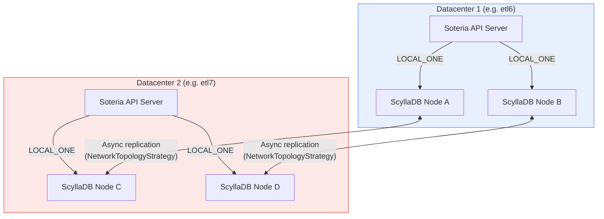

# ScyllaDB Architecture Overview

Soteria uses **ScyllaDB** as its storage backend instead of etcd.
This page explains the cross-datacenter topology, the design rationale behind
this choice, and how the Soteria API server connects to ScyllaDB.

---

## Why ScyllaDB Instead of etcd?

Kubernetes operators typically rely on etcd — the same store that backs the
kube-apiserver — for custom resource state. Soteria **cannot** use etcd for
three reasons:

1. **Cross-datacenter replication is a first-class requirement.**
   Soteria manages disaster-recovery plans across two (or more) OpenShift
   clusters. Both sites must read and write DR resources locally, without
   cross-datacenter round-trips on every API call. etcd does not support
   multi-datacenter replication — its Raft consensus requires a quorum that
   spans all members, making it latency-sensitive and partition-intolerant
   across WAN links.

2. **Availability during a datacenter failure.**
   When one datacenter is down, the surviving site must continue operating —
   reading existing plans and creating new execution records. A single etcd
   cluster stretched across two sites would lose quorum if one site fails.
   ScyllaDB's `NetworkTopologyStrategy` keeps independent replicas per DC,
   and `LOCAL_ONE` consistency lets each site operate autonomously.

3. **Automatic state reconciliation on recovery.**
   When the failed datacenter comes back, ScyllaDB's built-in asynchronous
   replication automatically synchronizes state. No manual intervention, no
   data import — writes from both sites converge via last-write-wins (LWW)
   resolution, with lightweight transactions (LWT) protecting critical
   state-machine transitions.

!!! info "Shared-State Architecture"
    Soteria implements a **shared-state** model: both clusters share the same
    ScyllaDB keyspace and see the same DR resources. This is not a
    primary/replica setup — each site is a full peer that can read and write
    locally.

---

## Cross-DC Topology

The diagram below shows a two-datacenter deployment — the most common
Soteria topology.



**Key characteristics:**

| Property | Value |
|---|---|
| Replication strategy | `NetworkTopologyStrategy` |
| Replication factor | 2 per DC (configurable) |
| Total nodes (minimum) | 4 (2 per DC) |
| Read/write consistency | `LOCAL_ONE` |
| Cross-DC sync | Asynchronous (eventual consistency) |
| Conflict resolution | Last-write-wins (LWW) + lightweight transactions for critical fields |

Each Soteria API server connects **only** to its local ScyllaDB datacenter
via DC-aware routing. Reads and writes never cross the WAN during normal
operation — ScyllaDB handles inter-DC replication transparently in the
background.

---

## Replication Strategy

### NetworkTopologyStrategy

In production, Soteria creates its keyspace with `NetworkTopologyStrategy`,
which lets you specify an independent replication factor (RF) for each
datacenter:

```sql
CREATE KEYSPACE IF NOT EXISTS soteria
  WITH replication = {
    'class': 'NetworkTopologyStrategy',
    'etl6': 2,
    'etl7': 2
  }
  AND TABLETS = {'enabled': false};
```

The `--scylladb-dc-replication` flag controls this. For example:

```bash
--scylladb-dc-replication=etl6:2,etl7:2
```

When this flag is set, Soteria auto-creates the keyspace on startup using
`NetworkTopologyStrategy` with the specified per-DC replication factors. When
the flag is omitted, the keyspace must already exist.

!!! warning "Tablets Must Be Disabled"
    The `AND TABLETS = {'enabled': false}` clause is **required**. ScyllaDB
    tablets are incompatible with CDC (Change Data Capture), which Soteria
    uses to implement the Kubernetes Watch API. Soteria sets this
    automatically when creating the keyspace.

### LOCAL_ONE Consistency

All reads and writes use `LOCAL_ONE` consistency:

- **Writes** are acknowledged as soon as one replica in the local DC confirms.
- **Reads** return data from one local replica.

This means each site operates with **local latency** — typically sub-millisecond
within a datacenter. Cross-DC replication happens asynchronously, so there is
a brief window where the two sites may see slightly different data. For DR
orchestration, this is acceptable because:

- State-machine transitions (e.g., plan phase changes) are protected by
  **lightweight transactions** (CAS with `Serial` consistency) that enforce
  cross-DC linearizability when needed.
- Status updates use **strategic merge patches** and ScyllaDB-tuned retry
  backoff to handle the occasional conflict from eventual consistency.
- Each site computes its own reconcile role (`Owner`, `Step0Only`, or `None`)
  based on the plan phase, eliminating cross-site write contention on
  execution status.

### Startup Topology Validation

When `--scylladb-local-dc` is set, Soteria validates on startup that the
keyspace uses `NetworkTopologyStrategy` and has replication configured for
the local datacenter. This catches misconfigured deployments early —
for example, running against a `SimpleStrategy` keyspace in a multi-DC
environment.

---

## Connection Configuration

The Soteria API server connects to ScyllaDB using the
[gocql](https://github.com/gocql/gocql) driver. Connection behavior is
controlled entirely via command-line flags.

### CLI Flags

| Flag | Default | Description |
|---|---|---|
| `--scylladb-contact-points` | `localhost:9042` | Comma-separated list of ScyllaDB node addresses |
| `--scylladb-keyspace` | `soteria` | Keyspace name |
| `--scylladb-local-dc` | *(empty)* | Local datacenter name for DC-aware routing (e.g., `etl6`) |
| `--scylladb-dc-replication` | *(empty)* | Auto-create keyspace with `NetworkTopologyStrategy`; comma-separated `dc:rf` pairs (e.g., `etl6:2,etl7:2`) |
| `--scylladb-tls-cert` | *(empty)* | Path to TLS client certificate (PEM) |
| `--scylladb-tls-key` | *(empty)* | Path to TLS client private key (PEM) |
| `--scylladb-tls-ca` | *(empty)* | Path to TLS CA certificate (PEM) |
| `--scylladb-tls-server-name` | *(empty)* | TLS server name override for certificate verification |

### DC-Aware Routing

When `--scylladb-local-dc` is set, the driver uses
`DCAwareRoundRobinPolicy`, which routes queries to nodes in the specified
datacenter first. Combined with `LOCAL_ONE` consistency, this ensures all
reads and writes stay local.

```text
Soteria API Server (etl6)
    │
    ├── Preferred: ScyllaDB nodes in DC "etl6"
    └── Fallback:  ScyllaDB nodes in DC "etl7" (only if all local nodes are down)
```

### TLS Configuration

In production, **mTLS is mandatory** for all ScyllaDB communication.
Certificates are managed by cert-manager with a shared CA across
datacenters. Provide all three TLS flags (`--scylladb-tls-cert`,
`--scylladb-tls-key`, `--scylladb-tls-ca`) to enable encrypted and
mutually authenticated connections. When all three are omitted, TLS is
disabled — suitable only for local development.

### Connection Resilience

The driver is configured with:

- **Connect timeout:** 10 seconds
- **Retry policy:** Exponential backoff (100 ms → 10 s, up to 10 retries)
- **Reconnect interval:** 1 second

These defaults ensure the API server recovers gracefully from transient
network issues or ScyllaDB node restarts.

---

## Schema Overview

Soteria uses a **generic key-value schema** that mirrors the etcd storage
model. Resources are stored as opaque blobs — no CQL schema changes are
needed when API types evolve.

### Tables

**`kv_store`** — Primary data table (CDC-enabled):

| Column | Type | Role |
|---|---|---|
| `api_group` | `text` | Partition key (part 1) |
| `resource_type` | `text` | Partition key (part 2) |
| `namespace` | `text` | Clustering key (part 1) |
| `name` | `text` | Clustering key (part 2) |
| `value` | `blob` | Serialized Kubernetes object |
| `resource_version` | `timeuuid` | Monotonic version (maps to Unix µs) |

CDC is enabled on this table (`WITH cdc = {'enabled': true}`) to power
the Kubernetes Watch API via ScyllaDB's change-data-capture stream.

**`kv_store_labels`** — Label index table:

| Column | Type | Role |
|---|---|---|
| `api_group` | `text` | Partition key (part 1) |
| `resource_type` | `text` | Partition key (part 2) |
| `label_key` | `text` | Partition key (part 3) |
| `label_value` | `text` | Clustering key (part 1) |
| `namespace` | `text` | Clustering key (part 2) |
| `name` | `text` | Clustering key (part 3) |

This normalized index enables server-side label-selector filtering for list
operations, working around ScyllaDB's lack of SAI/ENTRIES indexes on map
columns.

---

## etcd Is Disabled

Soteria's aggregated API server explicitly disables etcd:

```go
o.RecommendedOptions.Etcd = nil
```

ScyllaDB is not a sidecar or cache — it **is** the storage backend.
The custom `storage.Interface` implementation in `pkg/storage/scylladb/`
provides the full contract expected by the Kubernetes API machinery:
`Create`, `Get`, `GetList`, `GuaranteedUpdate`, `Delete`, and `Watch`.

---

## Next Steps

- [Submariner Setup](submariner.md) — Connect ScyllaDB across clusters using
  Submariner for cross-cluster networking.
- [Cilium Cluster Mesh](cilium.md) — Alternative cross-cluster connectivity
  using Cilium.
