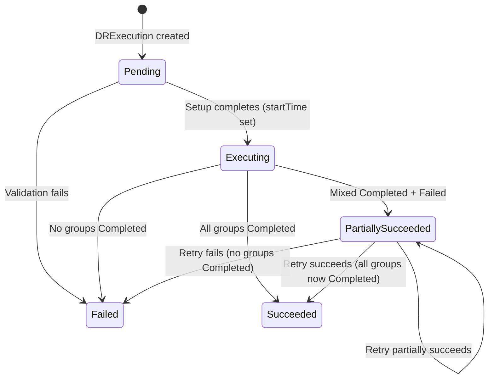
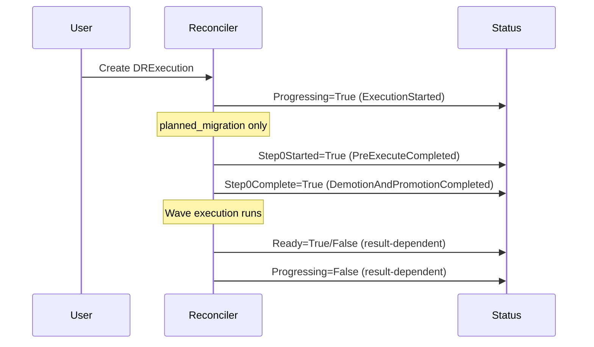
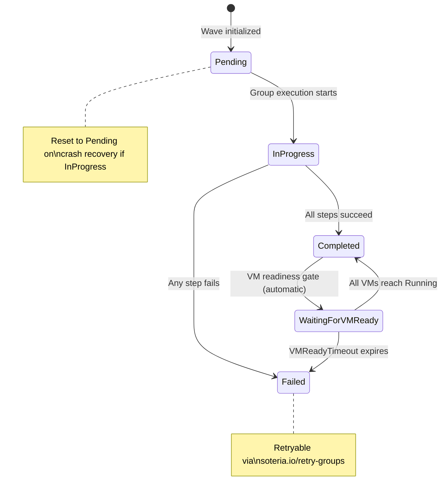
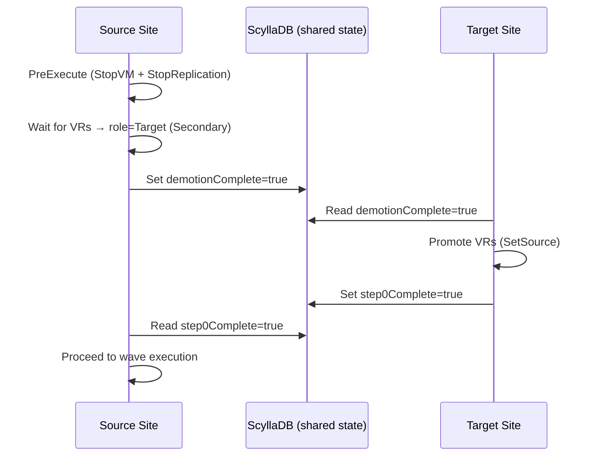

# DRExecution API Reference

The `DRExecution` resource records an immutable execution of a DRPlan. Each
DRExecution triggers a failover, failback, or re-protect operation and tracks
progress through waves of DRGroups down to individual storage and VM steps.

**API group:** `soteria.io/v1alpha1`
**Resource:** `drexecutions`
**Scope:** Namespaced

---

## Resource Structure

```yaml
apiVersion: soteria.io/v1alpha1
kind: DRExecution
metadata:
  name: erp-failover-20260901
  labels:
    soteria.io/plan-name: erp-full-stack   # Set server-side; enables plan-scoped queries
  annotations:
    soteria.io/triggered-by: admin@example.com   # Set server-side in PrepareForCreate
spec:
  planName: erp-full-stack
  mode: planned_migration
status:
  phase: Executing
  isActive: true
  # ... status fields populated by the controller
```

---

## DRExecutionSpec

The spec is **immutable after creation** — both `planName` and `mode` are
rejected by validation if changed on update.

| Field | Type | Required | Description |
|-------|------|----------|-------------|
| `planName` | `string` | **Yes** | Name of the DRPlan to execute. Must reference an existing DRPlan in the same namespace. A `soteria.io/plan-name` label is stamped server-side for efficient list queries. |
| `mode` | `string` | **Yes** | Execution type chosen at runtime. One of: `planned_migration`, `disaster`, `reprotect`. |

### Execution Modes

| Mode | Description | Step 0 | Graceful Shutdown |
|------|-------------|--------|-------------------|
| `planned_migration` | Orderly migration with data sync. Stops VMs on the source site, waits for final replication sync, then promotes the target site. | **Yes** — StopVM → StopReplication → wait for VR demotion → SetSource (promote) | Yes |
| `disaster` | Emergency failover when the source site is unavailable. Promotes the target site immediately without waiting for sync. | **No** | No |
| `reprotect` | Restores replication in the reverse direction after failover/failback. Not wave-based — operates directly on volume groups. | **No** | N/A |

### Labels and Annotations

| Key | Set By | Description |
|-----|--------|-------------|
| `soteria.io/plan-name` | Server (PrepareForCreate) | Enables efficient `LIST` queries filtered by plan. Used by the admission concurrency gate and reconciler exclusivity checks. |
| `soteria.io/triggered-by` | Server (PrepareForCreate) | Records the authenticated user who created the execution. Captures every creation path (console, `kubectl`, automation). |
| `soteria.io/retry-groups` | User (annotation patch) | Triggers retry of failed DRGroups. Values: `all-failed` or comma-separated group names (e.g., `wave-1-group-0,wave-2-group-1`). Removed automatically after processing. |

---

## DRExecutionStatus

| Field | Type | Description |
|-------|------|-------------|
| `phase` | `string` | Lifecycle phase. One of: `Pending`, `Executing`, `Succeeded`, `PartiallySucceeded`, `Failed`. See [Phase Semantics](#phase-semantics). |
| `isActive` | `bool` | `true` while the execution is in-flight (`Pending` or `Executing`). Set to `false` when a terminal `result` is written. |
| `result` | `string` | Overall outcome. One of: `Succeeded`, `PartiallySucceeded`, `Failed`. Empty while in-flight. See [Result Computation](#result-computation). |
| `waves` | [`[]WaveStatus`](#wavestatus) | Per-wave execution status. Populated during initialization from VM discovery and chunking. |
| `startTime` | `metav1.Time` | When execution began (set during setup phase). |
| `completionTime` | `metav1.Time` | When execution finished (set when a terminal result is written). |
| `duration` | `string` | Human-readable execution duration (e.g., `3m45s`). Computed as `completionTime - startTime`, truncated to seconds. Persisted for availability via both the aggregated API server and `kubectl` output. |
| `conditions` | [`[]metav1.Condition`](#status-conditions) | Standard Kubernetes conditions representing the latest observations. See [Status Conditions](#status-conditions). |
| `siteStatuses` | [`map[string]SiteCoordinationStatus`](#sitecoordinationstatus) | Per-site coordination signals, keyed by site name (e.g., `"east"`, `"west"`). Each controller writes **only** to its own site entry, eliminating ScyllaDB LWW conflicts from concurrent cross-site patches. |

### IsTerminal Method

```go
func (s DRExecutionStatus) IsTerminal() bool {
    return s.Result != ""
}
```

An execution is considered terminal when `Result` is non-empty. Any of `Succeeded`,
`PartiallySucceeded`, or `Failed` signals the execution has completed. However:

- **`Succeeded`** and **`Failed`** are fully closed — no further action is possible.
- **`PartiallySucceeded`** is re-openable via the `soteria.io/retry-groups` annotation.

---

## Phase Semantics

The `phase` field tracks the high-level lifecycle of a DRExecution.

| Phase | Meaning | IsActive | Result |
|-------|---------|----------|--------|
| `Pending` | Execution created but not yet started. The reconciler has not yet performed setup (validation, plan transition, wave initialization). | `true` | `""` (empty) |
| `Executing` | Active execution in progress. Waves are being processed, Step 0 may be running, or VMs are being started. | `true` | `""` (empty) |
| `Succeeded` | All DRGroups across all waves completed successfully. | `false` | `Succeeded` |
| `PartiallySucceeded` | At least one DRGroup completed, but one or more failed. Retryable via annotation. | `false` | `PartiallySucceeded` |
| `Failed` | No DRGroup completed successfully, or a fatal error occurred before wave execution. | `false` | `Failed` |

### Phase Transitions



!!! info "Phase is derived from Result"
    Terminal phases are set via `ResultToPhase(result)`. The `Pending → Executing`
    transition happens when the reconciler sets `startTime` and advances the phase
    directly. During retry, the Phase transitions directly from `PartiallySucceeded`
    to the new result phase — it does not pass through `Executing` again.

---

## Result Computation

The overall execution result is computed by scanning all DRGroup results across
all waves:

| Scenario | Result |
|----------|--------|
| No groups exist (empty waves) | `Succeeded` |
| All groups `Completed` | `Succeeded` |
| No groups `Completed` (all `Failed`, `Pending`, or `InProgress`) | `Failed` |
| At least one `Completed` + any `Failed` or incomplete | `PartiallySucceeded` |

For **re-protect** executions, the result is computed differently:

| Scenario | Result |
|----------|--------|
| No volume groups | `Succeeded` |
| All VGs setup succeeded, no timeout | `Succeeded` |
| No VGs setup succeeded | `Failed` |
| Some VGs failed or health monitoring timed out | `PartiallySucceeded` |

---

## Status Conditions

DRExecution uses standard `metav1.Condition` entries to represent observable
state transitions. All conditions include `observedGeneration` for consistency.

### Condition Types

| Type | Status | Reason | When Set | Meaning |
|------|--------|--------|----------|---------|
| `Progressing` | `True` | `ExecutionStarted` | Setup phase completes | Execution is actively running. Set when `startTime` is written. |
| `Progressing` | `False` | `ExecutionSucceeded` | Execution completes (success) | All waves completed successfully. |
| `Progressing` | `False` | `ExecutionPartiallySucceeded` | Execution completes (partial) | At least one group failed. |
| `Progressing` | `False` | `ExecutionFailed` | Execution completes (failure) | All groups failed or a fatal error occurred. |
| `Step0Started` | `True` | `PreExecuteCompleted` | After PreExecute returns | Planned migration Step 0 pre-execution (StopVM + StopReplication) completed. Anchors the demotion timeout baseline so VM shutdown time does not consume the timeout budget. |
| `Step0Complete` | `True` | `DemotionAndPromotionCompleted` | After VRs demoted + promoted | Source VRs confirmed in Secondary state and target VRs promoted to primary. Step 0 is fully done; wave execution can proceed. |
| `Ready` | `True` | `ExecutionSucceeded` | Terminal success | Execution finished successfully (failover/failback). |
| `Ready` | `True` | `ReprotectSucceeded` | Terminal success (re-protect) | Re-protect completed successfully. |
| `Ready` | `True` | `ReprotectPartiallySucceeded` | Terminal partial (re-protect) | Re-protect partially succeeded — some VGs had failures. |
| `Ready` | `False` | `ExecutionFailed` | Terminal failure | Execution failed. |
| `Ready` | `False` | `ReprotectFailed` | Terminal failure (re-protect) | Re-protect failed — no VGs succeeded. |
| `Ready` | `False` | `DemotionTimeout` | Step 0 timeout | VRs did not reach Secondary state within `resyncTimeout`. |
| `Ready` | `False` | `Step0Timeout` | Step 0 timeout (multi-site) | Step 0 timed out waiting for the other site. |
| `Ready` | `False` | `PreExecutionFailed` | Step 0 handler error | PreExecute (StopVM + StopReplication) returned an error. |
| `ResyncPending` | `True` | — | Legacy single-site path | Compatibility condition for executions upgraded mid-Step 0 from the legacy resync protocol. Routes into the health-wait gate. |
| `ReprotectPhase` | `True` | `Complete` | Re-protect finishes | Records re-protect role setup and health monitoring outcome. Message includes counts (e.g., "Role setup: 3/3, healthy: 3/3"). |
| `RetryRejected` | `True` | `RetryRejected` | Retry precondition fails | A retry was rejected. Reasons include: execution already `Succeeded`/`Failed`, group resolution failed, VM health validation failed, or handler resolution failed. The `message` field contains details. |

### Condition Lifecycle



---

## WaveStatus

Each wave contains a set of DRGroups processed concurrently (bounded by
`maxConcurrentFailovers`). Waves execute sequentially — wave N+1 starts only
after all wave N groups are complete and their VMs reach Running state.

| Field | Type | Description |
|-------|------|-------------|
| `waveIndex` | `int` | Zero-based wave ordinal. |
| `groups` | [`[]DRGroupExecutionStatus`](#drgroupexecutionstatus) | Per-DRGroup status within this wave. |
| `startTime` | `metav1.Time` | When this wave began processing. |
| `completionTime` | `metav1.Time` | When this wave finished (all groups terminal). |
| `vmReadyStartTime` | `metav1.Time` | When the wave entered the `WaitingForVMReady` state (all handler operations complete, waiting for VMs to reach Running). Used as the base for `vmReadyTimeout` calculation. |

---

## DRGroupExecutionStatus

Each DRGroup represents a chunk of VMs within a wave, processed as a unit.
The group goes through storage operations (SetSource) and VM operations (StartVM)
for each member VM.

| Field | Type | Description |
|-------|------|-------------|
| `name` | `string` | DRGroup identifier within the wave (e.g., `wave-1-group-0`). |
| `result` | `string` | Outcome of this DRGroup. One of: `Pending`, `InProgress`, `Completed`, `Failed`, `WaitingForVMReady`. See [DRGroupResult State Machine](#drgroupresult-state-machine). |
| `vmNames` | `[]string` | VMs belonging to this DRGroup. |
| `error` | `string` | Error details if the group failed. Includes the step name, target resource, and error message. |
| `steps` | [`[]StepStatus`](#stepstatus) | Per-step execution details within this DRGroup. |
| `retryCount` | `int` | Number of times this group has been retried. Incremented on each retry attempt for audit trail purposes. |
| `startTime` | `metav1.Time` | When this group began processing. |
| `completionTime` | `metav1.Time` | When this group finished. |

### DRGroupResult State Machine



**State descriptions:**

| Result | Meaning |
|--------|---------|
| `Pending` | Group has not started execution yet. Also the reset state when an `InProgress` group is detected after a pod restart (crash recovery). |
| `InProgress` | Group is actively executing handler steps (SetSource, StartVM). |
| `Completed` | All handler steps succeeded. If VM readiness gating is active, the group transitions through `WaitingForVMReady` first. |
| `Failed` | A handler step failed or the VM readiness timeout expired. The `error` field contains details. Retryable via annotation on `PartiallySucceeded` executions. |
| `WaitingForVMReady` | Handler operations completed; waiting for VMs to reach Running state. Entered automatically when all groups in a wave complete. Times out per `vmReadyTimeout` on the DRPlan. |

---

## StepStatus

Individual step execution records within a DRGroup. Steps are recorded by the
failover handler as each operation completes.

| Field | Type | Description |
|-------|------|-------------|
| `name` | `string` | Step identifier. See [Step Names](#step-names). |
| `status` | `string` | Step outcome: `Succeeded`, `Failed`, or handler-specific values. |
| `message` | `string` | Human-readable detail (e.g., `"Set source for volume group ns-erp-db"`, `"Failed to start VM web01: connection refused"`). |
| `timestamp` | `metav1.Time` | When this step completed. |

### Step Names

**Failover / Failback steps** (per DRGroup, recorded by `FailoverHandler`):

| Step Name | Operation | Description |
|-----------|-----------|-------------|
| `SetSource` | Volume promotion | Promotes a volume group to primary/writable via the storage driver. One step per volume group in the DRGroup. |
| `StartVM` | VM startup | Starts a virtual machine on the target cluster. One step per VM in the DRGroup. |
| `WaitVMReady` | VM readiness | Recorded when the VM readiness timeout expires (failure case only). |

**Re-protect steps** (per volume group, recorded by `ReprotectHandler`):

| Step Name | Operation | Description |
|-----------|-----------|-------------|
| `StateVerification` | Role verification | Verifies volume group replication state matches the expected configuration. |
| `HealthMonitoring` | Health check | Monitors replication health after role setup. May time out with a warning. |

---

## SiteCoordinationStatus

In multi-site deployments, each Soteria controller instance writes exclusively
to its own entry in the `siteStatuses` map. This write-isolation pattern
eliminates ScyllaDB last-writer-wins conflicts from concurrent cross-site
status patches.

| Field | Type | Description |
|-------|------|-------------|
| `demotionComplete` | `bool` | Set by the **source site** (Step 0) after all local primary VRs have been demoted to Secondary **and** the demotion snapshot has been confirmed synced. Signals the target site to promote its VRs to primary. |
| `step0Complete` | `bool` | Set by the **target site** after promoting its VRs to primary. Signals the source site that Step 0 is done and waves can proceed. |
| `lastUpdated` | `metav1.Time` | When this site last wrote to its coordination status. Used for timeout calculations. |

### Multi-Site Step 0 Flow



---

## Events

The DRExecution controller emits Kubernetes events to provide an audit trail
of execution progress.

| Reason | Type | Action | Description |
|--------|------|--------|-------------|
| `FailoverStarted` / `ReprotectingStarted` / `FailingBackStarted` | Normal | (phase-specific) | Execution started for a plan. |
| `Step0Failed` | Warning | PlannedMigration | Step 0 pre-execution (StopVM + StopReplication) failed. |
| `Step0Completed` | Normal | PlannedMigration | Step 0 completed (source demotion + target promotion). |
| `DemotionComplete` | Normal | PlannedMigration | Source site demotion completed. |
| `DemotionTimeout` | Warning | PlannedMigration | VRs did not reach Secondary state within `resyncTimeout`. |
| `Step0Timeout` | Warning | PlannedMigration | Step 0 timed out waiting for the other site. |
| `ExecutionCompleted` | Normal | WaveExecution | Execution completed (emitted on both DRExecution and DRPlan). |
| `ExecutionResumed` | Normal | Checkpoint | Execution resumed after pod restart. |
| `ReprotectStarted` | Normal | Dispatch | Re-protect execution started. |
| `ReprotectRoleSetupComplete` | Normal | RoleSetup | Re-protect role setup finished. |
| `ReprotectHealthy` | Normal | HealthMonitoring | All volume groups report healthy replication. |
| `ReprotectTimeout` | Warning | HealthMonitoring | Re-protect health monitoring timed out. |
| `ReprotectResumed` | Normal | Checkpoint | Re-protect execution resumed after restart. |
| `RetryStarted` | Normal | RetryAction | Retry started for specified groups. |
| `RetryRejected` | Warning | RetryAction | Retry rejected (precondition not met). |
| `RetryCompleted` | Normal | RetryAction | Retry completed. |
| `GroupRetrySucceeded` | Normal | RetryAction | A specific DRGroup retry succeeded. |
| `GroupRetryFailed` | Warning | RetryAction | A specific DRGroup retry failed. |
| `NoVolumeGroups` | Warning | Dispatch | No volume groups found for re-protect. |
| `SiteConfigMissing` | Warning | Validation | `--site-name` not configured for a multi-site plan. |

---

## Retry Mechanism

Failed DRGroups can be retried on `PartiallySucceeded` executions by annotating
the DRExecution resource.

### Annotation

```yaml
metadata:
  annotations:
    soteria.io/retry-groups: "all-failed"          # Retry all failed groups
    # OR
    soteria.io/retry-groups: "wave-1-group-0,wave-2-group-1"  # Retry specific groups
```

### Preconditions

A retry is rejected (with a `RetryRejected` condition and warning event) if:

1. The execution result is `Succeeded` or `Failed` (only `PartiallySucceeded` is retryable).
2. A retry is already in progress (any group has `InProgress` result).
3. The specified group names do not match any failed groups.
4. Any VM in the retry groups fails health validation (VMs in non-standard state are rejected to prevent failover from unpredictable starting points).
5. Handler resolution fails for the retry operation.

### Retry Flow

1. User patches the `soteria.io/retry-groups` annotation.
2. Controller validates preconditions.
3. Failed groups are reset to `Pending`, `retryCount` is incremented.
4. Groups are re-executed through the normal handler path.
5. The annotation is removed after processing.
6. The overall result is recomputed.

---

## Examples

### Planned Migration (In Progress)

```yaml
apiVersion: soteria.io/v1alpha1
kind: DRExecution
metadata:
  name: erp-migration-20260901
  namespace: soteria-system
  labels:
    soteria.io/plan-name: erp-full-stack
  annotations:
    soteria.io/triggered-by: platform-admin@example.com
spec:
  planName: erp-full-stack
  mode: planned_migration
status:
  phase: Executing
  isActive: true
  startTime: "2026-09-01T14:00:00Z"
  conditions:
    - type: Progressing
      status: "True"
      reason: ExecutionStarted
      message: "Execution started for plan erp-full-stack in planned_migration mode"
      lastTransitionTime: "2026-09-01T14:00:00Z"
    - type: Step0Started
      status: "True"
      reason: PreExecuteCompleted
      message: "Step 0 pre-execution completed, waiting for VRs to reach Secondary"
      lastTransitionTime: "2026-09-01T14:00:30Z"
    - type: Step0Complete
      status: "True"
      reason: DemotionAndPromotionCompleted
      message: "VRs demoted, confirmed Secondary, and promoted to primary"
      lastTransitionTime: "2026-09-01T14:02:15Z"
  waves:
    - waveIndex: 0
      startTime: "2026-09-01T14:02:16Z"
      groups:
        - name: wave-0-group-0
          result: Completed
          vmNames: ["db-primary", "db-replica"]
          startTime: "2026-09-01T14:02:16Z"
          completionTime: "2026-09-01T14:03:00Z"
          steps:
            - name: SetSource
              status: Succeeded
              message: "Set source for volume group ns-erp-database"
              timestamp: "2026-09-01T14:02:30Z"
            - name: SetSource
              status: Succeeded
              message: "Set source for volume group vm-default-db-replica"
              timestamp: "2026-09-01T14:02:45Z"
            - name: StartVM
              status: Succeeded
              message: "Started VM db-primary"
              timestamp: "2026-09-01T14:02:50Z"
            - name: StartVM
              status: Succeeded
              message: "Started VM db-replica"
              timestamp: "2026-09-01T14:03:00Z"
    - waveIndex: 1
      startTime: "2026-09-01T14:03:30Z"
      groups:
        - name: wave-1-group-0
          result: InProgress
          vmNames: ["app-server-1", "app-server-2"]
          startTime: "2026-09-01T14:03:30Z"
          steps:
            - name: SetSource
              status: Succeeded
              message: "Set source for volume group vm-default-app-server-1"
              timestamp: "2026-09-01T14:03:35Z"
```

### Disaster Failover (Partially Succeeded)

```yaml
apiVersion: soteria.io/v1alpha1
kind: DRExecution
metadata:
  name: erp-disaster-20260901
  namespace: soteria-system
  labels:
    soteria.io/plan-name: erp-full-stack
  annotations:
    soteria.io/triggered-by: oncall-engineer@example.com
spec:
  planName: erp-full-stack
  mode: disaster
status:
  phase: PartiallySucceeded
  isActive: false
  result: PartiallySucceeded
  startTime: "2026-09-01T03:15:00Z"
  completionTime: "2026-09-01T03:18:45Z"
  duration: "3m45s"
  conditions:
    - type: Progressing
      status: "False"
      reason: ExecutionPartiallySucceeded
      message: "Execution completed: PartiallySucceeded"
      lastTransitionTime: "2026-09-01T03:18:45Z"
    - type: Ready
      status: "True"
      reason: ExecutionPartiallySucceeded
      message: "Execution completed: PartiallySucceeded"
      lastTransitionTime: "2026-09-01T03:18:45Z"
  waves:
    - waveIndex: 0
      startTime: "2026-09-01T03:15:01Z"
      completionTime: "2026-09-01T03:18:45Z"
      groups:
        - name: wave-0-group-0
          result: Completed
          vmNames: ["db-primary"]
          startTime: "2026-09-01T03:15:01Z"
          completionTime: "2026-09-01T03:16:30Z"
          steps:
            - name: SetSource
              status: Succeeded
              message: "Set source for volume group ns-erp-database"
              timestamp: "2026-09-01T03:15:15Z"
            - name: StartVM
              status: Succeeded
              message: "Started VM db-primary"
              timestamp: "2026-09-01T03:16:30Z"
        - name: wave-0-group-1
          result: Failed
          vmNames: ["cache-server"]
          error: "step SetSource failed for vm-default-cache: replication state transition invalid"
          startTime: "2026-09-01T03:15:01Z"
          completionTime: "2026-09-01T03:15:20Z"
          steps:
            - name: SetSource
              status: Failed
              message: "Failed to set source for volume group vm-default-cache: replication state transition invalid"
              timestamp: "2026-09-01T03:15:20Z"
```

### Completed Execution with Retry History

```yaml
apiVersion: soteria.io/v1alpha1
kind: DRExecution
metadata:
  name: erp-disaster-20260901
  namespace: soteria-system
  labels:
    soteria.io/plan-name: erp-full-stack
spec:
  planName: erp-full-stack
  mode: disaster
status:
  phase: Succeeded
  isActive: false
  result: Succeeded
  startTime: "2026-09-01T03:15:00Z"
  completionTime: "2026-09-01T03:25:00Z"
  duration: "10m0s"
  conditions:
    - type: Progressing
      status: "False"
      reason: ExecutionSucceeded
      message: "Execution completed: Succeeded"
    - type: Ready
      status: "True"
      reason: ExecutionSucceeded
      message: "Execution completed: Succeeded"
  waves:
    - waveIndex: 0
      startTime: "2026-09-01T03:15:01Z"
      completionTime: "2026-09-01T03:25:00Z"
      groups:
        - name: wave-0-group-0
          result: Completed
          vmNames: ["db-primary"]
          startTime: "2026-09-01T03:15:01Z"
          completionTime: "2026-09-01T03:16:30Z"
        - name: wave-0-group-1
          result: Completed
          vmNames: ["cache-server"]
          retryCount: 1
          startTime: "2026-09-01T03:20:00Z"
          completionTime: "2026-09-01T03:25:00Z"
          steps:
            - name: SetSource
              status: Succeeded
              message: "Set source for volume group vm-default-cache"
              timestamp: "2026-09-01T03:22:00Z"
            - name: StartVM
              status: Succeeded
              message: "Started VM cache-server"
              timestamp: "2026-09-01T03:25:00Z"
```

### Re-protect Execution

Re-protect executions operate directly on volume groups without the wave executor.
The `waves` field is not populated. Results are tracked via conditions only.

```yaml
apiVersion: soteria.io/v1alpha1
kind: DRExecution
metadata:
  name: erp-reprotect-20260902
  namespace: soteria-system
  labels:
    soteria.io/plan-name: erp-full-stack
spec:
  planName: erp-full-stack
  mode: reprotect
status:
  phase: Succeeded
  isActive: false
  result: Succeeded
  startTime: "2026-09-02T10:00:00Z"
  completionTime: "2026-09-02T10:02:30Z"
  duration: "2m30s"
  conditions:
    - type: Progressing
      status: "True"
      reason: ExecutionStarted
      message: "Execution started for plan erp-full-stack in reprotect mode"
    - type: Ready
      status: "True"
      reason: ReprotectSucceeded
      message: "Re-protect completed: Succeeded"
    - type: ReprotectPhase
      status: "True"
      reason: Complete
      message: "Role setup: 3/3, healthy: 3/3"
```

---

## Key Constraints

| Constraint | Details |
|------------|---------|
| **Immutable spec** | `planName` and `mode` cannot be changed after creation. Enforced by `ValidateDRExecutionUpdate`. |
| **Human-triggered only** | All failover requires explicit human initiation — no auto-failover, no failure detection. |
| **Concurrent execution guard** | Only one active (non-terminal) execution per plan is allowed, enforced by the admission concurrency gate using the `soteria.io/plan-name` label. |
| **Fail-forward** | Rollback is impossible when the source site is down. Failed DRGroups are marked `Failed`, the engine continues with remaining groups, and the execution reports `PartiallySucceeded`. |
| **Retry restrictions** | Only `PartiallySucceeded` is retryable. VMs must pass health validation before retry to prevent failover from unpredictable state. |
| **Checkpointing** | Status is persisted after each DRGroup completes. Pod restart resumes from the last checkpoint — at most one in-flight DRGroup is lost. |
| **Site write-isolation** | In multi-site mode, each controller writes only to its own `siteStatuses` entry. Cross-site reads are eventually consistent via ScyllaDB. |

---

## Related Resources

- [DRPlan API Reference](drplan.md) — The plan that a DRExecution operates on.
- [Executing Failover](../../usage/failover.md) — Usage guide for triggering DR operations.
- [DR Lifecycle](../../architecture/dr-lifecycle.md) — Architecture overview of the 8-phase DR lifecycle.
