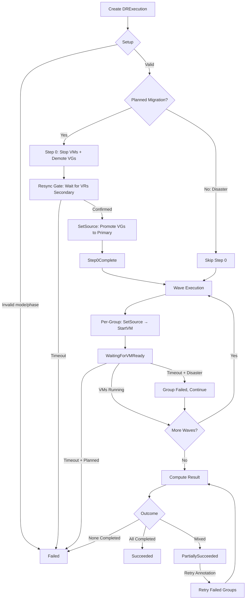

# Executing Failover

This guide walks you through triggering, monitoring, and recovering from
failover operations with Soteria. Every failover is initiated by creating a
**DRExecution** resource — there is no automatic failover or failure detection,
by design.

---

## Prerequisites

Before triggering a failover make sure:

- A **DRPlan** exists and its `status.phase` is in a valid starting state (see
  the table below).
- All VMs in the plan are labelled with `soteria.io/drplan: <plan-name>` and
  `soteria.io/wave: <wave-key>`.
- Volume replication is healthy — check `status.replicationHealth` on the
  DRPlan or run:

```bash
kubectl get drplan <plan-name> -o jsonpath='{.status.replicationHealth}' | jq .
```

---

## Execution Modes

Soteria supports two failover modes, selected at runtime via the
`spec.mode` field on the DRExecution resource:

| Mode | When to Use | Step 0 | Data Loss |
|------|-------------|--------|-----------|
| `planned_migration` | Maintenance windows, data-centre moves. Both sites are healthy. | Yes — VMs are stopped and volumes are demoted gracefully. | Zero (last writes are synced before cutover). |
| `disaster` | Active site is unavailable or degraded. | Skipped — the origin site may be unreachable. | Possible — up to the last sync point (RPO is storage-determined). |

!!! important "Mode is set at execution time"
    The execution mode is specified on the DRExecution, **not** on the DRPlan.
    The same plan can be executed in either mode depending on the situation
    (see [FR19](../architecture/overview.md)).

---

## Triggering a Planned Migration

### 1. Verify the DRPlan Phase

Planned migration is valid from the following rest states:

| Current Phase | Target Phase |
|---------------|--------------|
| `SteadyState` | `FailingOver` → `FailedOver` |
| `DRedSteadyState` | `FailingBack` → `FailedBack` |

Check the current phase:

```bash
kubectl get drplan <plan-name> -o jsonpath='{.status.phase}'
```

### 2. Create the DRExecution

```yaml
apiVersion: soteria.io/v1alpha1
kind: DRExecution
metadata:
  name: erp-planned-001
spec:
  planName: erp-full-stack
  mode: planned_migration
```

Apply it:

```bash
kubectl apply -f - <<EOF
apiVersion: soteria.io/v1alpha1
kind: DRExecution
metadata:
  name: erp-planned-001
spec:
  planName: erp-full-stack
  mode: planned_migration
EOF
```

### 3. What Happens Next

The reconciler drives the execution through these phases:

```
Setup → Step 0 → Resync Gate → Wave Execution → VM Readiness → Result
```

**Setup.** The controller validates the mode, transitions the DRPlan to its
in-progress phase (e.g. `FailingOver`), sets `status.startTime`, and emits a
`FailoverStarted` event.

**Step 0 (planned migration only).** The `FailoverHandler` runs `PreExecute`:

1. **Stop all origin VMs** in reverse wave order — dependants (e.g. webservers
   in the last wave) stop before dependencies (e.g. database in the first
   wave).
2. **Demote all source volume groups** by calling `StopReplication` on each
   VG. This sets the source VR/VGR to secondary (read-only). The rbd-mirror
   daemon automatically syncs the demotion snapshot to the target.

A `Step0Started` condition is set after PreExecute completes to anchor the
demotion timeout baseline.

**Resync Gate.** The controller watches VolumeReplication and
VolumeGroupReplication CRs (event-driven, not polling) and waits for all
VRs to confirm `role=Target` (`state=Secondary`). Once confirmed, it calls
`SetSource` on all VGs to promote them to primary (writable) on the target
site and sets the `Step0Complete` condition.

!!! info "Resync Timeout"
    If VRs do not reach the secondary state within `spec.resyncTimeout`
    (default 10 minutes), the execution is failed. Override on the DRPlan:
    ```yaml
    spec:
      resyncTimeout: "15m"
    ```

**Wave Execution.** Waves execute sequentially (wave 0 finishes before wave 1
starts). Within each wave, DRGroups execute sequentially. For each DRGroup
the handler runs:

1. **SetSource** — promote target VR/VGR to primary (writable).
2. **StartVM** — start the VMs on the target cluster.

**VM Readiness Gate.** After all handler operations in a wave complete,
completed groups transition to `WaitingForVMReady`. The controller watches
VirtualMachine status changes and waits for all VMs to reach `Running`.
A safety-net poll runs every 10 seconds in case a watch event is missed.

!!! info "VM Ready Timeout"
    If VMs do not reach `Running` within `spec.vmReadyTimeout` (default 5
    minutes), the behaviour depends on the mode:

    - **Planned migration:** fail-fast — the entire execution is aborted.
    - **Disaster:** fail-forward — the timed-out group is marked `Failed`
      and subsequent groups continue.

**Result.** Once all waves complete, the controller computes the overall
result, advances the DRPlan to the next rest state, and emits an
`ExecutionCompleted` event.

---

## Triggering a Disaster Failover

### 1. Verify the DRPlan Phase

Disaster failover is valid from the same starting phases as planned migration:

| Current Phase | Target Phase |
|---------------|--------------|
| `SteadyState` | `FailingOver` → `FailedOver` |
| `DRedSteadyState` | `FailingBack` → `FailedBack` |

### 2. Create the DRExecution

```yaml
apiVersion: soteria.io/v1alpha1
kind: DRExecution
metadata:
  name: erp-disaster-001
spec:
  planName: erp-full-stack
  mode: disaster
```

Apply it:

```bash
kubectl apply -f - <<EOF
apiVersion: soteria.io/v1alpha1
kind: DRExecution
metadata:
  name: erp-disaster-001
spec:
  planName: erp-full-stack
  mode: disaster
EOF
```

### 3. What Happens Next

Because `GracefulShutdown` is `false` for disaster mode, the execution flow
skips Step 0 entirely:

```
Setup → Wave Execution → VM Readiness → Result
```

**Setup.** Identical to planned migration — mode validation, phase transition,
`FailoverStarted` event.

**Wave Execution.** The per-group path is identical to planned migration:

1. **SetSource** — promote target VR/VGR to primary (writable).
2. **StartVM** — start VMs on the target cluster.

**VM Readiness Gate.** Same as planned migration, but timeout uses
**fail-forward** semantics: timed-out groups are marked `Failed` and execution
continues with the remaining groups.

**Result.** Same computation as planned migration.

!!! warning "Data loss in disaster mode"
    In disaster mode the origin VMs are **not stopped** and the source volumes
    are **not demoted**. Any writes that were not replicated to the target
    before the disaster are lost. The amount of data loss depends on your
    storage replication RPO, which is storage-determined — Soteria does not
    track or enforce RPO targets.

---

## Monitoring Execution

### Checking Execution Status

View the high-level status:

```bash
kubectl get drexecutions
```

Inspect detailed status including per-wave and per-group results:

```bash
kubectl get drexecution <execution-name> -o yaml
```

### Key Status Fields

| Field | Description |
|-------|-------------|
| `status.phase` | Lifecycle phase: `Pending`, `Executing`, `Succeeded`, `PartiallySucceeded`, `Failed` |
| `status.result` | Terminal outcome: `Succeeded`, `PartiallySucceeded`, `Failed` |
| `status.isActive` | `true` while executing, `false` when terminal |
| `status.startTime` | When execution began |
| `status.completionTime` | When execution reached a terminal state |
| `status.duration` | Human-readable elapsed time (e.g. `2m30s`) |
| `status.waves[]` | Per-wave status with groups, start/completion times |
| `status.conditions[]` | Standard Kubernetes conditions (see below) |

### Status Conditions

| Condition | Meaning |
|-----------|---------|
| `Progressing` | `True` while executing; set to `False` with a reason when complete |
| `Step0Started` | `True` after PreExecute completes (planned migration only) |
| `Step0Complete` | `True` after VRs are demoted, confirmed secondary, and promoted |
| `Ready` | `True` on success; `False` on failure with reason |
| `RetryRejected` | `True` if a retry annotation was rejected (with reason) |

### Watching Events

Soteria emits Kubernetes events on DRExecution and DRPlan resources throughout
execution:

```bash
# Watch events for a specific execution
kubectl get events --field-selector involvedObject.name=<execution-name> -w

# All events in the namespace related to DRExecutions
kubectl get events --field-selector reason=FailoverStarted -w
```

Key event reasons:

| Event Reason | Type | Description |
|--------------|------|-------------|
| `FailoverStarted` | Normal | Execution has begun |
| `GroupCompleted` | Normal | A DRGroup completed successfully |
| `GroupFailed` | Warning | A DRGroup failed — includes step name and target |
| `ExecutionCompleted` | Normal | Execution finished (emitted on both DRExecution and DRPlan) |
| `ExecutionSucceeded` | Normal | All groups completed |
| `ExecutionPartiallySucceeded` | Warning | Some groups failed |
| `ExecutionFailed` | Warning | Execution failed (no groups completed, or setup error) |
| `Step0Failed` | Warning | Step 0 pre-execution failed |
| `Step0Completed` | Normal | Step 0 finished (demote + promote) |
| `ExecutionResumed` | Normal | Execution resumed after pod restart |

### Per-Wave and Per-Group Status

Each wave and group tracks detailed execution progress:

```bash
# View wave status
kubectl get drexecution <name> -o jsonpath='{.status.waves}' | jq .

# Check a specific wave's groups
kubectl get drexecution <name> \
  -o jsonpath='{.status.waves[0].groups}' | jq .
```

Group result values:

| Result | Description |
|--------|-------------|
| `Pending` | Not yet started |
| `InProgress` | Handler operations running |
| `Completed` | Handler operations succeeded |
| `WaitingForVMReady` | SetSource + StartVM done, waiting for VM to reach `Running` |
| `Failed` | Group failed — check `error` field for details |

Each group also records per-step details in `steps[]`:

```bash
kubectl get drexecution <name> \
  -o jsonpath='{.status.waves[0].groups[0].steps}' | jq .
```

Step names: `SetSource`, `StartVM`, `WaitVMReady`.

---

## Understanding Results

### Overall Result Computation

The controller computes the overall execution result by scanning all groups
across all waves:

| Condition | Result |
|-----------|--------|
| All groups `Completed` | `Succeeded` |
| At least one `Completed` and at least one `Failed` (or `Pending`) | `PartiallySucceeded` |
| No groups `Completed` | `Failed` |

### DRPlan Phase Advancement

On `Succeeded` or `PartiallySucceeded`, the DRPlan automatically advances to
the next rest state:

| Starting Phase | After Failover |
|----------------|----------------|
| `SteadyState` | `FailedOver` |
| `DRedSteadyState` | `FailedBack` |

On `Failed`, the plan stays in its current rest state — the execution failed
before it could make meaningful progress.

!!! note "Partial success still advances the phase"
    Even `PartiallySucceeded` advances the plan phase. This is because some
    groups have already been migrated — the plan cannot return to the original
    rest state. Use the retry mechanism to address remaining failures.

### Identifying Failed Groups

```bash
# List all failed groups across waves
kubectl get drexecution <name> -o json | \
  jq '.status.waves[].groups[] | select(.result == "Failed") |
      {name, error, wave: .name, retryCount}'
```

Each failed group's `error` field contains structured information including
the step that failed and the target resource:

```
step SetSource failed for erp-database: resolving volume group erp-database: ...
```

---

## Retrying Failed Groups

When an execution finishes with `PartiallySucceeded`, you can retry the
failed groups without creating a new DRExecution.

### Preconditions

Retry requires **all** of the following:

1. The execution result is `PartiallySucceeded`.
2. No groups are currently `InProgress` (no retry already running).
3. All VMs in the retry groups pass health validation — Soteria rejects
   retry if any VM is in a non-standard state (migrating, provisioning, or
   paused) to prevent retry from an unpredictable starting point.

### Retry All Failed Groups

```bash
kubectl annotate drexecution <execution-name> \
  soteria.io/retry-groups=all-failed
```

### Retry Specific Groups

Specify a comma-separated list of group names:

```bash
kubectl annotate drexecution <execution-name> \
  soteria.io/retry-groups="erp-database,erp-webserver"
```

!!! tip "Finding group names"
    Group names match the DRGroup chunk names visible in the execution status:
    ```bash
    kubectl get drexecution <name> -o json | \
      jq '.status.waves[].groups[] | select(.result == "Failed") | .name'
    ```

### What Happens During Retry

1. The controller validates preconditions and resolves retry targets.
2. A `RetryStarted` event is emitted listing the groups being retried.
3. Groups are retried in wave order (wave N before wave N+1), sequentially
   within each wave — the same fail-forward semantics as initial execution.
4. Each retried group increments its `retryCount` for audit trail.
5. The handler re-executes `SetSource → StartVM` for each group (driver
   operations are idempotent).
6. The overall result is recomputed after all retry groups complete.
7. The retry annotation is automatically removed.

!!! note "Retry does not re-advance the DRPlan phase"
    The plan phase was already advanced during the initial execution. Retry
    only affects the DRExecution's result — it does not call
    `CompleteTransition` again.

### Retry Rejection

If retry preconditions are not met, the annotation is removed and a
`RetryRejected` condition is set on the execution with the reason. A
`RetryRejected` event is also emitted. Common reasons:

- **Group not found:** The annotation references a group name that doesn't
  exist in the execution.
- **Group not failed:** The referenced group has a result other than `Failed`
  (e.g. `Completed`).
- **VM health validation failed:** A VM in the retry group is migrating,
  provisioning, or paused.
- **Retry already in progress:** Another retry is still running (some groups
  are `InProgress`).

---

## Execution Lifecycle Summary

The following diagram shows the full execution lifecycle for both modes:



---

## Crash Recovery

Soteria checkpoints execution progress after each DRGroup completes. If the
controller pod restarts mid-execution:

1. On startup, the informer cache syncs and queues a reconcile for every
   existing DRExecution.
2. The reconciler detects in-progress executions (`startTime != nil` and
   no terminal `result`).
3. The `ResumeAnalyzer` walks `status.waves[]` to find the first wave with
   non-terminal groups. Groups that were `InProgress` at crash time are
   reset to `Pending` and retried.
4. Execution resumes from the identified wave, skipping already-completed
   and already-failed groups.

All driver operations (`SetSource`, `StartVM`, `StopReplication`) are
**idempotent** — safe to retry after crash.

!!! info "At most one in-flight DRGroup lost"
    Sequential chunk execution means only one chunk writes to the DRExecution
    at any time. The last group whose checkpoint completed is the recovery
    point — at most one in-flight DRGroup can be lost on crash.

---

## Multi-Site Coordination

In multi-site deployments (both `primarySite` and `secondarySite` configured
on the DRPlan), Step 0 for planned migration is coordinated between sites
using `status.siteStatuses`:

1. **Source site** runs PreExecute (stop VMs + StopReplication), waits for
   VRs to reach secondary, then sets `siteStatuses[sourceSite].demotionComplete`.
2. **Target site** observes `demotionComplete`, calls SetSource on all local
   VGs to promote to primary, then sets `siteStatuses[targetSite].step0Complete`.
3. Both sites observe `step0Complete` and the target site proceeds with
   wave execution.

Each site writes **only** to its own entry in `siteStatuses`, eliminating
cross-site write conflicts.

!!! warning "Mandatory `--site-name` flag"
    In multi-site deployments, the `--site-name` flag is required on every
    controller instance. Without it the controller cannot determine which
    site it owns and will skip reconciliation.
