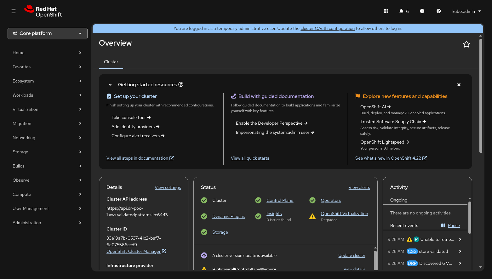

# Dashboard

The **Disaster Recovery** dashboard is the primary landing page of the Soteria
console plugin. It provides a single-pane-of-glass view of every DRPlan in the
cluster, answering the question _"Am I protected?"_ within seconds.

---

## Accessing the Dashboard

The dashboard is registered as an OpenShift dynamic plugin and appears in the
cluster console under its own top-level navigation entry. After the Soteria
Helm chart is installed and the `ConsolePlugin` resource is enabled, navigate
to **Disaster Recovery** in the OpenShift side menu.

Soteria also publishes Kubernetes events on DRPlan and DRExecution resources.
These events appear in the **Activity** stream on the cluster **Overview**
page, giving operators a quick heads-up without navigating away from the
default landing page.

---

## Page Layout

The dashboard page is composed of three vertical sections:

1. **Alert banners** — conditional warnings about replication problems
   (see [Alert Banners](#alert-banners) below).
2. **Toolbar** — a search box plus filter drop-downs for narrowing the plan
   list.
3. **Plan table** — one row per DRPlan, with sortable columns showing
   real-time status.

---

## Plan Table

The plan table is the core of the dashboard. Each row represents a single
DRPlan and displays five data columns plus an actions menu.

### Columns

| Column | Description |
|--------|-------------|
| **Name** | The DRPlan resource name. Clicking the name navigates to the [Plan Detail](plan-detail.md) view. |
| **Phase** | The current lifecycle phase shown as a colour-coded badge (see [Phase Badges](#phase-badges)). |
| **Active On** | The cluster site where workloads are currently running (e.g. `odf-exp-1`). |
| **Protected** | Replication health of the plan — an icon + label pair (see [Replication Health](#replication-health-indicators)). Warning icons appear when site-inventory or disk-topology checks fail. |
| **Last Execution** | The relative time since the most recent DRExecution completed, paired with a result badge (`Succeeded`, `Partial`, or `Failed`). Shows **Never** if no execution has run. |
| **Actions** | A kebab menu (⋮) exposing context-sensitive operations (see [Actions Menu](#actions-menu)). |

The table is **sortable** on every data column. Click a column header to
toggle ascending / descending order. By default the table sorts by
**Protected** so that plans in the worst health state surface first.

### Filtering and Search

The toolbar above the table provides:

- **Search** — a text input that filters plans by name (debounced at 300 ms).
- **Phase** — multi-select drop-down with all lifecycle phases.
- **Active On** — multi-select drop-down populated dynamically from the
  cluster sites present in the plan list.
- **Protected** — multi-select drop-down with health states: Healthy,
  Degraded, Error, Unknown.
- **Last Execution** — multi-select drop-down with result values: Succeeded,
  PartiallySucceeded, Failed, InProgress, Never.

Active filter chips appear in the toolbar and can be dismissed individually
or cleared all at once. A counter on the right shows
_"Showing N of M plans"_.

Filter state and scroll position are persisted across navigation — returning
to the dashboard restores the last-used filters. Filters are also stored in
URL query parameters, so filtered views can be bookmarked and shared.

---

## Phase Badges

Each plan's lifecycle phase is rendered as a PatternFly `Label` badge.
Phases fall into two categories:

### Rest Phases (Filled Badges)

These represent stable states where no operation is in progress.

| Phase | Badge | Meaning |
|-------|-------|---------|
| **Steady State** | :material-check-circle:{ .success } Green filled | Workloads running on the primary site; replication active toward secondary. |
| **DR Steady State** | :material-check-circle:{ .success } Green filled | Workloads running on the DR (secondary) site after reprotect; replication active toward primary. |
| **Failed Over** | :material-information:{ .info } Blue filled | Workloads migrated to the secondary site; reprotect has not yet run. |
| **Failed Back** | :material-information:{ .info } Blue filled | Workloads returned to the primary site after failback; restore has not yet run. |

### Transient Phases (Outlined Badges with Spinner)

These appear while a DRExecution is actively running. A spinner icon replaces
the static icon to indicate work in progress.

| Phase | Badge | Meaning |
|-------|-------|---------|
| **Failing Over** | :material-sync:{ .info } Blue outlined | Failover or planned migration is executing. |
| **Reprotecting** | :material-sync:{ .info } Blue outlined | Reprotect is re-establishing replication after failover. |
| **Failing Back** | :material-sync:{ .info } Blue outlined | Failback or planned migration is returning workloads to the primary site. |
| **Restoring** | :material-sync:{ .info } Blue outlined | Restore is re-establishing replication after failback. |

---

## Replication Health Indicators

The **Protected** column shows the replication health of each plan, derived
from the `ReplicationHealthy` condition on the DRPlan resource.

| Status | Icon | Colour | Meaning |
|--------|------|--------|---------|
| **Healthy** | :material-check-circle: | Green | All volume replication is functioning normally. |
| **Degraded** | :material-alert: | Yellow / Warning | Replication is partially impaired — some volumes may be lagging. |
| **Syncing** | :material-sync: | Blue / Info | An initial sync or resync is in progress. |
| **Not Replicating** | :material-minus-circle: | Grey / Disabled | Replication is intentionally stopped (e.g. during an active execution). |
| **Error** | :material-close-circle: | Red / Danger | Replication is broken — the plan is **unprotected**. Immediate attention required. |
| **Unknown** | :material-help-circle: | Grey / Disabled | The `ReplicationHealthy` condition is missing or unrecognized. |

### Warning Icons

In addition to the health indicator, two warning triangle icons may appear
beside the health badge:

- **Sites disagree on VM inventory** — the `SitesInSync` condition is
  `False`. The VM sets discovered on the primary and secondary sites do not
  match. Actions are blocked until the discrepancy is resolved.
- **Disk topology inconsistent** — the `DisksConsistent` condition is
  `False`. The volume attachment map differs between sites. Actions are
  blocked until the topology is corrected.

When either warning is present, the actions menu for that plan is disabled
with a tooltip explaining the block reason.

---

## Alert Banners

Alert banners appear at the top of the dashboard, above the toolbar, when one
or more plans have critical or degraded replication. The banners are
aggregated — one banner per severity level rather than one per plan.

| Banner | Variant | Trigger |
|--------|---------|---------|
| **N DR Plans running UNPROTECTED — replication broken** | Danger (red) | At least one plan has `ReplicationHealthy` status `Error`. |
| **N plans with degraded replication** | Warning (yellow) | At least one plan has `ReplicationHealthy` status `Degraded`. |

Each banner includes a **View affected plans** action link that automatically
applies the corresponding health filter to the plan table, letting the
operator focus on the problematic plans immediately.

When all plans are healthy, no banners are shown.

---

## Actions Menu

The kebab menu (⋮) on each plan row exposes DR operations that are valid for
the plan's current phase. Only applicable actions are listed — the menu is
empty (hidden) during transient phases.

| Current Phase | Available Actions |
|---------------|-------------------|
| **Steady State** | Failover :material-alert:{ .danger }, Planned Migration |
| **Failed Over** | Reprotect |
| **DR Steady State** | Failback :material-alert:{ .danger }, Planned Migration |
| **Failed Back** | Restore |
| _Transient phases_ | _(no actions — execution in progress)_ |

!!! note "Danger actions"
    Failover and Failback are marked as danger actions (red text) because they
    may involve data loss in disaster mode. Selecting an action navigates to
    the [Plan Detail](plan-detail.md) view where a confirmation dialog is
    presented before the DRExecution is created.

When the plan's `SitesInSync` or `DisksConsistent` condition is `False`, the
entire actions menu is disabled with a tooltip explaining why.

---

## Cross-Cluster Awareness

The dashboard is designed for single-cluster visibility — each OpenShift
cluster runs its own instance of the Soteria console plugin showing only the
DRPlans known to that cluster. Cross-cluster awareness is provided through:

- **Active On** column — shows which cluster site currently owns the
  workloads. The value comes from `status.activeSite` on the DRPlan and
  updates automatically after failover or failback.
- **Active On filter** — the drop-down is populated dynamically from the set
  of cluster sites present across all plans, making it easy to filter plans
  by their current site.
- **Replication health** — reflects the end-to-end replication state between
  clusters. A `Healthy` badge confirms that data is being replicated to the
  peer cluster.

!!! tip "Comparing clusters"
    To compare the DR posture of both clusters side by side, open the Soteria
    dashboard in two browser tabs — one pointing to each cluster's OpenShift
    console.

---

## Empty State

If no DRPlans exist in the cluster, the dashboard displays an empty-state
message with guidance on how to create the first plan:

> **No DR Plans configured**
>
> Create your first DR plan by labeling VMs with
> `app.kubernetes.io/part-of=<app-name>` and `soteria.io/wave=<number>`.

A **View documentation** link opens the getting-started guide in a new tab.
