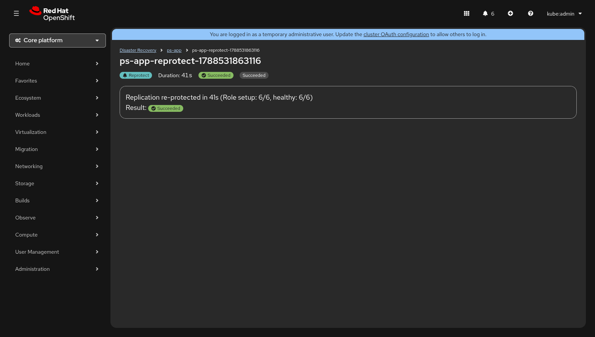
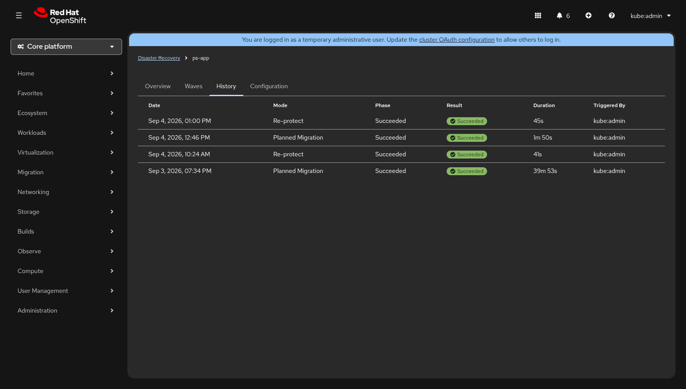

# Execution Monitor

The Execution Monitor is the real-time detail view for a running or completed
`DRExecution`. It is designed to be readable on a bridge-call screen share —
every metric updates within five seconds of a state change (NFR-7) so the
on-call team always sees current progress.

You reach the Execution Monitor by clicking any row in the
[Execution History table](#execution-history) on the Plan Detail page, or by
following the **View execution details** link in the transition progress
banner that appears while an execution is active.

---

## Page Layout

The Execution Monitor is arranged top-to-bottom in four sections:

| Section | Description |
|---------|-------------|
| **Execution Header** | Name, mode badge, timing, result badge, and retry controls |
| **Site Coordination Panel** | Source / target site step progress (planned migrations only) |
| **Wave Progress Stepper** | Vertical stepper with one step per wave; expandable DRGroup detail |
| **Execution Summary** | Completion card with bridge-call-ready one-liner and final result |

Each section is described in detail below.

---

## Execution Header

The header is the first thing visible when the page loads. Its content adapts
to whether the execution is still running or has completed.

### While Running

| Element | Description |
|---------|-------------|
| **Execution name** | The `DRExecution` resource name (e.g. `ps-app-reprotect-1788531863116`) |
| **Mode badge** | Colour-coded label — :red_circle: **Disaster Failover**, :blue_circle: **Planned Migration**, or **Reprotect** |
| **Phase** | Current execution phase (`Pending`, `Executing`, etc.) |
| **Started** | Wall-clock start time (local timezone, `HH:MM` format) |
| **Elapsed** | Live counter ticking every second |
| **Est. remaining** | Calculated from `elapsed ÷ completed_waves × remaining_waves`; shows *calculating…* until the first wave finishes |

### After Completion

| Element | Description |
|---------|-------------|
| **Execution name** | Same as above |
| **Mode badge** | Same colour-coded label |
| **Duration** | Total wall-clock time from start to completion |
| **Result badge** | :green_circle: **Succeeded**, :yellow_circle: **Partial**, or :red_circle: **Failed** |
| **Phase** | Final phase label |
| **Retry All Failed** | Appears only when the result is **Partially Succeeded** and more than one DRGroup failed. Applies the `soteria.io/retry-groups` annotation to re-execute every failed group. The button is disabled while a retry is already in progress. |

---

## Site Coordination Panel

For **Planned Migration** executions, a *Site Coordination* card appears
between the header and the wave stepper. It visualises the Step 0 handshake
that must complete before wave processing begins.

The panel contains two lanes displayed side by side:

| Lane | Steps shown |
|------|-------------|
| **Source** *(active site)* | Demoting Volumes → Demotion Synced |
| **Target** *(standby site)* | Promoting Volumes |

Each step shows one of three states:

- :white_check_mark: **Complete** — green check icon
- :spinner: **In progress** — spinning indicator with a *"Updated Xs ago"* timestamp
- :grey_question: **Pending** — grey clock icon

The panel auto-hides once all coordination steps are complete and wave
processing has started, so it does not consume screen space during the
main phase of the execution.

!!! note
    The Site Coordination Panel does **not** appear for Disaster Failover
    executions because disaster mode skips the graceful demotion handshake.

---

## Wave Progress Stepper

The central section of the Execution Monitor is a **vertical progress
stepper** (PatternFly `ProgressStepper`). Each step represents one wave from
the DRPlan and shows real-time progress as DRGroups within that wave are
processed.

### Wave States

Each wave step displays a colour and icon based on its current state:

| State | Icon / Colour | Meaning |
|-------|---------------|---------|
| **Pending** | Grey clock | Wave has not started yet |
| **In Progress** | Blue info | Wave is actively processing DRGroups |
| **Completed** | Green check | All DRGroups in the wave succeeded |
| **Partially Failed** | Yellow warning | Wave finished but one or more DRGroups failed |

The step description line shows the VM count and, once the wave has started,
the elapsed time (e.g. *"4 VMs — 1m 23s"*).

### DRGroup Detail (Expandable)

Each wave step contains a collapsible **group list** that auto-expands for
waves that are *In Progress* or *Partially Failed*. You can manually
toggle any wave with the **Show groups / Hide groups** control.

Inside the expanded section every DRGroup is displayed as a row with:

| Column | Content |
|--------|---------|
| **Group name** | Bold label (e.g. `web-tier`) |
| **VMs** | Comma-separated VM names in subdued text |
| **Status icon** | Spinner (in progress), green check (completed), red exclamation (failed), or grey clock (pending) |
| **Elapsed** | Monospace timer showing how long the group has been processing |

#### DRGroup Status Icons

| Status | Icon | Colour |
|--------|------|--------|
| In Progress / Waiting for VM Ready | Spinner | Blue |
| Completed | Check circle | Green |
| Failed | Exclamation circle | Red |
| Pending | Clock | Grey |

---

## Inline Errors and Retry

When a DRGroup fails, an **Error details** expandable section appears
directly below the group row. It is expanded by default so operators
notice failures immediately.

### Error Detail Contents

| Field | Description |
|-------|-------------|
| **Error** | The error message from the controller (e.g. *"timed out waiting for volume promotion"*) |
| **Failed step** | The specific reconciliation step that failed (e.g. `PromoteVolumes`, `WaitForVMReady`) |
| **Affected VMs** | List of VMs in the failed group |
| **Retry count** | How many times the group has already been retried (e.g. *"Previously retried 2 times"*) |

### Retry Actions

Retry buttons appear only when the overall execution result is
**Partially Succeeded** — meaning at least one group succeeded and the
execution is no longer active.

| Action | Scope | Where |
|--------|-------|-------|
| **Retry** (per-group) | Re-executes a single failed DRGroup | Inside the error detail section for that group |
| **Retry All Failed** | Re-executes every failed DRGroup across all waves | In the execution header (visible when >1 group failed) |

Both actions work by patching the `soteria.io/retry-groups` annotation on
the `DRExecution` resource. While a retry is in progress, all retry buttons
are disabled and display a tooltip: *"Retry in progress — wait for current
retry to complete"*.

If the controller rejects a retry (e.g. because the execution is still
active), a red **Retry rejected** inline alert appears beneath the button.

---

## Execution Summary

Once the execution completes, a **summary card** appears below the wave
stepper. This card is designed to be the single most useful artefact for a
bridge call — it provides a one-line summary and the final result badge.

### Summary Text by Mode

| Mode | Succeeded | Partially Succeeded / Failed |
|------|-----------|------------------------------|
| **Planned Migration / Disaster** | *"N VMs recovered in Xm Ys"* | *"M of N VMs recovered — K DRGroup failed"* |
| **Reprotect** | *"Replication re-protected in Xs (Role setup: N/N, healthy: N/N)"* | *"Re-protect failed — \<detail\>"* |

The **Result** line shows the same colour-coded badge used throughout the UI:

| Result | Badge colour | Icon |
|--------|-------------|------|
| Succeeded | Green | :white_check_mark: Check circle |
| Partial | Yellow | :warning: Warning triangle |
| Failed | Red | :x: Exclamation circle |

---

## Partial Success Visualisation

When an execution finishes with a **Partially Succeeded** result, multiple
visual cues help the operator understand what happened:

1. **Header** — the result badge shows a yellow **Partial** label and the
   *Retry All Failed* button appears.
2. **Wave stepper** — any wave that contains failed groups shows a
   **yellow warning** step icon instead of a green check. The wave
   auto-expands to reveal which groups failed.
3. **DRGroup rows** — failed groups display a red exclamation icon and
   their error detail section is expanded by default.
4. **Summary card** — the one-liner reports how many VMs were recovered
   versus the total, along with the count of failed DRGroups.

This layered approach ensures that partial failures are impossible to miss
at any zoom level — from a quick glance at the header badge down to the
specific failed step and error message.

---

## Execution History

The Execution History table lives on the **History** tab of the Plan Detail
page. It provides a chronological record of every execution for a given
DRPlan.

| Column | Description |
|--------|-------------|
| **Date** | Start timestamp in local format (e.g. *Sep 4, 2026, 01:00 PM*) |
| **Mode** | Human-readable mode: *Planned Migration*, *Disaster*, or *Re-protect* |
| **Phase** | Final phase (e.g. *Succeeded*) |
| **Result** | Colour-coded badge — Succeeded (green), Partial (yellow), Failed (red) |
| **Duration** | Wall-clock elapsed time (e.g. *1m 50s*, *39m 53s*) |
| **Triggered By** | The user or service account that created the execution (from the `soteria.io/triggered-by` annotation) |

Rows are sorted newest-first. Clicking any row navigates to the full
Execution Monitor for that execution.

---

## Accessibility

The Execution Monitor includes several accessibility features:

- **Live region announcements** — a hidden `aria-live="polite"` region
  announces wave completions (e.g. *"Wave 2 completed. Wave 3 starting."*)
  and the final result (*"Execution completed. Result: Succeeded."*).
- **Labelled steps** — every wave step and DRGroup carries an `aria-label`
  describing its current state.
- **Keyboard navigation** — all expandable sections and buttons are
  reachable via keyboard tab order.
- **Skeleton loading** — while data is being fetched, skeleton placeholders
  with `screenreaderText` keep screen readers informed.

---

## Tips for Bridge Calls

When sharing the Execution Monitor during an incident call:

1. **Start with the header** — it answers *"what are we doing?"* (mode),
   *"how long has it been running?"* (elapsed), and *"when will it finish?"*
   (estimated remaining).
2. **Watch the wave stepper** — waves process top-to-bottom. The currently
   active wave is highlighted with a blue info icon.
3. **Expand failed groups immediately** — the error detail section tells you
   the failed step and error message without leaving the page.
4. **Use the summary card** — once the execution finishes, read the one-line
   summary aloud. It is designed for exactly this purpose.
5. **Retry from the UI** — if a group failed due to a transient issue, use
   the inline **Retry** button rather than creating a new execution.
