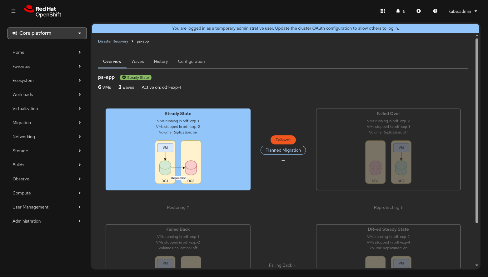
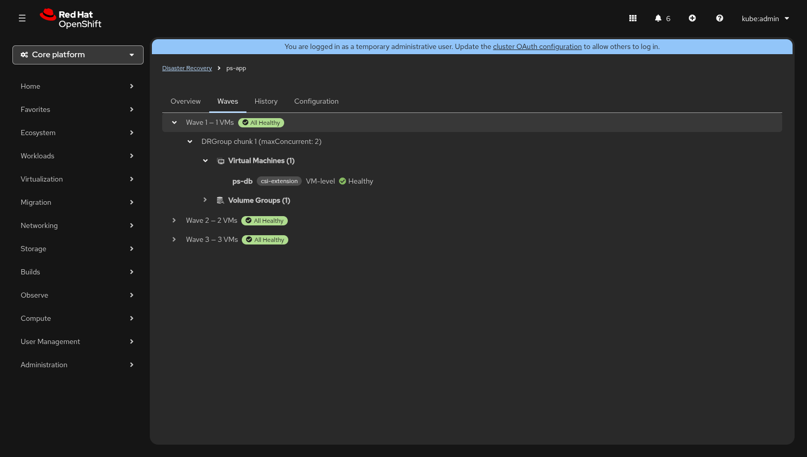
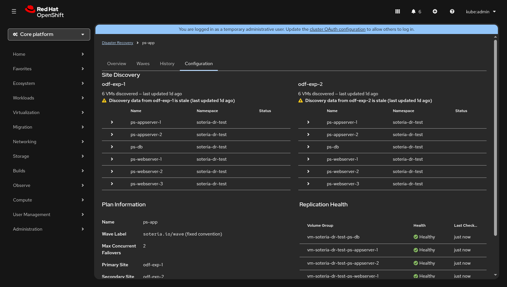

# Plan Detail

The **Plan Detail** view is the operational cockpit for a single DRPlan.
From this page you can inspect every aspect of the plan — its lifecycle
state, wave composition, execution history, and full configuration — and
trigger DR actions when the plan is in a rest phase.

Navigate here by clicking any plan row on the
[Dashboard](dashboard.md), or by using the breadcrumb link
**Disaster Recovery → Plans → _plan-name_**.



---

## Page Layout

The top of the page displays a breadcrumb trail and the **plan header**:

| Element | Description |
|---------|-------------|
| **Plan name** | Bold title — the `metadata.name` of the DRPlan resource. |
| **Phase badge** | Colour-coded label showing the current effective phase (e.g. *Steady State*, *Failing Over*). |
| **VM count** | Total number of VMs discovered for the plan. |
| **Wave count** | Number of waves the plan is divided into. |
| **Active site** | The cluster currently running the VMs (e.g. `odf-exp-1`). |

Below the header, four **tabs** organise the remaining content:

1. [Overview](#overview-tab)
2. [Waves](#waves-tab)
3. [History](#history-tab)
4. [Configuration](#configuration-tab)

---

## Overview Tab

The Overview tab is the default landing view.  It contains up to three
sections stacked vertically.

### Alert Banners

If sites disagree on VM inventory or disk topology, an inline **danger
alert** appears at the top of the tab:

| Alert | Meaning |
|-------|---------|
| **Sites do not agree on VM inventory** | The primary and secondary sites report different VM lists.  A "View site differences" link jumps to the Configuration tab's Site Discovery section. |
| **Disk topology inconsistent across sites** | Disk names or storage classes don't match between sites.  DR operations are blocked until the mismatch is resolved. |

While either alert is active, the action buttons on the lifecycle diagram
are **disabled** with a tooltip explaining the block reason.

### Transition Progress Banner

When a DR action is in flight, a **progress banner** replaces the quiet
lifecycle diagram area.  The banner shows:

- A progress bar with the percentage of waves completed.
- The current wave number (e.g. "Wave 2 of 3").
- Elapsed time since the execution started (updates every second).
- Estimated time remaining (calculated from average wave duration).
- A **View execution details** link that navigates to the
  [Execution Monitor](execution-monitor.md) for the running execution.

### DR Lifecycle Diagram

The lifecycle diagram is a 2 × 2 grid of **phase nodes** connected by
**transition edges**.  It represents the four rest phases and the four
transitions of the DR state machine:

```
Steady State ───Failover / Planned Migration──▸ Failed Over
     ▴                                               │
     │                                          Reprotect
   Restore                                           │
     │                                               ▾
Failed Back ◂──Failback / Planned Migration── DR-ed Steady State
```

Each phase node displays:

- The phase label (e.g. "Steady State").
- Which site is running VMs and which is standby.
- Whether volume replication is **on** or **off**.
- A small topology illustration showing the two sites.

The **current rest phase** is highlighted with a filled background; all
other phases are dimmed.  During a transition, the destination node's
border becomes dashed.

#### Phase Details

| Phase | Active Site | Standby Site | Vol. Replication |
|-------|-------------|-------------|------------------|
| Steady State | Primary | Secondary | On |
| Failed Over | Secondary | Primary | Off |
| DR-ed Steady State | Secondary | Primary | On |
| Failed Back | Primary | Secondary | Off |

#### Context-Aware Action Buttons

Only the transitions that are **valid from the current rest phase** show
action buttons.  This is a core UX design principle — the UI never
presents an action the operator cannot take.

| Current Phase | Available Actions |
|---------------|-------------------|
| Steady State | **Failover** (danger) · **Planned Migration** |
| Failed Over | **Reprotect** |
| DR-ed Steady State | **Failback** (danger) · **Planned Migration** |
| Failed Back | **Restore** |

Clicking any action button opens the [Pre-flight Confirmation
Modal](#pre-flight-confirmation-modal).  During a transition, no
buttons appear — the in-progress edge shows a pulsing "In progress..."
label instead.

!!! tip
    Actions marked **(danger)** use a red button variant to signal that
    they involve unplanned or forced VM movement.  Planned Migration and
    Reprotect/Restore use the standard secondary button style.

---

## Waves Tab

The Waves tab renders a hierarchical **tree view** of the plan's wave
composition using the PatternFly TreeView component.



### Tree Structure

```
Wave 1 — 1 VM  ✅ Healthy
├── DRGroup chunk 1 (maxConcurrent: 6)
│   ├── Virtual Machines (1)
│   │   └── ps-db  [csi-extension]  VM-level  ● Healthy
│   └── Volume Groups (1)
│       └── vg-ps-db  2 disks
Wave 2 — 2 VMs  ✅ Healthy
├── ...
Wave 3 — 3 VMs  ✅ Healthy
└── ...
```

Each **wave** node shows:

- The wave ordinal and total VM count.
- An **aggregate health badge** that summarises the replication status of
  all volume groups in the wave (`All Healthy`, or a breakdown such as
  `1 Degraded, 1 Syncing`).

Expanding a wave reveals its **DRGroup chunks** (controlled by
`maxConcurrentFailovers`).  Each chunk contains two sub-groups:

- **Virtual Machines** — one leaf per VM, showing:
    - VM name (bold).
    - Storage backend label (e.g. `csi-extension`).
    - Consistency level: either a `NS: <namespace>` label for
      namespace-level consistency, or plain text "VM-level".
    - A **replication health indicator** (green check, yellow warning,
      blue sync, red error, or grey unknown).
- **Volume Groups** — one node per volume group, expandable to show
  individual disks and their PVC mappings across sites.

!!! note
    If no waves have been configured for the plan, the tab displays the
    message *"No waves configured for this plan"*.

---

## History Tab

The History tab shows a **sortable table** of all past and in-progress
executions for this plan.


| Column | Description |
|--------|-------------|
| **Date** | Start time formatted as locale-aware date + time (e.g. "Sep 3, 2026, 02:15 PM"). |
| **Mode** | The execution mode: *Planned Migration*, *Disaster*, or *Re-protect*. |
| **Phase** | Current phase of the execution (e.g. `Completed`, `Running`). |
| **Result** | A colour-coded badge — **Succeeded** (green ✓), **Partial** (yellow ⚠), **Failed** (red ✕), or *In Progress* (plain text). |
| **Duration** | Elapsed wall-clock time (e.g. "1m 50s", "39m 53s"). |
| **Triggered By** | The user or system component that initiated the execution (read from the `soteria.io/triggered-by` annotation). |

Rows are sorted **newest first**.  Clicking any row navigates to the
execution's detail page in the [Execution Monitor](execution-monitor.md).

When no executions exist, an **empty state** is displayed with the
message *"Trigger a planned migration to validate your DR plan"*.

---

## Configuration Tab

The Configuration tab is divided into three sections.



### Site Discovery

The top area displays a **side-by-side comparison** of the VMs discovered
on the primary and secondary sites.  Each site column includes:

- The site name and total VM count.
- A "last updated" relative timestamp (e.g. "2 minutes ago").
- A table of discovered VMs with columns: **Name**, **Namespace**, and
  **Status**.

VMs that exist on one site but not the other are highlighted with a
**warning background** and a ⚠ icon.  Clicking the expand arrow on a VM
row reveals its **disk detail table** comparing disk names, PVC names,
and storage classes across sites.  Mismatched storage classes are
highlighted in red; disks missing from one site are highlighted in
yellow.

!!! warning
    If the discovery data from a site is more than five minutes old, a
    **stale data** warning appears below the site header.

### Plan Information

A horizontal **description list** showing the plan's core settings:

| Field | Example |
|-------|---------|
| Name | `ps-app` |
| Wave Label | `soteria.io/wave` (fixed convention) |
| Max Concurrent Failovers | `6` |
| Primary Site | `odf-exp-1` |
| Secondary Site | `odf-exp-2` |
| Volume Replication Driver | `csi-extension` |
| Created | `Sep 1, 2026, 10:30 AM` |

If the DRPlan resource has **labels** or **annotations** (excluding
internal Kubernetes annotations), they are displayed below the field
list.

### Replication Health

A **per-volume-group health table** listing each volume group's name,
replication health indicator, and last-checked timestamp.  If per-VG
data is not available, the section falls back to the plan-level overall
health indicator.

---

## Pre-flight Confirmation Modal

Clicking an action button on the lifecycle diagram opens a **modal
dialog** that serves as the final gate before creating a DRExecution.

The modal displays:

| Item | Description |
|------|-------------|
| **Title** | "Confirm _Action_: _plan-name_" |
| **VM / wave summary** | Total VM count and wave count from pre-flight data. |
| **Estimated duration** | Predicted RTO based on historical execution times. |
| **DR site capacity** | Assessment of the target site's resource headroom. |
| **Action summary** | Prose description of what the execution will do. |
| **Confirmation keyword** | A text input that must match a specific keyword before the confirm button enables (e.g. type `FAILOVER` to confirm a failover). |

| Action | Confirmation Keyword | Button Style |
|--------|---------------------|--------------|
| Failover | `FAILOVER` | Danger (red) |
| Planned Migration | `MIGRATE` | Primary (blue) |
| Reprotect | `REPROTECT` | Primary (blue) |
| Failback | `FAILBACK` | Danger (red) |
| Restore | `RESTORE` | Primary (blue) |

If creation fails, an inline **danger alert** appears inside the modal
with the error message.

---

## Related Pages

- [Dashboard](dashboard.md) — overview of all DRPlans
- [Execution Monitor](execution-monitor.md) — live execution tracking
- [Creating a DRPlan](../creating-a-drplan.md) — how to define a plan
- [Waves & Throttling](../waves.md) — wave composition and
  `maxConcurrentFailovers`
- [DR Lifecycle](../../architecture/dr-lifecycle.md) — architecture of
  the state machine
