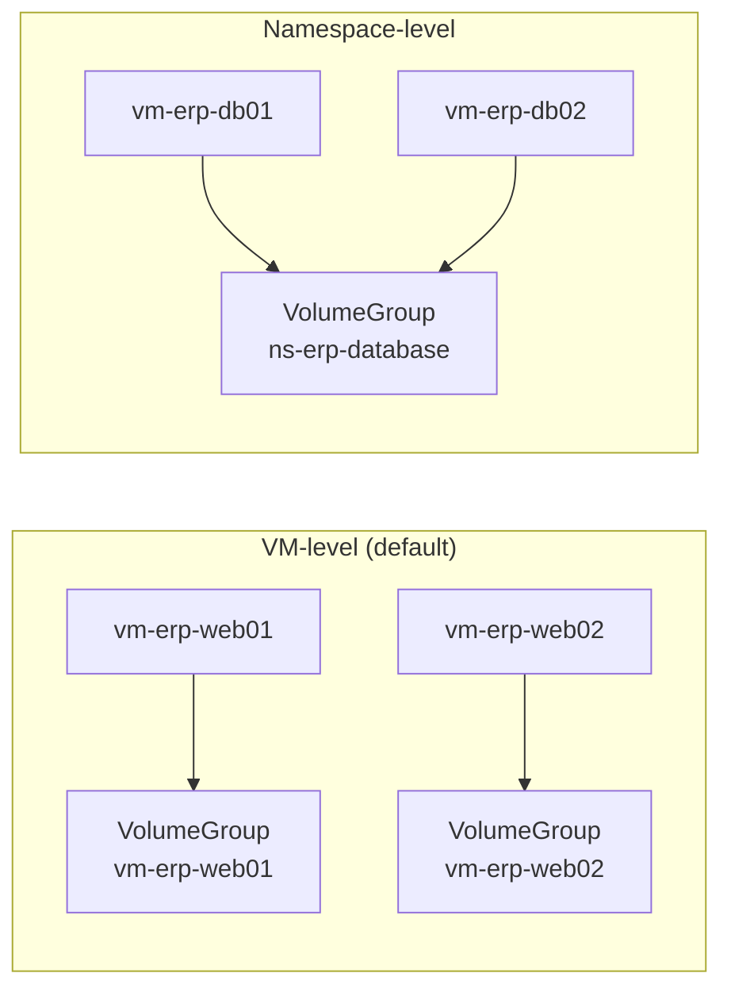
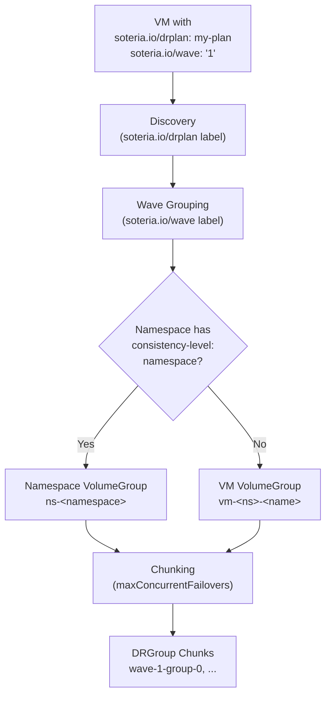

# Volume Grouping

Soteria groups VM disks into **volume groups** to ensure storage operations
(snapshots, replication promotion/demotion) are applied atomically to the
right set of disks during failover. This page explains the two grouping
strategies, how to configure them, and the constraints you need to be aware of.

## Overview

Every VM discovered by a DRPlan has its disks placed into a **VolumeGroup**.
How those groups are formed depends on the **consistency level** configured for
the VM's namespace:

| Strategy | Scope | Naming Convention | Use Case |
|---|---|---|---|
| **VM-level** (default) | Each VM forms its own VolumeGroup | `vm-<namespace>-<vmname>` | Independent workloads where per-VM consistency is sufficient |
| **Namespace-level** | All VMs in the namespace share one VolumeGroup | `ns-<namespace>` | Tightly coupled services that require crash-consistent snapshots across VMs |



## VM-Level Grouping (Default)

When no special annotation is set on a namespace, each VM's disks form their
own independent VolumeGroup. This is the default behavior and suits most
workloads.

**How it works:**

1. Soteria discovers VMs via the `soteria.io/drplan` label.
2. Each VM gets its own VolumeGroup named `vm-<namespace>-<vmname>`.
3. During failover, each VolumeGroup is promoted independently — they can be
   placed in different DRGroup chunks and even fail over at different times
   within a wave.

### Example: VM-Level Grouping

```yaml
# VM: erp/web01 — no namespace annotation needed (VM-level is the default)
apiVersion: kubevirt.io/v1
kind: VirtualMachine
metadata:
  name: web01
  namespace: erp
  labels:
    soteria.io/drplan: erp-plan    # (1)!
    soteria.io/wave: "1"           # (2)!
spec:
  template:
    spec:
      volumes:
        - name: rootdisk
          persistentVolumeClaim:
            claimName: web01-root
        - name: datadisk
          persistentVolumeClaim:
            claimName: web01-data
```

1. Associates this VM with the `erp-plan` DRPlan.
2. Places this VM in wave `1`.

This VM's two PVC-backed disks form a single VolumeGroup named
`vm-erp-web01`. The disks are snapshotted and promoted together, giving you
crash-consistent recovery for _this VM_ without affecting other VMs.

## Namespace-Level Grouping

For applications where multiple VMs must be recovered to a consistent point in
time — such as a database primary and its replicas, or a distributed system
where partial recovery would leave data inconsistent — you can enable
**namespace-level consistency**.

**How it works:**

1. Annotate the namespace with `soteria.io/consistency-level: namespace`.
2. Soteria groups _all_ VMs discovered in that namespace into a single
   VolumeGroup named `ns-<namespace>`.
3. During failover, all disks in the VolumeGroup are promoted atomically as
   one unit — they always land in the same DRGroup chunk.

### Example: Namespace-Level Grouping

```yaml
# Step 1: Annotate the namespace
apiVersion: v1
kind: Namespace
metadata:
  name: erp-database
  annotations:
    soteria.io/consistency-level: namespace    # (1)!
```

1. Triggers namespace-level volume grouping for all VMs in this namespace.

```yaml
# Step 2: VMs in the annotated namespace
apiVersion: kubevirt.io/v1
kind: VirtualMachine
metadata:
  name: db-primary
  namespace: erp-database
  labels:
    soteria.io/drplan: erp-plan
    soteria.io/wave: "1"           # (1)!
---
apiVersion: kubevirt.io/v1
kind: VirtualMachine
metadata:
  name: db-replica
  namespace: erp-database
  labels:
    soteria.io/drplan: erp-plan
    soteria.io/wave: "1"           # (2)!
```

1. Both VMs must be in the **same wave** (see [wave constraint](#wave-constraint) below).
2. Same wave as `db-primary` — required for namespace-level consistency.

Both `db-primary` and `db-replica` are grouped into a single VolumeGroup
named `ns-erp-database`. Their disks are promoted atomically, ensuring
crash-consistent recovery across the entire database tier.

## Label-to-DRGroup Mapping

Understanding how labels drive the grouping pipeline helps you predict exactly
how your VMs will be organized during failover:



**Step-by-step:**

1. **Discovery** — The DRPlan controller lists VMs with the `soteria.io/drplan`
   label matching the plan name.
2. **Wave grouping** — VMs are partitioned by their `soteria.io/wave` label
   value. VMs without a wave label are placed in a default wave (empty-string
   key).
3. **Consistency resolution** — For each namespace containing discovered VMs,
   the controller reads the `soteria.io/consistency-level` annotation.
   Namespace-level namespaces merge all their VMs into one VolumeGroup;
   VM-level namespaces (the default) create per-VM VolumeGroups.
4. **Chunking** — Within each wave, VolumeGroups are packed into DRGroup chunks
   respecting `maxConcurrentFailovers`. Namespace-level VolumeGroups are placed
   first (largest-first) because they are indivisible. VM-level VolumeGroups
   fill the remaining capacity.

### VM Exclusivity

A VM can belong to **at most one DRPlan**. This is structurally enforced by the
Kubernetes label model: the `soteria.io/drplan` label key can only have one
value per resource, so assigning a VM to a second plan automatically removes it
from the first.

No runtime validation is needed — the constraint is guaranteed by design.

## Constraints and Validation

### Wave Constraint

!!! warning "Namespace-level VMs must be in the same wave"
    When a namespace has `soteria.io/consistency-level: namespace`, **all VMs in
    that namespace that belong to the DRPlan must carry the same
    `soteria.io/wave` value.**

    Namespace-level consistency means all VMs in the namespace form one
    indivisible VolumeGroup. Because waves execute sequentially, placing VMs in
    different waves would cause their disks to be promoted at different times —
    breaking the atomicity guarantee.

**What happens if you violate this constraint:**

The DRPlan controller detects the conflict during reconciliation and sets the
plan's `Ready` condition to `False` with reason `WaveConflict`:

```
Ready   False   WaveConflict   Namespace-level VMs span multiple waves:
                               namespace "erp-database" VMs [db-primary db-replica]
                               in waves [1 2];
```

The plan remains in this blocked state until you correct the wave labels so all
VMs in the namespace share the same wave.

### Throttle Capacity Constraint

!!! warning "Namespace groups must fit within `maxConcurrentFailovers`"
    A namespace-level VolumeGroup is **indivisible** — it cannot be split across
    DRGroup chunks. If the number of VMs in a namespace group exceeds the
    plan's `maxConcurrentFailovers` setting, the plan is blocked.

**What happens if you violate this constraint:**

The DRPlan controller sets `Ready=False` with reason
`NamespaceGroupExceedsThrottle`:

```
Ready   False   NamespaceGroupExceedsThrottle
                maxConcurrentFailovers (2) is less than namespace+wave group
                size (5) for namespace erp-database wave 1
```

**To fix:** Either increase `maxConcurrentFailovers` to be at least as large as
the namespace group, or restructure your namespaces so that no single namespace
group exceeds the limit.

## Choosing a Strategy

| Consideration | VM-Level | Namespace-Level |
|---|---|---|
| **Consistency scope** | Per-VM crash consistency | Cross-VM crash consistency within a namespace |
| **Flexibility** | VMs can be in different waves and DRGroup chunks | All VMs must share one wave; group is indivisible |
| **Capacity impact** | Each VM uses 1 slot in `maxConcurrentFailovers` | All VMs in namespace use slots as one block |
| **Recovery granularity** | Individual VM failover timing | All-or-nothing for the namespace |
| **Best for** | Stateless services, independent VMs, microservices | Database clusters, tightly coupled multi-VM apps |

### Recommended Patterns

**Pattern 1: Independent web servers**

Use VM-level grouping (the default). Each web server can fail over
independently and doesn't need atomic recovery with other VMs.

```
Namespace: web-frontend (no annotation)
├── web01  →  VolumeGroup: vm-web-frontend-web01
├── web02  →  VolumeGroup: vm-web-frontend-web02
└── web03  →  VolumeGroup: vm-web-frontend-web03
```

**Pattern 2: Database cluster**

Use namespace-level grouping. The primary and replicas must be recovered to the
same point in time to avoid data inconsistency.

```
Namespace: erp-database (annotation: soteria.io/consistency-level: namespace)
├── db-primary  ─┐
└── db-replica   ├→  VolumeGroup: ns-erp-database
                 ┘
```

**Pattern 3: Mixed application**

Use separate namespaces with different grouping strategies. Place tightly
coupled VMs in a namespace-level namespace; keep independent VMs in a
default (VM-level) namespace.

```
Namespace: erp-database  (namespace-level)
├── db-primary  ─┐
└── db-replica   ├→  VolumeGroup: ns-erp-database
                 ┘
Namespace: erp-app  (vm-level, default)
├── app01  →  VolumeGroup: vm-erp-app-app01
└── app02  →  VolumeGroup: vm-erp-app-app02
```

## Pre-Flight Verification

Before executing a failover, the DRPlan controller generates a **pre-flight
report** that shows exactly how volume groups are formed and chunked. Use
`kubectl` to inspect it:

```bash
kubectl get drplan erp-plan -o jsonpath='{.status.preflight}' | jq .
```

The pre-flight report includes:

- Total VMs and their wave assignments
- Volume group formation (names, consistency levels, member VMs)
- DRGroup chunking preview (which VMs fail over together)
- Any warnings (wave conflicts, throttle violations)

!!! tip "Verify before executing"
    Always inspect the pre-flight report after changing namespace annotations,
    wave labels, or `maxConcurrentFailovers`. This shows you the exact execution
    plan before committing to a failover.

## Related Topics

- [DRPlan Authoring](drplan.md) — Creating and configuring DRPlan resources
- [Waves & Throttling](waves.md) — Wave-based execution ordering and
  concurrency control
- [Executing Failover](failover.md) — Running a DR execution
- [DRPlan API Reference](../reference/api/drplan.md) — Full API specification
