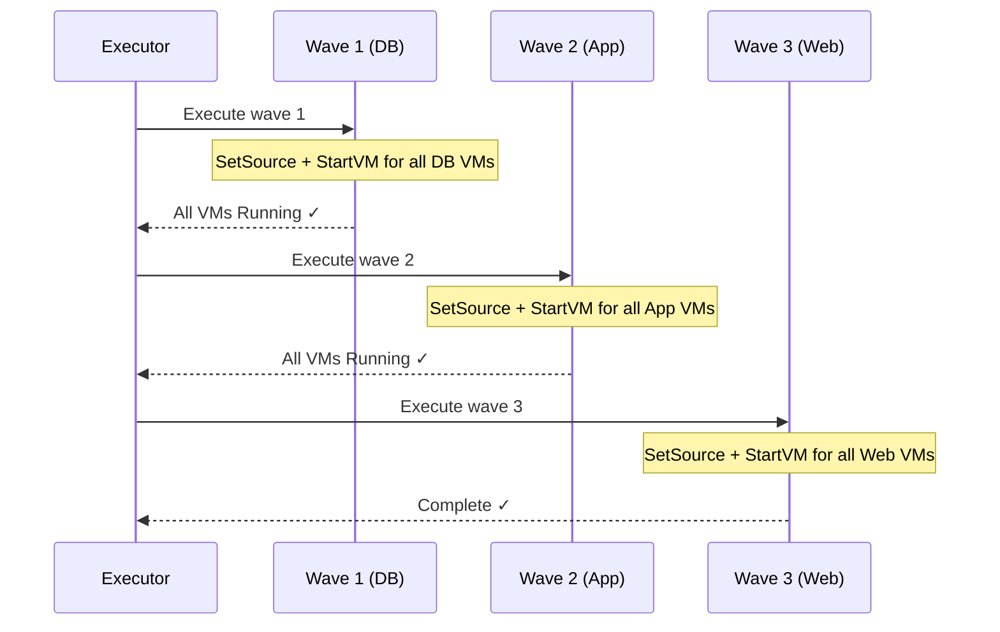
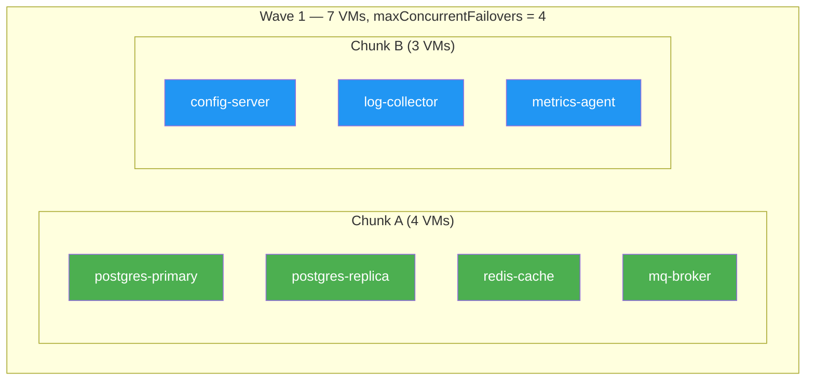
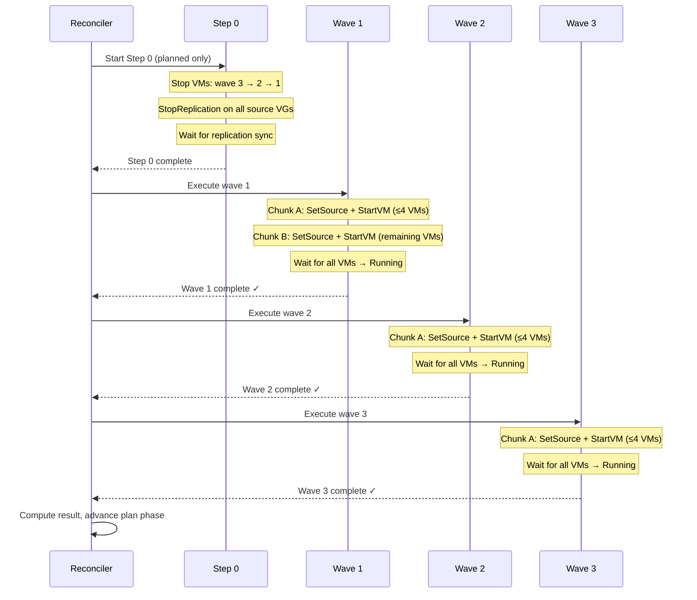

# Waves & Throttling

Soteria executes DR operations in **waves** — ordered groups of VMs that
fail over sequentially. Within each wave, VMs are chunked into **DRGroups**
that respect a concurrency limit you set on the DRPlan. This page explains
how waves form, how they execute, and how throttling keeps the process safe
and predictable.

## Wave Formation

Every VM that belongs to a DRPlan is assigned to a wave via the
`soteria.io/wave` label. The label value is a simple string — Soteria sorts
waves **lexicographically** by this value, so `"1"` runs before `"2"`,
`"a"` before `"b"`, and so on.

```yaml
apiVersion: kubevirt.io/v1
kind: VirtualMachine
metadata:
  name: postgres-primary
  labels:
    soteria.io/drplan: erp-full-stack
    soteria.io/wave: "1"       # Database tier — starts first
---
apiVersion: kubevirt.io/v1
kind: VirtualMachine
metadata:
  name: app-server-1
  labels:
    soteria.io/drplan: erp-full-stack
    soteria.io/wave: "2"       # Application tier — starts after DB
---
apiVersion: kubevirt.io/v1
kind: VirtualMachine
metadata:
  name: web-frontend-1
  labels:
    soteria.io/drplan: erp-full-stack
    soteria.io/wave: "3"       # Web tier — starts last
```

!!! tip "Naming convention"
    Use numeric strings (`"1"`, `"2"`, `"3"`) for clarity. Because sorting
    is lexicographic, `"10"` sorts before `"2"`. If you need more than nine
    waves, zero-pad: `"01"`, `"02"`, … `"10"`.

!!! info "VMs without a wave label"
    VMs that lack the `soteria.io/wave` label are placed into a wave with an
    empty-string key. This wave sorts before all named waves, so unlabeled
    VMs execute first. To avoid surprises, always label your VMs explicitly.

### Discovery at Execution Time

When a DRExecution is created, Soteria **re-discovers** VMs at execution time
by listing all `VirtualMachine` resources that carry
`soteria.io/drplan: <plan-name>`. It does not rely on cached DRPlan status.
This ensures the wave grouping reflects the current state of the cluster —
if you add or relabel a VM between executions, the next execution picks up
the change.

## Execution Pipeline

The wave executor runs a fixed pipeline for every execution:


1. **Discover** — List VMs by `soteria.io/drplan` label.
2. **Group by wave** — Partition VMs into waves by `soteria.io/wave` value.
3. **Resolve volume groups** — Apply namespace consistency rules
   (see [Volume Grouping](volumes.md)).
4. **Chunk** — Split each wave's volume groups into DRGroup chunks that
   respect `maxConcurrentFailovers`.
5. **Execute** — Run waves one at a time, sequentially.

## Sequential Wave Execution

Waves execute **strictly in order**: wave N must complete before wave N+1
begins. This guarantees that infrastructure tiers start in the correct
dependency order — databases before application servers, application servers
before web frontends.



### VM Readiness Gate

After all `StartVM` operations in a wave complete, the executor waits for
every VM in the wave to reach **Running** state. Wave N+1 does not begin
until all wave N VMs are Running. This is the **readiness gate** — it
ensures that downstream services don't start before their dependencies are
actually available.

The readiness timeout is controlled by `spec.vmReadyTimeout` on the DRPlan:

```yaml
apiVersion: soteria.io/v1alpha1
kind: DRPlan
metadata:
  name: erp-full-stack
spec:
  maxConcurrentFailovers: 4
  vmReadyTimeout: 5m        # Default: 5 minutes
  # ...
```

If any VM fails to reach Running within the timeout, it is marked as failed.
The executor uses **fail-forward semantics** — failed VMs don't block the
remaining waves (see [Fail-Forward](#fail-forward-semantics) below).

## DRGroup Chunking and Throttling

Within each wave, the VMs may exceed the concurrency limit set by
`spec.maxConcurrentFailovers`. Soteria handles this by splitting the wave's
volume groups into sequential **DRGroup chunks**, each containing at most
`maxConcurrentFailovers` VMs.

### How `maxConcurrentFailovers` Works

The `maxConcurrentFailovers` field on `DRPlanSpec` limits the number of VMs
that are processed concurrently within a single DRGroup chunk. It counts
**individual VMs** regardless of their consistency level.

```yaml
spec:
  maxConcurrentFailovers: 4   # At most 4 VMs per chunk
```

### Chunking Algorithm

The chunker processes each wave independently:

1. **Partition volume groups** into namespace-level groups and VM-level
   groups.
2. **Place namespace groups first** (largest first) because they are
   indivisible.
3. **Fill remaining capacity** with VM-level groups (one VM each).
4. **Start a new chunk** when the current chunk is full.



Chunks within a wave execute **sequentially** — Chunk A completes (including
its checkpoint write) before Chunk B begins. VM-level parallelism within each
chunk is handled by the handler's internal goroutines: `SetSource` runs for
all volume groups, then `StartVM` runs for all VMs in the chunk concurrently.

### Namespace Indivisibility

!!! warning "Namespace-level volume groups cannot be split across chunks"
    When a namespace uses `soteria.io/consistency-level: namespace`
    annotation, **all VMs in that namespace within the same wave** form a
    single, indivisible volume group. This group must fit entirely within one
    DRGroup chunk to preserve crash-consistent snapshot atomicity.

    For example, if a namespace has 3 VMs with namespace-level consistency
    and `maxConcurrentFailovers` is 4, those 3 VMs occupy 3 of the 4 slots
    in a single chunk. The remaining slot can be used by a VM-level group.

**Pre-flight validation:** If any namespace-level volume group contains more
VMs than `maxConcurrentFailovers` allows, the execution is **rejected**
because that group can never fit in any chunk. The chunker records this as a
`ChunkError` and the execution fails at initialization.

For example, with `maxConcurrentFailovers: 3`:

| Scenario | Result |
|---|---|
| Namespace group has 2 VMs | ✅ Fits in a chunk (2 ≤ 3) |
| Namespace group has 3 VMs | ✅ Fills an entire chunk (3 = 3) |
| Namespace group has 4 VMs | ❌ Rejected — can never fit (4 > 3) |

### Per-Group Execution Path

For each DRGroup chunk, the handler runs a unified two-step path:

1. **SetSource** — Promote each volume group to primary (writable) on the
   target site.
2. **StartVM** — Start each VM in the chunk on the target site.

This path is identical for both planned migration and disaster failover.
The difference is in **Step 0** (pre-execution), not in the per-group path.

## Step 0: Planned Migration Pre-Execution

In **planned migration** mode (`GracefulShutdown: true`), Soteria runs a
global Step 0 before any wave begins:

1. **Stop all origin VMs in reverse wave order** — Dependants stop before
   dependencies. Web frontends (wave 3) stop first, then application servers
   (wave 2), then databases (wave 1). This ensures higher-tier services
   drain gracefully before losing their backends.

2. **Demote source volumes** — Call `StopReplication` on each source volume
   group to transition from primary to secondary. The storage system (e.g.,
   rbd-mirror) automatically syncs the final demotion snapshot to the
   target.

3. **Wait for replication sync** — The reconciler waits for all
   VolumeReplications to confirm the target has caught up (configurable via
   `spec.resyncTimeout`, default 10 minutes).

In **disaster failover** mode (`GracefulShutdown: false`), Step 0 is skipped
entirely because the origin site may be unreachable.

## Fail-Forward Semantics

Soteria uses a **fail-forward** error model: if a DRGroup fails during
execution, the failure is recorded but does **not** block subsequent chunks
or waves.

| Outcome | All groups succeeded | Some groups failed | All groups failed |
|---|---|---|---|
| **Execution result** | `Succeeded` | `PartiallySucceeded` | `Failed` |
| **Plan phase advances?** | ✅ Yes | ✅ Yes | ❌ No |

!!! note "Retrying failed groups"
    After a `PartiallySucceeded` execution, you can retry individual failed
    DRGroups by annotating the DRExecution with
    `soteria.io/retry-groups: <group-name>` or
    `soteria.io/retry-groups: all-failed`. See
    [Executing Failover](failover.md) for details.

## Checkpointing

After each DRGroup completes (success or failure), Soteria writes a
**checkpoint** to the DRExecution status. This means:

- On pod restart, execution resumes from the last checkpoint — at most one
  in-flight DRGroup is re-executed.
- All driver operations are idempotent, so retrying a checkpointed group is
  safe.
- Wave-level checkpoints are written at the end of each wave.

## Complete Execution Timeline

Putting it all together, here is the full execution timeline for a planned
migration with 3 waves and `maxConcurrentFailovers: 4`:



## Configuration Reference

| Field | Path | Default | Description |
|---|---|---|---|
| Wave label | `metadata.labels["soteria.io/wave"]` | (none) | Assigns a VM to a wave. Sorted lexicographically. |
| Max concurrent failovers | `spec.maxConcurrentFailovers` | (required) | Maximum VMs per DRGroup chunk. Must be ≥ 1. |
| VM ready timeout | `spec.vmReadyTimeout` | `5m` | Time to wait for VMs to reach Running after StartVM. |
| Resync timeout | `spec.resyncTimeout` | `10m` | Time to wait for VR/VGR sync during planned Step 0. |
| Consistency level | Namespace annotation `soteria.io/consistency-level` | `vm` | Set to `namespace` for crash-consistent namespace groups. |
